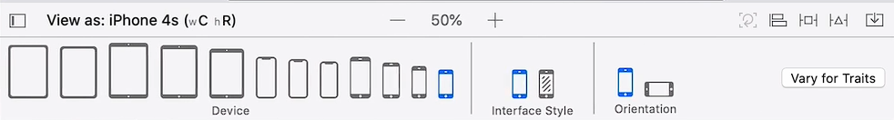

## Notes: Understanding Class Sizes and Orientation

### Starting Point

* The app being used is a cloned version of the completed Dicee app.
* The app functions correctly, but the UI breaks when:

  * rotating the device,
  * changing orientation,
  * or running on devices with different screen sizes/aspect ratios.
* Example issue:

  * In landscape mode, the **Roll button disappears**, making the app unusable.

---

## Why the Problem Happens

* The UI elements were manually positioned for one screen size/orientation only.
* Without proper layout rules, elements do not adapt automatically to:

  * different devices,
  * orientations,
  * or screen dimensions.

---

## Auto Layout

* Auto Layout is used to define **rules (constraints)** for UI elements.
* These rules allow the interface to automatically resize and reposition itself properly across all devices and orientations.

---

## Storyboards

### Main.storyboard

* Contains the main app interface.
* Current layout has Auto Layout warnings (yellow warning icon).

### LaunchScreen.storyboard

* Used as the introductory/loading screen before the main app appears.
* Works the same way as Main.storyboard because both use Interface Builder.
* Simpler layout makes it a better place to learn Auto Layout concepts.

---

## Problems Seen in LaunchScreen.storyboard

* Background gets cut off in landscape mode.
* Logo moves off-screen and becomes invisible.
* Elements stay fixed instead of adapting to orientation changes.

---

## Size Classes

### What Are Size Classes?

* Size classes group devices with similar screen sizes and aspect ratios.
* Instead of designing separately for every device, Apple groups similar devices together.

### Examples

* iPhone 6, 7, and 8 share the same size class.
* iPhone 6/7/8 Plus share another size class.
* Older devices like iPhone 4s and SE have their own size classes.

    

---

## Purpose of Size Classes

* Simplifies UI design across many devices.
* Allows developers to preview layouts for:

  * different screen sizes,
  * orientations,
  * light/dark mode.

---

## Manual Adjustment vs Auto Layout

### Manual Adjustment

* You can manually move elements for a specific device size.
* Example:

  * repositioning a logo for iPhone 4.

### Problem

* Impossible to manually optimize layouts for every App Store user/device.

### Solution

* Use Auto Layout constraints to automatically adapt layouts.

---

## Size Class Area in Interface Builder

* Located at the bottom of Interface Builder.
* Used to:

  * switch between device previews,
  * change orientation,
  * test light/dark mode,
  * preview different size classes.
* Can be collapsed to create more workspace.

---

## Key Takeaways

* Modern iOS apps must support many screen sizes and orientations.
* Manual positioning is not scalable.
* Auto Layout uses constraints to create responsive interfaces.
* Size classes help test and design for groups of devices efficiently.
* The next step is learning how to create and apply Auto Layout constraints.
