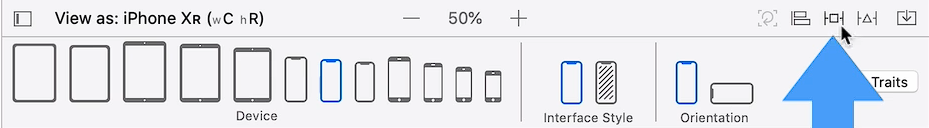
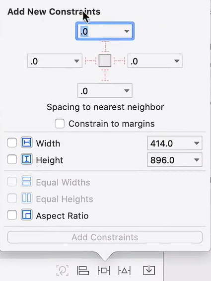

# Notes: Auto Layout Constraints (iOS / Xcode)

## Goal

Fix the issue where the background image gets cut off when the device orientation changes.

## Main Idea

The background image should resize automatically so it always touches all four edges of the screen:

* Top = 0 from top
* Bottom = 0 from bottom
* Left = 0 from left
* Right = 0 from right

This is done using **Auto Layout Constraints**.

---

# Steps to Fix the Background Image

## 1. Set Up the Initial Layout

* Use the default size class: **iPhone XR (Portrait)**.
* Select the background image view (`AppBreweryBackground`).
* Resize it so it fills the entire screen.
* Place the logo in the center.

This becomes the desired portrait layout.

---

# Adding Constraints

## 2. Add Constraints to the Background Image

Click the **Add New Constraints** button (square icon).

    

Add these constraints:

* Top = 0
* Bottom = 0
* Leading = 0
* Trailing = 0

Activate all four constraints and click:

**Add 4 Constraints**

This tells the image view to stretch and stay attached to all edges of the screen.

    

---

# Problem with Safe Area

## Issue

When switching to landscape, the background does not fully extend to the left and right edges.

### Why?

The constraints were attached to the **Safe Area** instead of the full screen.

The Safe Area avoids:

* Status bar
* Battery/signal area
* Home indicator area

This is useful for buttons and text, but not for backgrounds.

---

# Solution: Use Superview Instead of Safe Area

Change the constraints from:

* Safe Area Leading/Trailing

to:

* Superview Leading/Trailing

### Superview

The superview is the parent view that covers the entire screen.

After changing:

* The background stretches edge-to-edge properly in landscape mode.

---

# Understanding Constraint Options

Constraints can be attached relative to:

## 1. Safe Area

Keeps content away from system UI areas.

Best for:

* Buttons
* Text
* Logos
* Interactive content

---

## 2. Superview

Uses the full screen dimensions.

Best for:

* Background images
* Full-screen elements

---

## 3. Margins

Adds spacing from the edges.

Useful when:

* You do not want content touching screen edges
* You want cleaner spacing for readability

---

# Editing Constraints

You can inspect and modify constraints in:

* The Constraints list
* The Attribute Inspector

There you can:

* Change the first item and second item
* Modify constants (spacing values)
* Switch between Safe Area, Superview, or Margins

---

# Important Takeaways

* Backgrounds should usually be constrained to the **Superview**.
* Interactive UI elements are often constrained to the **Safe Area**.
* Margins help improve spacing and readability.
* Constraints allow layouts to adapt across:

  * Different device sizes
  * Portrait and landscape orientations

---

# Result

After fixing the constraints:

* The background fills the entire screen correctly.
* The UI adapts properly on all device sizes and orientations.

---

# Next Topic

The next lesson focuses on:

* Aligning the logo
* Learning about alignment constraints
