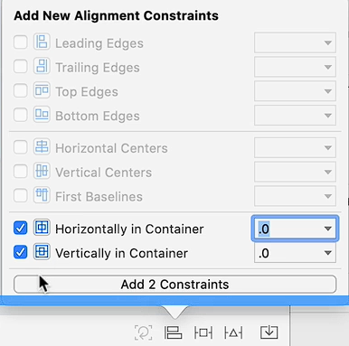
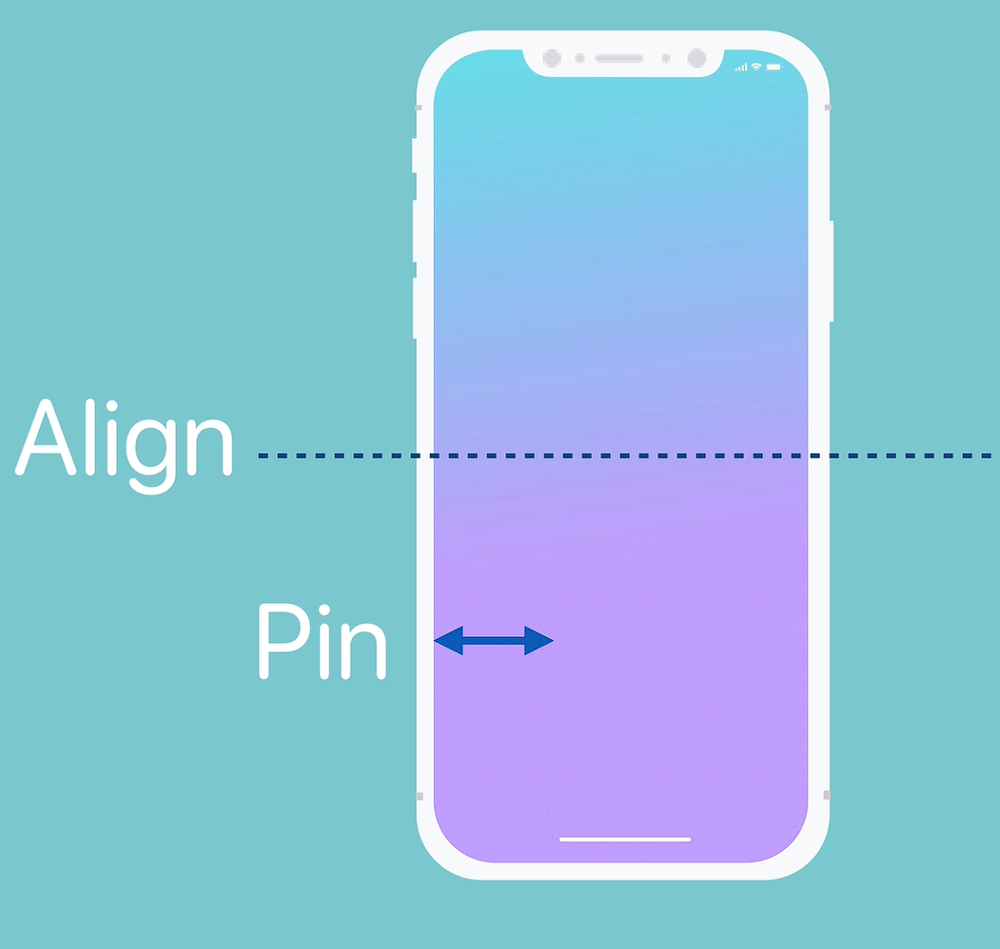

# Notes: Use Alignment and Pinning Constraints in iOS (Storyboard)

#### Centering a Logo on All Devices

* Goal: Keep the logo centered regardless of:

  * Device size
  * Orientation (portrait/landscape)

---

## 1. Pinning Constraints vs Alignment Constraints

### A. Pinning Constraints

* Pinning defines the distance between a UI element and the edges of its container (superview).
* Example:

  * 300 pts from top
  * 300 pts from bottom

### Problem with Pinning

* Works poorly in landscape mode.
* When screen height shrinks, there may not be enough vertical space.
* Constraints can break because the fixed distances no longer fit.

---

### B. Alignment Constraints

* Alignment positions elements relative to the center of the container.
* Example:

  * Horizontally centered
  * Vertically centered

### Benefits

* Automatically adapts to:

  * Landscape orientation
  * Different screen sizes
  * iPads and smaller iPhones

### Steps Used

1. Select the logo.
2. Open the **Alignment** menu.
3. Add:

   * Horizontal Center in Container
   * Vertical Center in Container

    

Result:

* Logo stays perfectly centered on all devices/orientations.

---

## 2. Combining Alignment + Pinning

You can combine both techniques.

### Example

A button should:

* Stay horizontally centered
* Always remain 30 pts above the bottom safe area

### Result

* Horizontal position stays centered
* Vertical position follows a fixed distance rule

This creates more flexible layouts.

---

## 3. Label Challenge Example

### Goal

Place a label:

* Horizontally centered
* 30 pts below the logo
* Works in landscape mode too

---

### Solution

#### Step 1: Horizontal Alignment

* Use **Align** menu
* Add:

  * Horizontally in Container

#### Step 2: Vertical Positioning

* Add a constraint:

  * Label is 30 pts below the logo

Important:

* Ensure the constraint is relative to the logo, not:

  * Safe Area
  * View
  * Other elements

### Result

* Label stays centered horizontally
* Maintains 30 pt spacing below logo
* Layout adapts correctly in landscape

---

# Key Concepts Learned

## Two Main Types of Auto Layout Constraints

    

### 1. Alignment Constraints

Used to:

* Center elements horizontally
* Center elements vertically

### 2. Pinning Constraints

Used to:

* Set distance from edges or other elements

---

# Important Takeaway

* Use alignment when elements should stay centered.
* Use pinning when spacing or edge distance matters.
* Combining both creates responsive and adaptive UI layouts.
