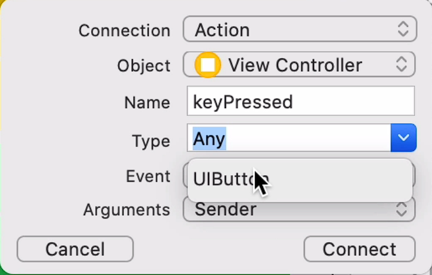
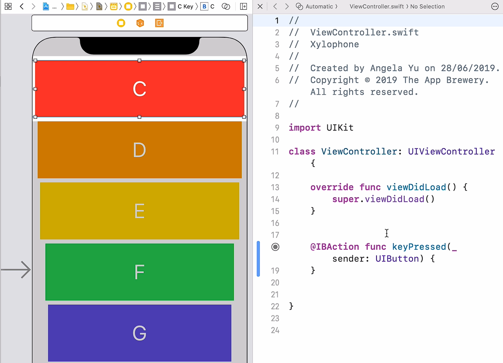
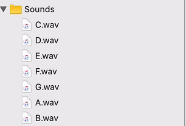

## Notes: Xylophone iOS App Setup

### 1. Clone and Set Up the Skeleton Project

* Clone the skeleton project from GitHub:

  * Repository: [Xylophone-IOS13 GitHub Repository](https://github.com/appbrewery/Xylophone-IOS13)
* In Xcode:

  * Select **Clone an Existing Project** or go to **Source Control → Clone**
  * Paste the GitHub URL
  * Choose a save location
  * Rename the project if desired (e.g., “Xylophone”)
  * Click **Clone**

---

### 2. Explore the User Interface

* Open `Main.storyboard`
* The UI already contains:

  * 7 xylophone buttons
  * Buttons decrease in width to create a cascading xylophone effect
* Constraints are used to adjust button sizes:

  * Example:

    * One button has width constraint = 40
    * Another has width constraint = 15
* Landscape view makes the layout resemble a real xylophone

---

### 3. Connect a Button to Code

* Open the **Assistant View** to see:

  * `Main.storyboard`
  * `ViewController.swift`
* Link the red “C” button:

  * Hold **Control**
  * Click and drag from the button into `ViewController.swift`
* Create an:

  * **Action**
  * Name: `keyPressed`
* Use camelCase naming:

  * First word lowercase
  * Following words capitalized
* Change the type:

  * From `Any`
  * To `UIButton`
* Click **Connect**

<p align="center">
    
</p>

---

### 4. Test the Button Action

Add a print statement inside the IBAction:

```swift
print("I got pressed")
```

* Run the app
* Press the red button
* The message appears in the debug console
* Other buttons do nothing because they are not linked yet

<p align="center">
    
</p>

---

### 5. Key Concepts Learned

* Cloning a GitHub project into Xcode
* Understanding storyboard constraints
* Using Assistant View
* Creating an `IBAction`
* Connecting UI elements to Swift code
* Testing button interactions with `print()`

---

### 6. Next Step

* Replace the `print("I got pressed")` statement
* Play sound files when buttons are tapped
* Each button already has a corresponding sound file included in the project

<p align="center">
    
</p>
