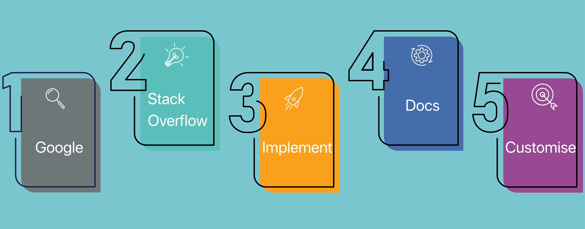
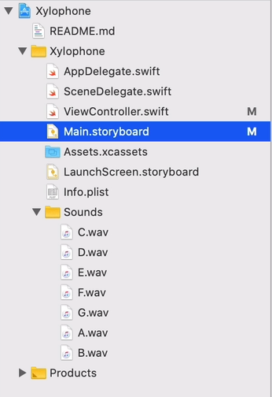
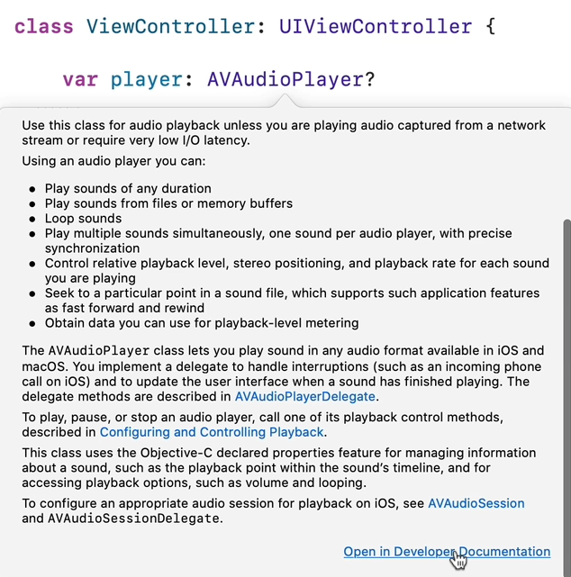

# Notes: Playing Sound in an iOS App Using Swift

## Lesson Overview

* Previously, an **IBAction** was connected to a button in `Main.storyboard`.
* Pressing the button printed `"I got pressed"` in the debug console.
* Goal: Make the button play a xylophone sound instead of printing text.
* Focus of the lesson: Learning how to find solutions using **StackOverflow** and **Apple API Documentation**, rather than simply copying code.

---

# Key Concepts

## 1. What is an API?

**API (Application Programming Interface)** = a set of tools and functionality provided by Apple that developers can use in their apps to interact with their iOS.

### TV Analogy

* TV API:

  * Turn TV on/off
  * Change channel
  * Adjust volume
* API Documentation:

  * Like the TV's instruction manual.

### Apple API Documentation

* Located on Apple's developer website.
* Acts as the instruction manual for iOS development.
* Very detailed and information-dense.

---

## 2. What is StackOverflow?

* A Q&A website for programmers.
* Used by developers to find solutions to coding problems.
* Contains:

  * Questions
  * Answers
  * Code examples
  * Community voting system

### Important Features

* **Upvotes** indicate useful answers.
* **Accepted Answer (green checkmark)** indicates the solution accepted by the original asker.
* Users earn **reputation points** for helpful contributions.

### Why Use It?

* Developers cannot memorize every piece of code.
* It provides quick examples and solutions.

---

# The 5-Step Problem-Solving Process

<p align="center">
    
</p>

## Step 1: Google the Problem

### Search Structure

Search using:

1. What you want the app to do
2. Programming language
3. Desired resource

### Example

```text
Play sound using Swift StackOverflow
```

### Why Google First?

* Google's search engine usually finds the most relevant StackOverflow result faster than StackOverflow's internal search.

---

## Step 2: Explore StackOverflow

### Things to Check

* Does the question match your problem?
* Look at:

  * Accepted answer
  * Top-voted answers
  * More recent answers

### Important Tip

The accepted answer may be old and no longer the best solution.

Always review:

* Top answer
* Top 3 answers
* Latest Swift-compatible solutions

---

## Step 3: Implement the Code

### Import AVFoundation

```swift
import AVFoundation
```

### Purpose

Provides access to:

* Audio
* Video
* Media playback features

### Create an Audio Player

```swift
var player: AVAudioPlayer?
```

### Modify Sample Code

Original StackOverflow code referenced:

```swift
soundName.mp3
```

Changed to:

```swift
C.wav
```

because the project's sound files are:

```text
C.wav
D.wav
...
```

<p align="center">
    
</p>

### Trigger Sound from Button

Replace:

```swift
print("I got pressed")
```

with:

```swift
playSound()
```

Result:

* Pressing the red button now plays a sound.

---

## Step 4: Understand the Code Using Documentation

## AVFoundation

### Purpose

Framework for:

* Audio playback
* Audio recording
* Video playback
* Media processing

Documentation suggests:

> Use `AVAudioPlayer` for playback of a single audio track.

---

## Bundle

### What is a Bundle?

A bundle represents:

* App code
* Resources stored with the app

Used to locate files inside the app.

Example:

```swift
Bundle.main
```

Used to find:

```text
C.wav
```

inside app resources.

---

## AVAudioSession

### Purpose

Controls how audio behaves on iOS.

### setCategory(.playback)

```swift
.playback
```

Meaning:

* Audio is essential to the app.
* Sounds continue even if the phone is on silent mode.

### Why It's Important

Without this setting:

* iOS silences app audio when the device is in silent mode.

For a musical app:

* Sound is a core feature.
* Therefore `.playback` is the correct category.

---

## Reading Apple Documentation Efficiently

## Full Documentation

Useful when learning a new framework.

Read:

* Overview
* Main classes
* Related links

---

## Quick Documentation Shortcut

### Option + Click

Hold:

```text
Option (⌥)
```

and click on:

* AVAudioPlayer
* Bundle
* AVAudioSession

<p align="center">
    
</p>

This displays:

* Quick definitions
* Short documentation summaries

without opening the full documentation.

---

## Step 5: Customize the Code

After understanding the code:

1. Remove unnecessary parts.
2. Simplify the solution.
3. Keep only what your app needs.

### Important Idea

Just because a StackOverflow answer is highly upvoted doesn't mean every line is necessary.

---

## Simplified Final Version

The lesson replaces the complex implementation with a simpler version.

```swift
import UIKit
import AVFoundation

class ViewController: UIViewController {
    
    var player: AVAudioPlayer!

    override func viewDidLoad() {
        super.viewDidLoad()
    }

    @IBAction func keyPressed(_ sender: UIButton) {
        playSound()
    }
    
    func playSound() {
        let url = Bundle.main.url(forResource: "C", withExtension: "wav")
        player = try! AVAudioPlayer(contentsOf: url!)
        player.play()
                
    }
}
```

### Still Includes:

* `AVFoundation`
* `AVAudioPlayer`
* Loading `C.wav`
* Playing the sound

### Removes:

* Extra audio session configuration
* Silent-mode playback support

### Trade-Off

Simpler code, but:

[X] Sound won't play if the phone is on silent.

For this project, that's acceptable.

---

## Final Flow of the Sound Code

1. Import AVFoundation.
2. Create an AVAudioPlayer.
3. Locate `C.wav` using Bundle.
4. Load the file into the player.
5. Call:

```swift
player.play()
```

6. Sound is played.

---

# Key Takeaways

* Good programming involves **good Googling**.
* Use this workflow:

  1. Google
  2. StackOverflow
  3. Implement
  4. Read Documentation
  5. Customize
* StackOverflow helps find solutions quickly.
* Apple Documentation helps understand how the solution works.
* `AVFoundation` is used for audio/video functionality.
* `AVAudioPlayer` plays audio files.
* `Bundle` locates app resources.
* `AVAudioSession` controls audio behavior (including silent mode).
* Option + Click provides quick documentation inside Xcode.
* Always understand and adapt copied code rather than blindly using it.
