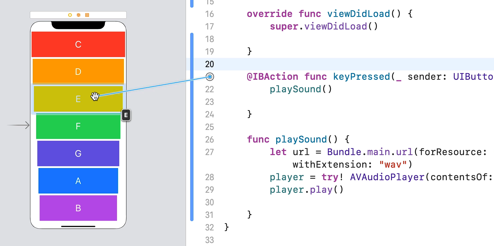

# Notes: Linking Multiple Buttons to a Single IBAction in Swift

## 1. Why Not Create Separate IBActions for Every Button?

* Creating one `IBAction` per button is:

  * Time-consuming (requires linking each button individually).
  * Unnecessary because it creates extra code.
* A better approach is to connect **multiple buttons to the same IBAction**.

---

## 2. Linking Multiple Buttons to One IBAction

* In **Main.storyboard**, drag the existing `IBAction` connection to all buttons.
* Result:

  * Any button press triggers the same function.
  * Less code and easier maintenance.

<p align="center">
    
</p>

Example:

```swift
@IBAction func keyPressed(_ sender: UIButton) {
    playSound()
}
```

---

## 3. Understanding IBAction

An `IBAction` is similar to a normal Swift function:

```swift
@IBAction func keyPressed(_ sender: UIButton) {
    // Code here
}
```

Components:

* `@IBAction` → Connects the function to Interface Builder.
* `func` → Function keyword.
* `keyPressed` → Function name.
* `(sender: UIButton)` → Input parameter.
* `{ }` → Code block.

Difference:

* Normal functions are called manually.
* `IBAction` functions are automatically called when a linked UI element is interacted with.

---

## 4. What is `sender`?

* `sender` represents the button that triggered the action.
* It contains information about the pressed button.

Example:

```swift
print(sender)
```

Output includes:

* Button frame
* Tag
* Appearance properties
* Other UIButton details

---

## 5. Accessing Button Properties

Using dot notation, you can access properties of the pressed button.

Example: Print background color

```swift
print(sender.backgroundColor)
```

Possible outputs:

* `systemYellowColor`
* `systemOrangeColor`
* `systemPurpleColor`

---

## 6. Accessing the Button Title

Since button titles correspond to sound file names (`C`, `D`, `E`, etc.), getting the title helps identify which sound to play.

Possible methods:

```swift
sender.currentTitle
```

```swift
sender.titleLabel?.text
```

```swift
sender.title(for: .normal)
```

Recommended (simplest):

```swift
print(sender.currentTitle)
```

Output:

```
C
D
E
F
G
A
B
```

---

## 7. Key Concept Learned

By using:

```swift
sender.currentTitle
```

you can determine which button was pressed.

Since the button titles match the sound file names, this information can later be passed into the `playSound()` function to play the correct note.

Example idea:

```swift
let note = sender.currentTitle
```

If the user presses **D**, the app can eventually play **D.wav** instead of always playing **C.wav**.

---

## Summary

* Link multiple buttons to a single `IBAction`.
* Use the `sender` parameter to identify the tapped button.
* Access button properties with dot notation.
* Use `sender.currentTitle` to get the button's title.
* The button title can be used to determine which sound file to play, making the xylophone app play different notes.
