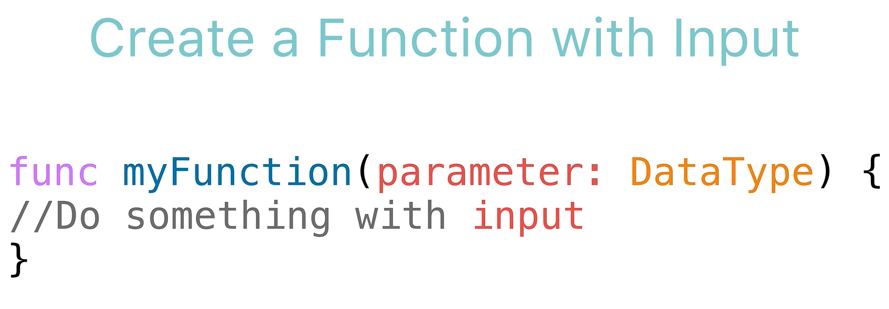
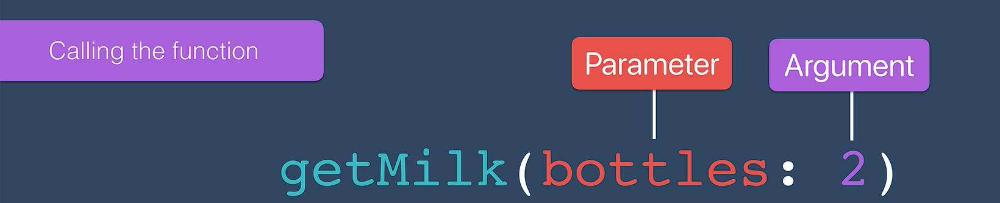
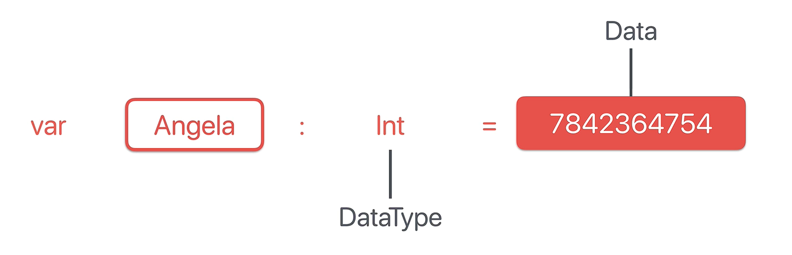

# Swift Deep Dive Notes: Functions with Inputs

## Goal of the Lesson

Learn how **functions can accept inputs** in Swift so they can perform different actions based on the data provided.

**Example Problem:**
When a xylophone key is pressed, pass the button's title to a function that plays a sound.

---

## 1. Function Parameters and Arguments

### Parameter

A **parameter** is an input variable declared when creating a function.

<p align="center">
    
</p>

```swift
func greeting2(whoToGreet: String) {
    print("Hello \(whoToGreet)")
}
```

* `whoToGreet` = parameter name
* `String` = parameter data type

### Argument

An **argument** is the actual value passed into the function when it is called.

<p align="center">
    
</p>

```swift
greeting2(whoToGreet: "Angela")
```

* `"Angela"` = argument

### Key Difference

| Term      | Meaning                                           |
| --------- | ------------------------------------------------- |
| Parameter | Placeholder/input variable in function definition |
| Argument  | Actual value supplied when calling the function   |

---

## 2. Data Types in Swift

Every variable in Swift has a **data type**.

<p align="center">
    
</p>

Examples:

```swift
var age = 12
```

Swift infers:

```swift
age // Int
```

Common data types:

| Data Type | Example |
| --------- | ------- |
| Int       | 12      |
| String    | "Hello" |
| Double    | 3.14    |
| Bool      | true    |

---

## 3. Type Inference

Swift can automatically determine a variable's data type from the assigned value.

```swift
var myAge = 12
```

Swift infers:

```swift
myAge: Int
```

This feature is called **Type Inference**.

---

## 4. Data Types Cannot Change

Once a variable is assigned a data type, it can only store that type.

### Valid

```swift
var myAge = 12
myAge = 20
```

### Invalid

```swift
var myAge = 12
myAge = "Three"
```

Error:

```swift
Cannot assign value of type 'String' to type 'Int'
```

Because:

* `myAge` is an `Int`
* `"Three"` is a `String`

---

## 5. Explicitly Declaring Data Types

Instead of relying on type inference, you can specify the type yourself.

```swift
var myAge: Int = 12
```

or

```swift
var name: String = "Angela"
```

### Important

The declared type overrides the value.

```swift
var myAge: Int = "Twelve"
```

Error because an `Int` variable cannot store a `String`.

---

## 6. Creating Functions with Inputs

Function syntax:

```swift
func functionName(parameterName: DataType) {
    // code
}
```

Example:

```swift
func greeting2(whoToGreet: String) {
    print("Hello \(whoToGreet)")
}
```

* Function expects a `String` input.
* The input is used inside the function body.

---

## 7. String Interpolation

Used to insert variables into text.

```swift
print("Hello \(whoToGreet)")
```

Example output:

```swift
Hello Angela
```

---

## 8. Calling Functions with Different Inputs

```swift
greeting2(whoToGreet: "Angela")
greeting2(whoToGreet: "Jack Bauer")
```

Output:

```swift
Hello Angela
Hello Jack Bauer
```

The same function can produce different results depending on the input.

---

## 9. Why Function Inputs Are Useful

Without inputs:

```swift
func greeting() {
    print("Hello")
}
```

Always produces the same output.

With inputs:

```swift
func greeting2(whoToGreet: String) {
    print("Hello \(whoToGreet)")
}
```

Produces different outputs based on the argument provided.

### Benefit:

Functions become more **reusable** and **flexible**.

---

## Robot Analogy

A robot that can only fetch milk is not very useful.

Without inputs:

```swift
fetchMilk()
```

With inputs:

```swift
fetch(item: "Bread")
fetch(item: "Newspaper")
```

The same function can perform different tasks because of the input provided.

---

## Key Takeaways

* Functions can accept **inputs**.
* Inputs are defined as **parameters**.
* Actual values passed in are called **arguments**.
* Every variable has a **data type**.
* Swift uses **type inference** to determine data types automatically.
* A variable's data type cannot change after creation.
* Functions with inputs are more **reusable** and **adaptable**.
* **String interpolation** (`\(variable)`) allows variables to be inserted into text.
