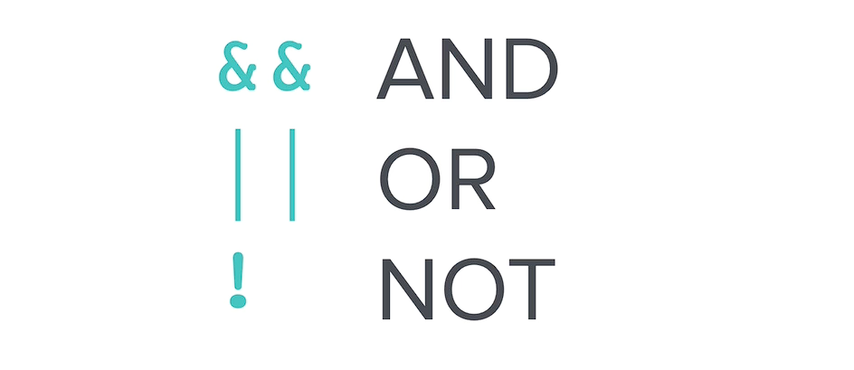

# Swift Deep Dive Notes: If-Else Control Flow

## What Are Conditionals?

Conditionals allow a program to make decisions based on whether a condition is **true** or **false**.

### Basic Idea

```swift
if trafficLight == "green" {
    go()
} else {
    stop()
}
```

* If the condition is **true**, the code inside the `if` block runs.
* If the condition is **false**, the code inside the `else` block runs.

---

## IF, ELSE IF, and ELSE

Use `else if` when there are multiple possible conditions.

### Example

```swift
if trafficLight == "green" {
    print("Go")
} else if trafficLight == "amber" {
    print("Use your judgment")
} else {
    print("Stop")
}
```

### Flow

1. Check the `if` condition.
2. If false, check the `else if` condition.
3. If all conditions are false, execute `else`.

---

# Love Calculator Example

### Step 1: Generate a Random Number

```swift
let loveScore = Int.random(in: 0...100)
```

* `let` creates a constant.
* `Int.random(in:)` generates a random integer within a range.

### Step 2: Use an IF Statement

```swift
if loveScore == 100 {
    print("You love each other like Kanye loves Kanye")
} else {
    print("You'll be forever alone")
}
```

### Important: `==` vs `=`

| Operator | Meaning                        |
| -------- | ------------------------------ |
| `==`     | Checks if two values are equal |
| `=`      | Assigns a value                |

Example:

```swift
loveScore == 100   // Comparison (true/false)
loveScore = 100    // Assignment
```

---

# Comparison Operators

| Operator | Meaning                  |
| -------- | ------------------------ |
| `==`     | Equal to                 |
| `!=`     | Not equal to             |
| `>`      | Greater than             |
| `<`      | Less than                |
| `>=`     | Greater than or equal to |
| `<=`     | Less than or equal to    |

All comparison operators return either:

* `true`
* `false`

---

# Extended Love Calculator

### Requirements

* Score > 80 → Message A
* Score between 40 and 80 → Message B
* Score < 40 → Message C

### Solution

```swift
if loveScore > 80 {
    print("You love each other like Kanye loves Kanye")
} else if loveScore > 40 {
    print("You go together like Coke and Mentos")
} else {
    print("You'll be forever alone")
}
```

---

# How ELSE IF Works

### Example: loveScore = 55

```swift
if loveScore > 80   // false
else if loveScore > 40   // true
```

Output:

```swift
You go together like Coke and Mentos
```

### Example: loveScore = 85

```swift
if loveScore > 80   // true
```

Output:

```swift
You love each other like Kanye loves Kanye
```

Once a condition is true, Swift skips the remaining `else if` and `else` blocks.

---

# Difference Between `else if` and Separate `if`

### Using `else if`

```swift
if loveScore > 80 {
    print("A")
} else if loveScore > 40 {
    print("B")
}
```

For `loveScore = 85`:

* Prints only **A**

### Using Two Separate IF Statements

```swift
if loveScore > 80 {
    print("A")
}

if loveScore > 40 {
    print("B")
}
```

For `loveScore = 85`:

* Prints **A**
* Prints **B**

Reason: Each `if` is checked independently.

---

# Logical Operators

Logical operators combine multiple conditions.

<p align="center">
    
</p>

## AND (`&&`)

Both conditions must be true.

```swift
if loveScore > 40 && loveScore <= 80 {
    print("You go together like Coke and Mentos")
}
```

### Example

For `loveScore = 85`:

* `loveScore > 40` → true
* `loveScore <= 80` → false

Result:

```swift
true && false = false
```

Condition does not run.

---

## OR (`||`)

At least one condition must be true.

```swift
if age < 18 || age > 65 {
    print("Special discount")
}
```

---

## NOT (`!`)

Reverses a boolean value.

```swift
if !isRaining {
    print("Go outside")
}
```

---

# Key Takeaways

* `if` executes code when a condition is true.
* `else` executes when all previous conditions are false.
* `else if` allows checking multiple conditions.
* `==` compares values, while `=` assigns values.
* Comparison operators return `true` or `false`.
* `else if` stops checking after the first true condition.
* Separate `if` statements are all evaluated independently.
* Logical operators:

  * `&&` = AND
  * `||` = OR
  * `!` = NOT

## Quick Structure

```swift
if condition1 {
    // Code
} else if condition2 {
    // Code
} else {
    // Code
}
```

This is the standard Swift pattern for making decisions in your programs.
