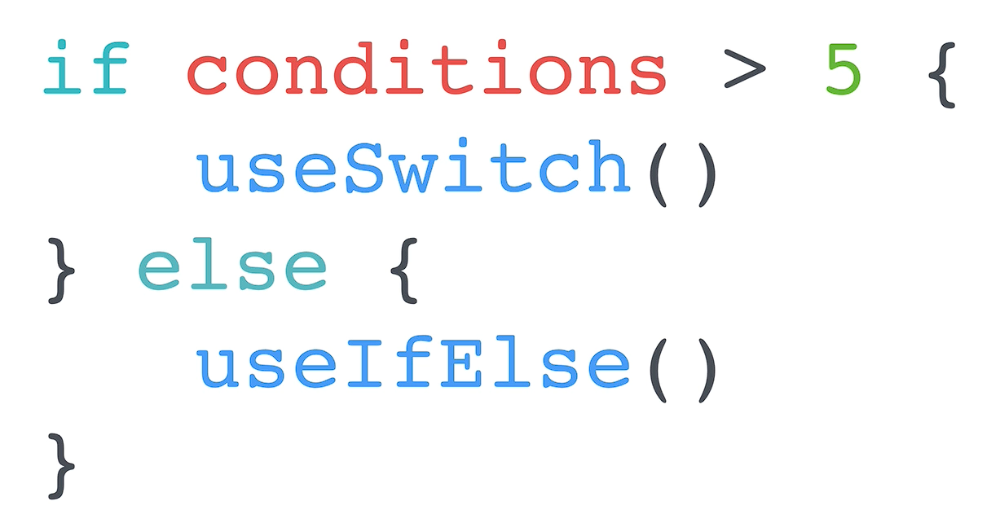
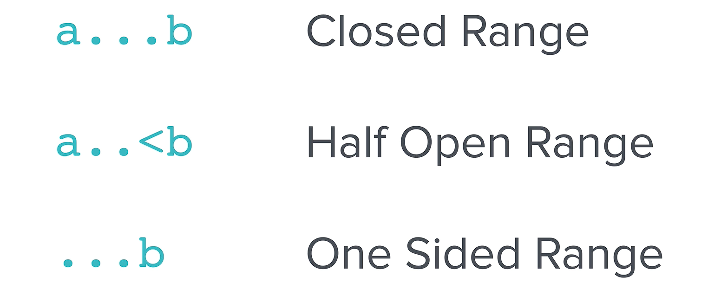

## Swift Deep Dive Notes: Switch Statements

### 1. What is a Switch Statement?

* A **Switch Statement** is used to check a variable's value against multiple possible cases.
* It provides a cleaner and often more efficient alternative to long `if-else` chains.
* Think of it like asking a station manager which platform to use instead of checking every platform manually.

### 2. Basic Structure

```swift
switch variable {
case value1:
    // code
case value2:
    // code
default:
    // code
}
```

### 3. Example: Egg Timer

```swift
switch hardness {
case "Soft":
    print(5)
case "Medium":
    print(7)
case "Hard":
    print(12)
default:
    print("Error")
}
```

**How it works:**

* The value of `hardness` is compared against each case.
* When a match is found, the corresponding code runs.
* `default` acts like an `else` statement and handles unmatched values.

---

## Why Use Switch Statements?

### Advantages

* Less repetitive code than multiple `if-else` statements.
* Easier to read and maintain.
* More efficient when dealing with many conditions (typically more than 5 cases).
* Uses pattern matching instead of checking every condition sequentially.

### When to Use

<p align="center">
    
</p>

| Situation            | Recommended |
| -------------------- | ----------- |
| Few conditions (<5)  | `if-else`   |
| Many conditions (5+) | `switch`    |

---

## Swift Range Operators

<p align="center">
    
</p>

### 1. Closed Range (`...`)

Includes both endpoints.

```swift
1...100
```

Range: **1 to 100 (inclusive)**

---

### 2. Half-Open Range (`..<`)

Includes the first value but excludes the second.

```swift
1..<100
```

Range: **1 to 99**

---

### 3. One-Sided Range

One endpoint is omitted.

```swift
...40
```

Means: **all values up to and including 40**

---

## Using Ranges in Switch Statements

Example from the Love Calculator:

```swift
switch loveScore {

case 81...100:
    print("You love each other like Kanye loves Kanye")

case 41..<81:
    print("You go together like Coke and Mentos")

case ...40:
    print("You'll be forever alone")

default:
    print("Error: Love score out of range")
}
```

### Breakdown

| Love Score   | Output                                       |
| ------------ | -------------------------------------------- |
| 81–100       | "You love each other like Kanye loves Kanye" |
| 41–80        | "You go together like Coke and Mentos"       |
| 0–40         | "You'll be forever alone"                    |
| Other values | Error message                                |

---

## Key Takeaways

* `switch` is a cleaner alternative to long `if-else` chains.
* Every switch statement should include a `default` case.
* Swift switch statements support **range matching**, not just exact values.
* Range operators:

  * `...` → Closed range (inclusive)
  * `..<` → Half-open range (excludes upper bound)
  * `...value` or `value...` → One-sided range
* Switch statements become more beneficial as the number of conditions increases.

### Exam/Interview Tip

A switch statement performs **pattern matching** against cases, making it especially useful for handling many possible values or value ranges in a readable way.
