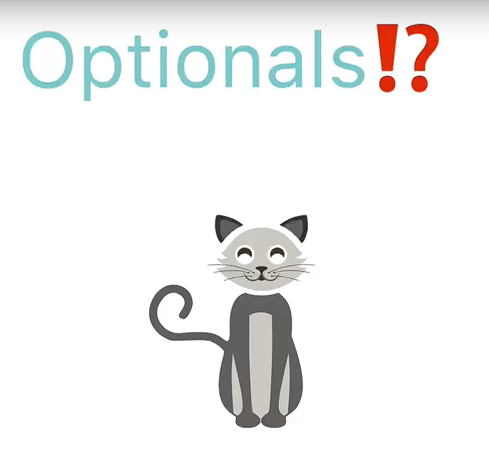
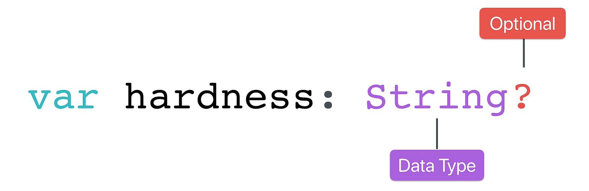

# Swift Deep Dive: Defining and Unwrapping Optional

## What Are Optionals?

<p align="center">
    
</p>

An **Optional** is a special Swift data type that can either:

* Contain a value
* Contain **nil** (no value)

Optionals are used when a variable may not have data yet.

### Example

```swift
var username: String?
```

The `?` means the variable is an **Optional String**.

It can store:

```swift
username = "John"
```

or

```swift
username = nil
```

---

## Why Do We Need Optionals?

Many values in apps may not exist immediately.

Example:

* A user's username before they sign up
* A profile picture before it's uploaded
* Data that hasn't been loaded from a server yet

Without optionals, Swift would not allow variables to contain "nothing."

---

## Creating an Optional

<p align="center">
    
</p>

```swift
var player1Username: String?
```

Initially:

```swift
player1Username = nil
```

Later:

```swift
player1Username = "jackbauerisawesome"
```

---

## Printing an Optional

```swift
print(player1Username)
```

Output:

```swift
Optional("jackbauerisawesome")
```

This shows that the value is still wrapped inside an Optional.

---

## Force Unwrapping (`!`)

To access the actual value:

```swift
print(player1Username!)
```

The `!` is called **force unwrapping**.

It tells Swift:

> "I'm certain this Optional contains a value."

Example:

```swift
let unwrappedUsername = player1Username!
```

Now:

```swift
unwrappedUsername
```

is a normal `String`, not a `String?`.

---

## Danger of Force Unwrapping

If the Optional contains `nil`:

```swift
player1Username = nil
print(player1Username!)
```

The app will **crash**.

Reason:

* Swift cannot use a value that doesn't exist.
* Force unwrapping `nil` causes a runtime error.

---

## Safe Way: Check for nil First

Before force unwrapping, verify the value exists:

```swift
if player1Username != nil {
    print(player1Username!)
}
```

The condition ensures the code only runs when a value is present.

---

## Why Swift Uses Optionals

Swift was designed to be safer than many older programming languages.

A common issue in languages like Java is the **Null Pointer Exception**, which occurs when code tries to use a null value.

Swift's Optionals help prevent these errors by:

1. Making developers aware that a value could be `nil`
2. Encouraging checks before using the value
3. Reducing app crashes

---

# Key Symbols

| Symbol | Meaning                               |
| ------ | ------------------------------------- |
| `?`    | Optional (may contain a value or nil) |
| `!`    | Force unwrap an Optional              |
| `nil`  | No value / empty                      |
| `!=`   | Does not equal                        |

---

# Quick Example

```swift
var player1Username: String?

player1Username = "jackbauerisawesome"

if player1Username != nil {
    print(player1Username!)
}
```

Output:

```swift
jackbauerisawesome
```

---

# Exam / Interview Takeaway

**Optionals in Swift allow variables to either hold a value or `nil`. They improve safety by forcing developers to handle missing data before using it. Use `?` to create an Optional and `!` to force unwrap it, but only when you are certain the value is not `nil`.**
