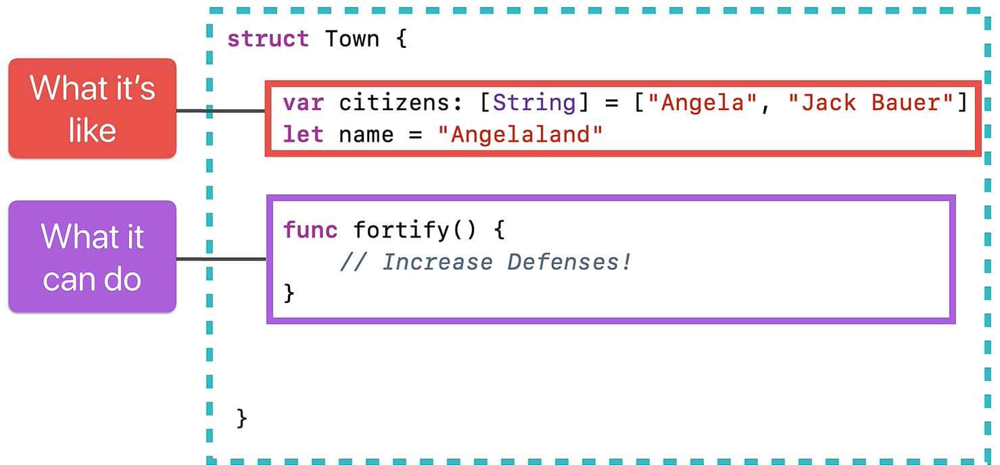
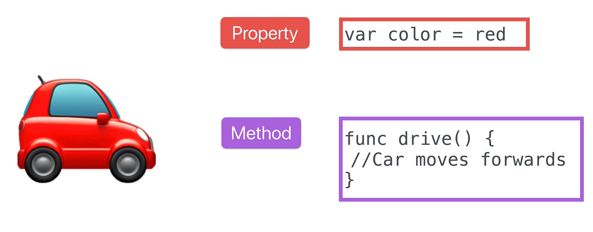
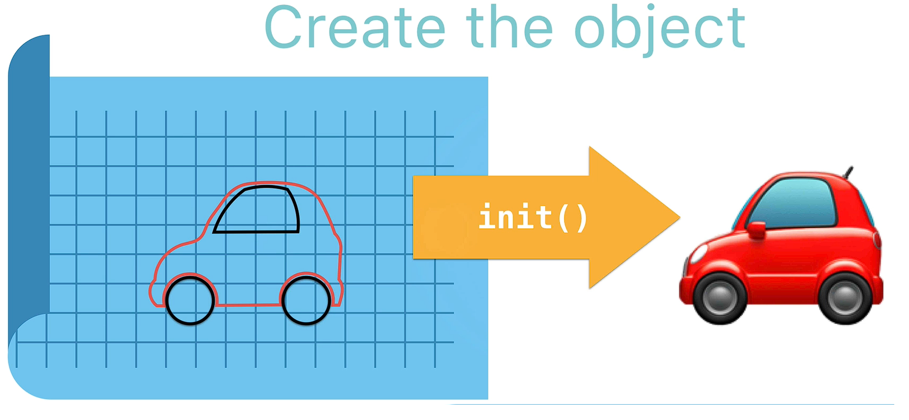

## Swift Deep Dive Notes: Structures, Methods, and Properties

### What is a Structure (`struct`)?

* A **structure** in Swift is a **custom data type** that groups related **properties** (data) and **methods** (behaviors).
* Swift already provides built-in data types like:

  * `String`
  * `Int`
  * `Float`
  * `Double`
  * `Bool`
  * `Array`
  * `Dictionary`
* Structures allow developers to create their own data types.

---

## Why Use Structures?

Instead of storing related information separately, a structure keeps them together.

**Example:** A quiz question has:

* Question text
* Correct answer

These belong together, so they can be grouped inside a structure.

---

## Creating a Structure

```swift
struct Town {
    let name = "Angelaland"
    var citizens = ["Angela", "Jack Bauer"]
    var resources = [
        "Grain": 100,
        "Ore": 42,
        "Wool": 75
    ]
}
```

### Naming Rule

* Struct names should begin with a **capital letter**.
* Examples:

  * `Town`
  * `Car`
  * `Question`

This follows the convention used by Swift's built-in types (`String`, `Int`, etc.).

---

## Properties

Properties describe the characteristics of a structure.

```swift
let name = "Angelaland"
var citizens = ["Angela", "Jack Bauer"]
var resources = ["Grain": 100]
```

### Types of Properties

* **Constants (`let`)** → cannot change
* **Variables (`var`)** → can change

---

## Creating an Object (Initialization)

A structure acts as a **blueprint**.

<p align="center">
    
</p>

To create an actual object:

```swift
var myTown = Town()
```

* `Town` = blueprint
* `myTown` = actual object created from that blueprint

This process is called **initialization**.

---

## Accessing Properties

Use **dot notation**:

```swift
print(myTown.citizens)
print(myTown.name)
```

Access dictionary values:

```swift
myTown.resources["Grain"]
```

---

## Modifying Properties

If a property is declared with `var`, it can be changed.

### Add a Citizen

```swift
myTown.citizens.append("Keanu Reeves")
```

Count citizens:

```swift
print(myTown.citizens.count)
```

---

## Methods

A structure can contain functions.

When a function is inside a structure, it is called a **method**.

```swift
struct Town {

    func fortify() {
        print("Defenses increased!")
    }

}
```

### Calling a Method

```swift
myTown.fortify()
```

Output:

```text
Defenses increased!
```

---

## Function vs Method

| Function                  | Method                         |
| ------------------------- | ------------------------------ |
| Standalone behavior       | Behavior inside a struct/class |
| Not attached to an object | Attached to an object          |
| Example: `print()`        | Example: `myTown.fortify()`    |

---

## Structures as Blueprints

A structure defines:

<p align="center">
    
</p>

### Properties → What an object is like

Examples:

* Car color
* Number of seats
* Number of doors

### Methods → What an object can do

Examples:

* Drive
* Brake
* Turn on indicators

---

# Initializers

An **initializer** lets us customize objects when they are created.

<p align="center">
    
</p>

### Why?

Instead of every town being the same:

```swift
Town()
```

We can create many unique towns:

* Athens
* Beijing
* New Delhi
* Angelaland

---

## Generic Structure

```swift
struct Town {

    let name: String
    var citizens: [String]
    var resources: [String: Int]

}
```

Now the structure has no predefined values.

---

## Creating an Initializer

```swift
init(name: String,
     citizens: [String],
     resources: [String: Int]) {

    self.name = name
    self.citizens = citizens
    self.resources = resources
}
```

### Purpose

The initializer fills the structure's properties using values passed in when the object is created.

---

## Creating Custom Objects

```swift
var anotherTown = Town(
    name: "Nameless Island",
    citizens: ["Tom Hanks"],
    resources: ["Coconuts": 100]
)
```

Another example:

```swift
var ghostTown = Town(
    name: "Ghosty McGhostface",
    citizens: [],
    resources: ["Tumbleweed": 1]
)
```

Both objects:

* Use the same blueprint (`Town`)
* Have different data

---

## The `self` Keyword

`self` refers to the current object being created or used.

Example:

```swift
init(name: String,
     citizens: [String],
     resources: [String: Int]) {

    self.name = name
    self.citizens = citizens
    self.resources = resources
}
```

### Why use `self`?

Without it:

```swift
name = name
```

It's unclear which `name` is being referred to.

With `self`:

```swift
self.name = name
```

Meaning:

> Set the object's `name` property to the value passed into the initializer.

---

## Multiple Objects from One Blueprint

```swift
var town1 = Town(...)
var town2 = Town(...)
```

Both:

* Have type `Town`
* Share the same structure
* Store different values

Changes to one do not affect the other.

```swift
town1.citizens.append("Wilson")
town2.fortify()
```

---

# Key Takeaways

1. **Structures create custom data types.**
2. Use the `struct` keyword to define them.
3. Struct names start with a capital letter.
4. **Properties** describe an object's data.
5. **Methods** describe an object's behavior.
6. A struct is a **blueprint**; objects are created from it.
7. Creating an object is called **initialization**.
8. **Initializers (`init`)** allow custom values when creating objects.
9. Use **dot notation** to access properties and methods.
10. `self` refers to the current object and helps distinguish properties from parameters.
11. Multiple objects can be created from the same structure while holding different data.

### Quick Example

```swift
struct Town {

    let name: String
    var citizens: [String]

    func fortify() {
        print("Defenses increased!")
    }
}

var town = Town(
    name: "Angelaland",
    citizens: ["Angela", "Jack Bauer"]
)

town.fortify()
```

**Output:**

```text
Defenses increased!
```

This demonstrates the core idea of structures: **a blueprint containing properties (data) and methods (behavior) that can be used to create customizable objects.**
