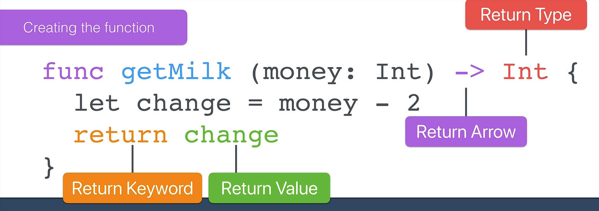

## Swift Deep Dive: Functions with Outputs (Return Values)

### 1. Review of the Three Types of Functions

#### Type 1: Basic Functions

* Group multiple lines of code together.
* Execute code in order when called.
* Useful for avoiding repeated code.

**Example:**

```swift
func greeting() {
    print("Hello")
}
```

---

#### Type 2: Functions with Inputs (Parameters)

* Accept data as input.
* Can perform different actions depending on the input provided.

**Example:**

```swift
func getMilk(bottles: Int) {
    print("Get \(bottles) bottles of milk")
}
```

---

#### Type 3: Functions with Inputs and Outputs (Return Values)

* Accept input.
* Produce an output (return value).
* Most powerful and flexible type of function.

**Example Concept:**

* Input: Money given to a robot.
* Output: Change left after buying milk.

---

## 2. Syntax of a Function with a Return Value

```swift
func functionName(parameter: DataType) -> ReturnType {
    return value
}
```

### Components:

* `func` → Defines a function.
* `parameter: DataType` → Input.
* `-> ReturnType` → Specifies the output type.
* `return` → Sends a value back from the function.

### Important Rule:

The returned value must match the specified return type.

---

## 3. Example: Calculating Change

<p align="center">
    
</p>

```swift
func getMilk(money: Int) -> Int {
    let change = money - 2
    return change
}
```

### Function Call

```swift
let change = getMilk(money: 4)
```

### What Happens?

1. Input = `4`
2. Calculate: `4 - 2 = 2`
3. Return `2`
4. `change` is assigned the value `2`

---

## 4. Function Calls Are Replaced by Their Output

When a function returns a value:

```swift
let change = getMilk(money: 4)
```

is effectively treated as:

```swift
let change = 2
```

because the function call evaluates to its returned value.

---

## 5. Example: Returning a Boolean

### Goal

Check whether a person's name is on a guest list.

```swift
func greeting3(name: String) -> Bool {
    if name == "Angela" || name == "Jack Bauer" {
        return true
    } else {
        return false
    }
}
```

### Logic

* If the name is `"Angela"` or `"Jack Bauer"` → return `true`
* Otherwise → return `false`

---

## 6. Using the Returned Value

### Direct Use

```swift
greeting3(name: "Angela")
```

Output:

```swift
true
```

---

### Storing the Result in a Variable

```swift
let doorShouldOpen = greeting3(name: "Angela")
```

* `doorShouldOpen` becomes a Boolean (`Bool`).
* Value stored: `true`

```swift
print(doorShouldOpen)
```

Output:

```swift
true
```

If the name is not on the guest list:

```swift
let doorShouldOpen = greeting3(name: "Bob")
```

Output:

```swift
false
```

---

## Key Takeaways

* Swift functions can:

  1. Have no inputs or outputs.
  2. Have inputs only.
  3. Have both inputs and outputs.

* Return values are specified using:

  ```swift
  -> ReturnType
  ```

* Use the `return` keyword to send data back.

* The returned value must match the declared return type.

* Function calls with outputs can be assigned to variables.

* Common return types include:

  * `Int`
  * `String`
  * `Bool`
  * Other Swift data types

### Quick Formula

```swift
func name(parameter: Type) -> ReturnType {
    return value
}
```

**Input → Function → Output**
