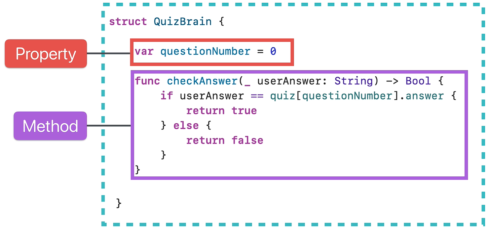

# Swift Deep Dive Notes: Immutability in Structures

## 1. Recap: Structures

A **struct** is a blueprint used to create objects (instances).

A struct can contain:

<p align="center">
    
</p>

### Properties

Variables or constants that describe an object.

```swift
var questionNumber = 0
```

Properties define what an object **has**.

### Methods

Functions inside a struct.

```swift
func getQuestion() {
    // code
}
```

Methods define what an object **does**.

---

# 2. What is Immutability?

**Immutability** means that something cannot be changed after it is created.

Swift uses two keywords:

| Keyword | Meaning                       |
| ------- | ----------------------------- |
| `var`   | Mutable (can be changed)      |
| `let`   | Immutable (cannot be changed) |

Example:

```swift
var score = 10
score = 20
```

This works because `score` is mutable.

```swift
let score = 10
score = 20
```

This causes an error because `score` is immutable.

---

# 3. Immutability Concept

When an object is immutable, you cannot modify part of it directly.

Instead, you must:

1. Create a new copy.
2. Apply the desired changes to the new copy.

Think of an immutable object as a finished stone sculpture. To change it, you create a new sculpture rather than editing the existing one.

---

# 4. Mutating a Struct from Outside

Example:

```swift
struct Town {
    var citizens = ["Angela", "Jack Bauer"]
}

var myTown = Town()
```

Modifying a property:

```swift
myTown.citizens.append("Keanu Reeves")
```

This works because:

* `citizens` is a variable (`var`)
* `myTown` is declared using `var`

---

# 5. Mutating a Struct from Inside

Suppose we add a method:

```swift
struct Town {
    var resources = ["Wool": 75]

    func harvestRice() {
        resources["Rice"] = 100
    }
}
```

Swift produces an error:

```text
Cannot assign through subscript: 'self' is immutable
```

---

# 6. Why Does This Error Occur?

Inside a struct method:

```swift
resources["Rice"] = 100
```

is interpreted as:

```swift
self.resources["Rice"] = 100
```

`self` refers to the current instance of the struct.

By default, Swift treats `self` as immutable inside regular methods, so modifying a property is not allowed.

---

# 7. The `mutating` Keyword

To allow a method to modify properties, mark it with `mutating`.

```swift
struct Town {
    var resources = ["Wool": 75]

    mutating func harvestRice() {
        resources["Rice"] = 100
    }
}
```

Now Swift allows the modification.

Usage:

```swift
var myTown = Town()

myTown.harvestRice()

print(myTown.resources)
```

Output:

```swift
["Wool": 75, "Rice": 100]
```

---

# 8. What Does `mutating` Mean?

The `mutating` keyword tells Swift that the method will change the state of the struct.

Inside a mutating method, `self` behaves like a variable, allowing property modifications.

---

# 9. Types of Methods in a Struct

### Non-Mutating Methods

Do not change any properties.

```swift
func printResources() {
    print(resources)
}
```

Characteristics:

* Read-only
* No `mutating` keyword needed

### Mutating Methods

Modify one or more properties.

```swift
mutating func harvestRice() {
    resources["Rice"] = 100
}
```

Characteristics:

* Changes the struct's state
* Requires the `mutating` keyword

---

# 10. Using `let` with Struct Instances

Example:

```swift
let myTown = Town()
```

The entire instance becomes immutable.

Trying to call:

```swift
myTown.harvestRice()
```

results in an error.

Reason:

* The instance was created using `let`
* Immutable instances cannot be modified
* Mutating methods cannot be called

---

# 11. Important Rules

### Mutable Instance

```swift
var myTown = Town()
myTown.harvestRice()
```

Works because the instance is mutable.

### Immutable Instance

```swift
let myTown = Town()
myTown.harvestRice()
```

Produces an error because the instance is immutable.

### Mutating Method

```swift
mutating func harvestRice() {
    resources["Rice"] = 100
}
```

Required whenever a method changes any property of the struct.

---

# Key Takeaways

* `var` creates mutable values.
* `let` creates immutable values.
* Struct instances created with `let` cannot be modified.
* Inside a struct, `self` is immutable by default.
* Methods that modify properties must be marked with `mutating`.
* Mutating methods can only be called on struct instances declared with `var`.

## One-Line Summary

A method that changes a struct's properties must be marked `mutating`, and the struct instance must be declared with `var` rather than `let`.
