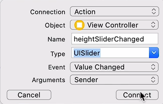
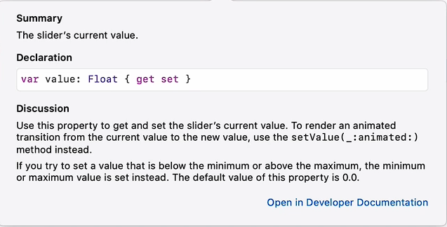

# Notes: How to use UISliders in iOS (Swift/Xcode)

## Lesson Goal

Learn how to use **UISliders** in an iOS app to:

* Detect slider movement
* Read slider values
* Format values properly
* Update labels dynamically
* Prepare slider values for BMI calculation

---

# Project Structure

The project follows the **MVC pattern**:

* **Models**
* **Views**
* **Controllers**

The app contains **2 screens (View Controllers)**:

1. **Calculator Screen**

   * User adjusts:

     * Height slider
     * Weight slider
   * Presses **Calculate**

2. **Result Screen**

   * Displays:

     * BMI result
     * Health advice

---

# UISlider Basics

A **UISlider**:

* Displays a horizontal track
* Lets users choose a value within a range

### Slider Properties

Set in the **Attribute Inspector**:

* **Minimum value**
* **Maximum value**
* **Starting value**

### Example Ranges

#### Height Slider

* Min: `0`
* Max: `3`
* Start: `1.5`

#### Weight Slider

* Min: `0`
* Max: `200`

---

# Desired App Behavior

When the slider moves:

* Corresponding labels update immediately
* Height shows:

  * **2 decimal places**
* Weight shows:

  * **Whole numbers only**

Example:

* Height → `1.75 m`
* Weight → `72 Kg`

---

# Connecting UISliders to Code

## Step 1: Create IBActions

### Height Slider

```swift
@IBAction func heightSliderChanged(_ sender: UISlider) {

}
```

### Weight Slider

```swift
@IBAction func weightSliderChanged(_ sender: UISlider) {

}
```

### Important

<p align="center">
    
</p>

Set sender type to:

```swift
UISlider
```

instead of:

```swift
Any
```

---

# Accessing Slider Value

Use:

```swift
sender.value
```

Example:

```swift
print(sender.value)
```

This prints the current slider position.

---

# Formatting Decimal Places

## Height → 2 Decimal Places

Use String formatting:

```swift
String(format: "%.2f", sender.value)
```

### Explanation

* `%.2f`

  * `2` = number of decimal places
  * `f` = floating-point number

---

# Removing Decimal Places

<p align="center">
    
</p>

## Option 1: String Formatting

```swift
String(format: "%.0f", sender.value)
```

## Option 2: Convert to Integer

```swift
Int(sender.value)
```

---

# Creating IBOutlets for Labels

Connect labels to code:

```swift
@IBOutlet weak var heightLabel: UILabel!
@IBOutlet weak var weightLabel: UILabel!
```

---

# Updating Labels Dynamically

## Height Label

```swift
let height = String(format: "%.2f", sender.value)
heightLabel.text = "\(height)m"
```

---

## Weight Label

```swift
let weight = String(format: "%.0f", sender.value)
weightLabel.text = "\(weight)Kg"
```

---

# String Interpolation

Used to combine values with text:

```swift
"\(value)m"
```

Example Output:

```swift
1.75m
```

---

# Common Problem: Type Mismatch

This causes an error:

```swift
weightLabel.text = Int(sender.value)
```

### Why?

* `text` expects a **String**
* `Int()` returns an **Integer**

### Fix

Convert to String:

```swift
String(Int(sender.value))
```

OR use formatting:

```swift
String(format: "%.0f", sender.value)
```

---

# Key Concepts Learned

## UIKit Components

* UISlider
* UILabel

## Swift Concepts

* IBActions
* IBOutlets
* String formatting
* Type conversion
* String interpolation

---

# Final Behavior

The app should:

* Update labels live while dragging sliders
* Display:

  * Height with 2 decimal places
  * Weight as whole numbers
* Keep units visible (`m`, `Kg`)

---

# Important Notes

### Warning in Storyboard

`"View Controller is unreachable"`

* Safe to ignore for now
* Will be fixed later when learning navigation between screens

---

# Next Lesson Preview

Next step:

* Use slider values to calculate BMI
* Access slider values outside IBActions
* Navigate between screens
