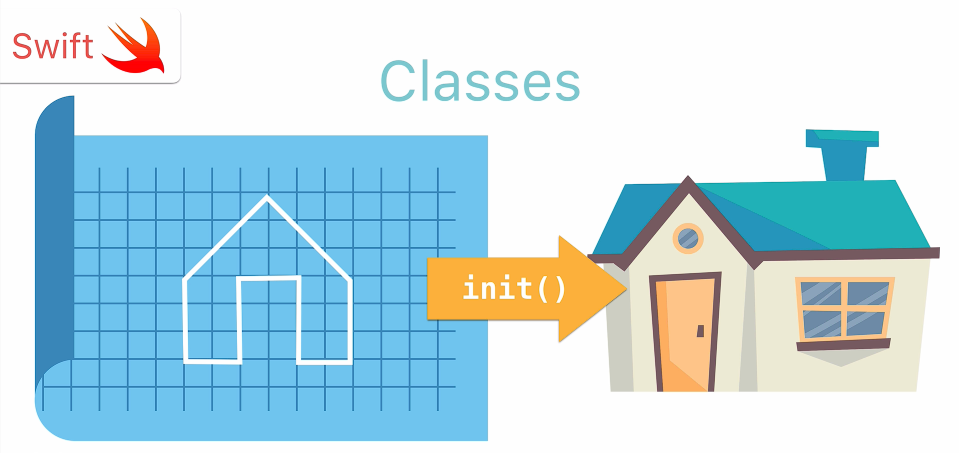

# Swift Deep Dive Notes: Classes and Inheritance

## What Are Classes?

<p align="center">
    
</p>

* A **class** is a blueprint for creating objects.
* Like **structs**, classes can contain:

  * **Properties** (data/attributes)
  * **Methods** (functions/behaviors)
* Objects are created (initialized) from a class.

```swift
class Enemy {
    var health = 100
    var attackStrength = 10

    func move() {
        print("Walk forwards")
    }

    func attack() {
        print("Land a hit, does \(attackStrength) damage")
    }
}
```

---

## Creating Objects from a Class

Create an object by using the class name followed by parentheses.

```swift
let skeleton = Enemy()
```

Access properties:

```swift
print(skeleton.health)
```

Call methods:

```swift
skeleton.move()
skeleton.attack()
```

### Output

```text
100
Walk forwards
Land a hit, does 10 damage
```

---

## Why Use Classes?

Classes allow you to create many objects from the same blueprint without rewriting code.

```swift
let skeleton1 = Enemy()
let skeleton2 = Enemy()
let skeleton3 = Enemy()
```

Each object automatically gets:

* `health`
* `attackStrength`
* `move()`
* `attack()`

---

# Inheritance

## What Is Inheritance?

Inheritance allows one class (**Subclass**) to gain all the properties and methods of another class (**Superclass**).

### Terminology

| Term        | Meaning                                        |
| ----------- | ---------------------------------------------- |
| Superclass  | Parent class                                   |
| Subclass    | Child class                                    |
| Inheritance | Child receives parent’s properties and methods |

---

## Creating a Subclass

```swift
class Dragon: Enemy {

}
```

`Dragon` inherits everything from `Enemy`.

```swift
let dragon = Dragon()

dragon.move()
dragon.attack()
```

Even though `Dragon` is empty, it can still use all `Enemy` functionality.

---

# Adding New Properties

A subclass can have its own unique properties.

```swift
class Dragon: Enemy {
    var wingSpan = 2
}
```

Usage:

```swift
dragon.wingSpan = 5
```

Only dragons have `wingSpan`; regular enemies do not.

---

# Using Inherited Properties

A subclass can also access properties inherited from the superclass.

```swift
dragon.attackStrength = 15
```

The property comes from `Enemy` but is available in `Dragon`.

---

# Adding New Methods

A subclass can have its own custom methods.

```swift
class Dragon: Enemy {

    func talk(speech: String) {
        print(speech)
    }
}
```

Usage:

```swift
dragon.talk(speech: "My teeth are swords!")
```

---

# Overriding Methods

## What Is Overriding?

Overriding allows a subclass to replace a method inherited from its superclass.

### Example

Enemy movement:

```swift
func move() {
    print("Walk forwards")
}
```

Dragon movement:

```swift
override func move() {
    print("Fly forwards")
}
```

Now:

```swift
dragon.move()
```

Output:

```text
Fly forwards
```

---

# Calling the Superclass Method

Sometimes you want to keep the original behavior and add more functionality.

Use the `super` keyword.

### Example

```swift
override func attack() {
    super.attack()
    print("Spits fire and does 10 damage")
}
```

### What Happens?

1. Calls `Enemy.attack()`
2. Executes Dragon-specific code

Output:

```text
Land a hit, does 15 damage
Spits fire and does 10 damage
```

---

# Benefits of Inheritance

* Reduces code duplication
* Reuses existing functionality
* Makes code easier to maintain
* Allows specialization of classes

Instead of rewriting everything, subclasses build on top of existing classes.

---

# Real-World Example: UIKit

Apple heavily uses inheritance in UIKit.

Inheritance chain:

```text
NSObject
   ↓
UIResponder
   ↓
UIView
   ↓
UIControl
   ↓
UIButton
```

### Meaning

* `UIButton` inherits from `UIControl`
* `UIControl` inherits from `UIView`
* `UIView` inherits from `UIResponder`
* `UIResponder` inherits from `NSObject`

Each level adds more specialized functionality.

---

# Key Exam/Interview Points

### Class

A blueprint used to create objects.

### Object

An instance of a class.

### Property

A variable stored inside a class.

### Method

A function inside a class.

### Superclass

The parent class being inherited from.

### Subclass

The child class that inherits from another class.

### Inheritance

The ability of a subclass to gain properties and methods from a superclass.

### Override

Replacing an inherited method with a custom implementation.

### `super`

Calls the original implementation from the superclass.

---

# Quick Recap

1. Classes are blueprints for objects.
2. Objects are created using class initialization.
3. Classes contain properties and methods.
4. Subclasses inherit from superclasses.
5. Subclasses can:

   * Add new properties
   * Add new methods
   * Override inherited methods
6. `super` allows access to the superclass implementation.
7. Inheritance is a major advantage of classes and is widely used throughout UIKit.
