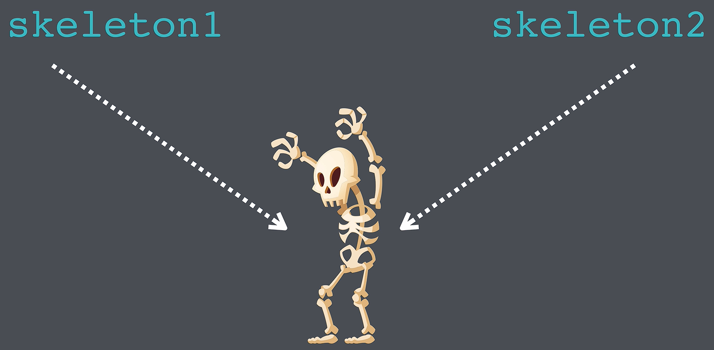

## Swift Deep Dive Notes: Structs vs Classes

### 1. Similarities Between Structs and Classes

* Both are **blueprints** used to group:

  * **Properties (attributes)** → e.g., `health`, `attackStrength`
  * **Methods (behavior)** → e.g., `takeDamage()`
* Both can create multiple objects/instances from the same blueprint.
* Both can have **initializers**.

---

### 2. Key Differences

| Struct                                 | Class                                                         |
| -------------------------------------- | ------------------------------------------------------------- |
| Passed by **value**                    | Passed by **reference**                                       |
| Gets a **free memberwise initializer** | Must provide initializer if properties have no default values |
| Cannot inherit from other types        | Supports inheritance                                          |
| Generally immutable by default         | Mutable objects                                               |
| Safer and simpler                      | More complex and error-prone                                  |

---

### 3. Initializers

#### Struct

Swift automatically provides a memberwise initializer:

```swift
struct Enemy {
    var health: Int
    var attackStrength: Int
}
```

Usage:

```swift
let enemy = Enemy(health: 100, attackStrength: 10)
```

#### Class

Must create an initializer manually:

```swift
class Enemy {
    var health: Int
    var attackStrength: Int

    init(health: Int, attackStrength: Int) {
        self.health = health
        self.attackStrength = attackStrength
    }
}
```

---

### 4. Classes are Passed by Reference

<p align="center">
    
</p>

Example:

```swift
let skeleton1 = Enemy(health: 100, attackStrength: 10)
let skeleton2 = skeleton1
```

* `skeleton2` is **not a copy**.
* Both variables point to the **same object**.

If:

```swift
skeleton1.takeDamage(10)
```

Then:

```swift
print(skeleton2.health)
```

Output:

```swift
90
```

because both references point to the same object.

#### Problem

Changes through one reference affect all references:

```swift
skeleton1.takeDamage(10)
skeleton2.takeDamage(20)
```

Both variables now reflect the same final health value.

---

### 5. Structs are Passed by Value

<p align="center">
    
</p>

Example:

```swift
var skeleton1 = Enemy(health: 100, attackStrength: 10)
var skeleton2 = skeleton1
```

* A **real copy** is created.
* Each variable owns its own data.

If:

```swift
skeleton1.takeDamage(10)
```

then:

```swift
skeleton2.health
```

remains unchanged.

#### Result

* Modifying one copy does not affect the other.
* Behavior is easier to understand and predict.

---

### 6. Mutating Methods in Structs

Structs require the `mutating` keyword when modifying properties:

```swift
mutating func takeDamage(_ amount: Int) {
    health -= amount
}
```

Without `mutating`, Swift gives an error.

Also, structs must be declared with `var` if they will change:

```swift
var skeleton1 = Enemy(...)
```

not

```swift
let skeleton1 = Enemy(...)
```

---

### 7. Inheritance

#### Classes Support Inheritance

```swift
class Dragon: Enemy {
    // additional functionality
}
```

#### Structs Do Not

```swift
struct Enemy { }
```

A struct cannot be used as a superclass.

---

### 8. Value vs Reference Analogy

#### Struct (Value Type)

Giving someone a **copy of a photo**.

* Everyone has their own copy.
* Editing or deleting one copy doesn't affect others.

#### Class (Reference Type)

Giving someone the **location of a photo**.

* Everyone accesses the same photo.
* If someone changes or deletes it, everyone is affected.

---

### 9. Apple's Recommendation

**Default to using structs.**

Use a **class** only when:

* You need **inheritance**
* You need compatibility with **Objective-C** code
* Shared reference behavior is required

---

## Summary: Structs Vs Classes

### Structs

* Value type
* Passed by value
* Free memberwise initializer
* Requires `mutating` methods for modifications
* No inheritance
* Safer and easier to reason about

### Classes

* Reference type
* Passed by reference
* Manual initializer often required
* Supports inheritance
* Multiple variables can point to the same object
* More powerful but more error-prone

### Rule of Thumb

> Start with a **struct**. Switch to a **class** only if you need inheritance, Objective-C interoperability, or shared reference semantics.
