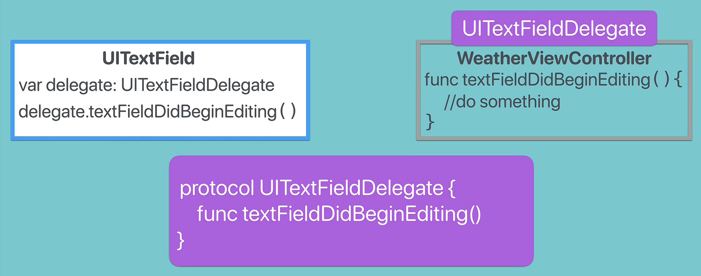

# Notes: Swift Delegate Design Patterns

## What is the Delegate Design Pattern?

A **delegate design pattern** is a common solution for allowing one object to **communicate events or changes to another object** without needing to know anything about that object's specific type.

### Definition

A delegate is an object that acts on behalf of, or responds to events from, another object.

The delegate pattern in Swift is built on top of **protocols**.

---

# Why Do We Need Delegates?

### The Problem

Apple creates reusable UI components such as:

* `UITextField`
* `UIButton`
* `UILabel`

These components should be reusable in **any app**.

Suppose a developer creates:

```swift
class WeatherViewController {
}
```

and wants to know when a user starts typing in a `UITextField`.

### Naive Solution

The `UITextField` could directly call:

```swift
weatherVC.textFieldDidBeginEditing()
```

But this creates several problems:

* Apple doesn't know what custom classes developers will create.
* `UITextField` cannot depend on future classes.
* It would be impossible to support every possible class.

**Goal:** Allow any class to receive notifications from a `UITextField` without the text field knowing anything about that class.

---

# Solution: Protocol + Delegate Pattern

<p align="center">
    
</p>

## Step 1: Create a Protocol

The protocol defines what methods a delegate must implement.

Example:

```swift
protocol UITextFieldDelegate {
    func textFieldDidBeginEditing()
}
```

This protocol acts as a contract.

Any class that adopts it promises:

> "I know how to handle text field events."

---

## Step 2: Adopt the Protocol

```swift
class WeatherViewController: UITextFieldDelegate {

    func textFieldDidBeginEditing() {
        print("User started editing")
    }
}
```

Now `WeatherViewController` can act as a delegate.

---

## Step 3: Add a Delegate Property

Inside `UITextField`:

```swift
var delegate: UITextFieldDelegate?
```

The delegate property can hold any object that conforms to the protocol.

---

## Step 4: Assign the Delegate

In the view controller:

```swift
let textField = UITextField()

textField.delegate = self
```

### What does `self` mean?

`self` refers to the current object.

In this case:

```swift
textField.delegate = self
```

means:

> "WeatherViewController will be the delegate for this text field."

---

## Step 5: Notify the Delegate

When the user begins editing:

```swift
delegate?.textFieldDidBeginEditing()
```

The text field doesn't know:

* Which class the delegate is
* What the class does
* What properties it contains

It only knows:

> "This object conforms to UITextFieldDelegate, so it must have a textFieldDidBeginEditing() method."

---

# Event Flow (Sequence)

### 1. Create a UITextField

```swift
let textField = UITextField()
```

### 2. Set Delegate

```swift
textField.delegate = self
```

### 3. User Starts Editing

```swift
textField detects editing
```

### 4. Text Field Calls Delegate Method

```swift
delegate?.textFieldDidBeginEditing()
```

### 5. Delegate Responds

```swift
func textFieldDidBeginEditing() {
    // custom code
}
```

---

# Why Delegates Are Useful

### 1. Reusability

`UITextField` can work with any class.

Examples:

* WeatherViewController
* LoginViewController
* SearchViewController
* ChatViewController

No changes are needed inside `UITextField`.

---

### 2. Loose Coupling

The text field doesn't depend on specific classes.

It only depends on the protocol.

```text
UITextField
     ↓
UITextFieldDelegate
     ↓
Any conforming class
```

---

### 3. Flexibility

You can swap delegates easily.

```swift
textField.delegate = weatherVC
```

or

```swift
textField.delegate = loginVC
```

As long as they conform to the protocol.

---

### 4. Type Safety

Swift guarantees that a delegate has implemented the required methods.

Because:

```swift
class MyVC: UITextFieldDelegate
```

must implement:

```swift
func textFieldDidBeginEditing()
```

---

# Real-World Analogy

### Teacher and Class Monitor

* Teacher = `UITextField`
* Monitor = Delegate
* Rules/Responsibilities = Protocol

The teacher doesn't care who the monitor is.

The teacher only knows:

> "Anyone who becomes monitor must perform these duties."

When something happens:

```text
Teacher → tells Monitor
```

Similarly:

```text
UITextField → tells Delegate
```

---

# Relationship Between Protocols and Delegates

### Protocol

Defines **what methods are required**.

```swift
protocol UITextFieldDelegate {
    func textFieldDidBeginEditing()
}
```

### Delegate

The object that adopts the protocol.

```swift
class WeatherViewController: UITextFieldDelegate
```

### Delegate Property

Stores the delegate object.

```swift
var delegate: UITextFieldDelegate?
```

### Delegate Method Call

Used to notify the delegate.

```swift
delegate?.textFieldDidBeginEditing()
```

---

# Key Takeaways

* The **delegate pattern** allows one object to notify another object about events.
* It is heavily used throughout UIKit.
* Delegates are built using **protocols**.
* A protocol defines required methods.
* Any class conforming to the protocol can become a delegate.
* The delegating object doesn't need to know the delegate's actual class.
* This creates **reusable**, **flexible**, and **loosely coupled** code.

## Extras

**Protocols define the contract.**

**Delegates implement the contract.**

**The delegating object sends notifications through the contract without knowing who receives them.**

### Workflow

```text
- Protocol
- Delegate adopts protocol
- Object stores delegate reference
- Object calls delegate methods
- Delegate responds
```

This pattern is the foundation of many UIKit components such as:

* `UITextFieldDelegate`
* `UITableViewDelegate`
* `UICollectionViewDelegate`
* `UIScrollViewDelegate`
