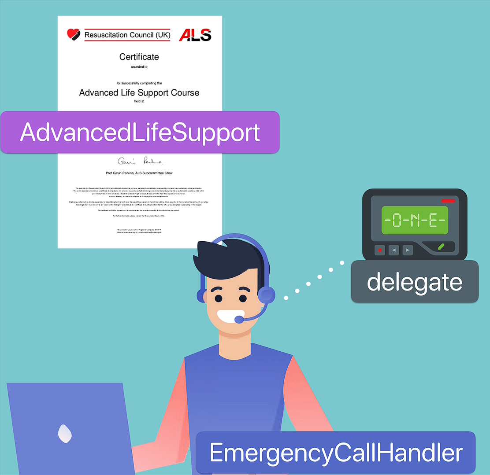
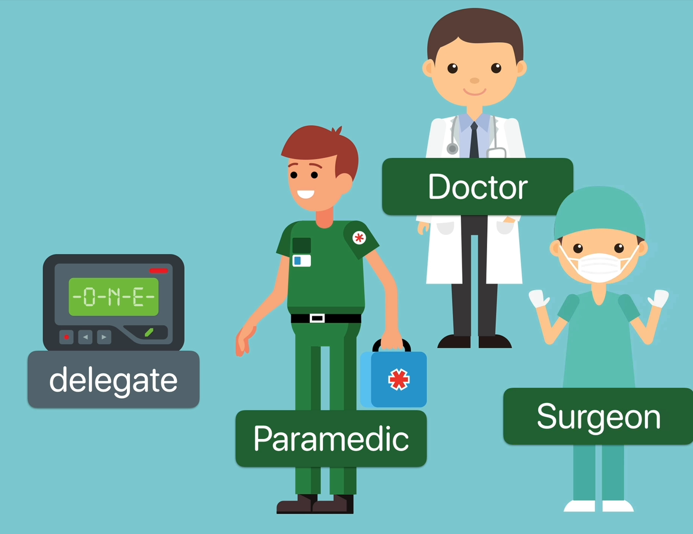

# Example: Protocols & Delegates in Swift

## Why Learn Protocols & Delegation?

* Protocols and delegation are fundamental concepts in Swift.
* They can feel abstract at first, so understanding them through analogies helps.
* Delegation allows one object to notify another object to perform a task without knowing the details of that object.

---

## Emergency Call Center Analogy

### Roles

<p align="center">
    
</p>

| Analogy                                 | Swift Concept              |
| --------------------------------------- | -------------------------- |
| Emergency Call Handler                  | Class that owns a delegate |
| Bleep/Pager                             | Delegate property          |
| Person carrying pager                   | Delegate                   |
| Advanced Life Support (ALS) Certificate | Protocol                   |
| CPR                                     | Required protocol method   |

### Key Idea

The emergency call handler does **not care who carries the pager**.

<p align="center">
    
</p>

It only cares that whoever carries it:

* Has completed the ALS course.
* Knows how to perform CPR.

This is exactly how protocols work.

---

## What is a Protocol?

A protocol defines a set of requirements.

```swift
protocol AdvancedLifeSupport {
    func performCPR()
}
```

### Important:

* A protocol only specifies **what must exist**.
* It does **not provide implementation**.
* Any class or struct adopting the protocol must implement all required methods.

---

## Delegate Property

The emergency call handler has a delegate property:

```swift
var delegate: AdvancedLifeSupport?
```

### Why use the protocol as the type?

Because the handler only needs to know:

> "Can this object perform CPR?"

It doesn't need to know:

* Whether it's a paramedic
* A doctor
* A surgeon

---

## EmergencyCallHandler

Responsibilities:

* Take calls
* Assess situations
* Trigger emergencies

Example:

```swift
func medicalEmergency() {
    delegate?.performCPR()
}
```

### Key Point

The handler calls:

```swift
delegate?.performCPR()
```

without knowing who the delegate is.

---

## Paramedic as Delegate

```swift
struct Paramedic: AdvancedLifeSupport {
    func performCPR() {
        print("Doing chest compressions")
    }
}
```

Since `Paramedic` adopts `AdvancedLifeSupport`, it must implement:

```swift
performCPR()
```

---

## Setting the Delegate

When a paramedic starts their shift:

```swift
handler.delegate = self
```

This means:

> "I am the delegate. Notify me when CPR is needed."

Equivalent to picking up the emergency pager.

---

## Delegation Flow

### 1. Create objects

```swift
let emilio = EmergencyCallHandler()
let pete = Paramedic(handler: emilio)
```

### 2. Emergency occurs

```swift
emilio.medicalEmergency()
```

### 3. Delegate is notified

```swift
delegate?.performCPR()
```

### 4. Paramedic responds

```swift
Doing chest compressions
```

---

## Multiple Possible Delegates

The power of delegation is that different objects can become delegates.

### Doctor

```swift
class Doctor: AdvancedLifeSupport {
    func performCPR() {
        print("Doing chest compressions")
    }
}
```

Additional functionality:

```swift
func useStethoscope() {
    print("Listening for heart sounds")
}
```

---

### Surgeon

```swift
class Surgeon: Doctor {
    override func performCPR() {
        super.performCPR()
        print("Singing Stayin' Alive")
    }
}
```

Additional functionality:

```swift
func useElectricDrill() {
    print("Whirr...")
}
```

---

## Inheritance + Protocols

Since:

```swift
class Surgeon: Doctor
```

and Doctor already adopts:

```swift
AdvancedLifeSupport
```

the Surgeon automatically inherits protocol conformance.

The surgeon can:

* Use the existing implementation.
* Override methods for custom behavior.

---

## Main Benefit of Delegation

The emergency call handler remains completely unaware of:

* Whether the delegate is a paramedic.
* A doctor.
* A surgeon.

It only knows:

```swift
delegate?.performCPR()
```

As long as the delegate conforms to:

```swift
AdvancedLifeSupport
```

everything works.

---

## Real-World Connection to UIKit

In UIKit:

```swift
UITextField
```

acts like the EmergencyCallHandler.

Its delegate:

```swift
UITextFieldDelegate
```

must adopt the required protocol.

When an event occurs, the text field notifies its delegate, just like the emergency handler notifying whoever carries the pager.

---

## Short Version

### Protocol

Defines a contract (requirements).

### Delegate

An object assigned to handle specific tasks or events.

### Delegation Pattern

A design pattern where:

1. One object owns a delegate property.
2. The delegate conforms to a protocol.
3. Events are forwarded to the delegate through protocol methods.

### Core Benefit

**Loose coupling** — the sender doesn't need to know the exact type of the receiver, only that it conforms to the required protocol.
