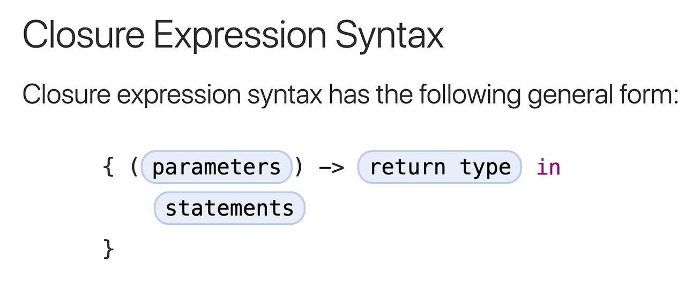

# Swift Deep Dive Notes: Closures

## What Are Closures?

* **Closures are anonymous functions** (functions without a name).
* They are **self-contained blocks of functionality** that can be passed around and used in code.
* You can think of a regular function as a **named closure**.

### Function Structure

A normal function contains:

1. `func` keyword
2. Function name
3. Input parameters
4. Return type
5. Function body

Example:

```swift
func add(no1: Int, no2: Int) -> Int {
    return no1 + no2
}
```

---

# Functions as Parameters

Swift allows:

* Passing a function **into another function**
* Returning a function **from another function**

Example:

```swift
func calculator(
    n1: Int,
    n2: Int,
    operation: (Int, Int) -> Int
) -> Int {
    return operation(n1, n2)
}
```

### Passing Functions

```swift
func add(no1: Int, no2: Int) -> Int {
    return no1 + no2
}

calculator(n1: 2, n2: 3, operation: add)
```

Another example:

```swift
func multiply(no1: Int, no2: Int) -> Int {
    return no1 * no2
}

calculator(n1: 2, n2: 3, operation: multiply)
```

---

# Converting a Function into a Closure

### Original Function

```swift
func multiply(no1: Int, no2: Int) -> Int {
    return no1 * no2
}
```

### Step 1: Remove `func` and function name

```swift
{ (no1: Int, no2: Int) -> Int in
    return no1 * no2
}
```

### Closure Syntax

```swift
{ (parameters) -> ReturnType in
    // code
}
```

Components:

* Parameters
* Return type
* `in` keyword
* Closure body

---

# Closure Simplification Techniques

## 1. Type Inference

Swift can infer parameter and return types.

```swift
{ (no1, no2) in
    return no1 * no2
}
```

---

## 2. Implicit Return

For single-expression closures, `return` can be omitted.

```swift
{ (no1, no2) in
    no1 * no2
}
```

---

## 3. Shorthand Argument Names

Swift automatically provides:

* `$0` = first parameter
* `$1` = second parameter
* `$2` = third parameter

Example:

```swift
{ $0 * $1 }
```

---

## 4. Trailing Closure Syntax

If a closure is the **last parameter**, it can be written outside the parentheses.

Instead of:

```swift
calculator(n1: 2, n2: 3, operation: { $0 * $1 })
```

Use:

```swift
calculator(n1: 2, n2: 3) { $0 * $1 }
```

This is called a **trailing closure**.

---

# Benefits of Closures

### Advantages

* Less code
* More concise syntax
* Easy to pass functionality around
* Commonly used in Swift APIs

### Disadvantages

* Can reduce readability
* May be confusing for beginners
* Requires familiarity with Swift syntax

---

# Real-World Use: `map`

Closures are often used with higher-order functions like `map`.

### Example Array

```swift
let array = [6, 2, 3, 9, 4, 1]
```

---

## Using a Function with `map`

```swift
func addOne(n1: Int) -> Int {
    return n1 + 1
}

array.map(addOne)
```

Result:

```swift
[7, 3, 4, 10, 5, 2]
```

---

## Using a Closure with `map`

Full closure:

```swift
array.map({ (n1: Int) -> Int in
    return n1 + 1
})
```

Simplified:

```swift
array.map { $0 + 1 }
```

Result:

```swift
[7, 3, 4, 10, 5, 2]
```

---

# Another `map` Example: Convert Ints to Strings

```swift
let newArray = array.map {
    "\($0)"
}
```

Result:

```swift
["6", "2", "3", "9", "4", "1"]
```

This transforms every integer into a string.

---

# Important Higher-Order Functions

Swift provides three powerful collection functions:

1. **map** → Transform each item.
2. **filter** → Keep only items that match a condition.
3. **reduce** → Combine all items into a single value.

---

# Key Points 

* Closures are **anonymous functions**.
* Functions can be passed as **parameters** and returned as **values**.
* Closure syntax:

<p align="center">
    
</p>

```swift
{ (parameters) -> ReturnType in
    // code
}
```

* `in` separates the closure signature from its body.
* Swift supports:

  * Type inference
  * Implicit returns
  * Shorthand arguments (`$0`, `$1`, etc.)
  * Trailing closures
* Closures are heavily used with functions like `map`, `filter`, and `reduce`.

## One-Line Definition

**A closure is a self-contained, anonymous block of code that can capture functionality and be passed around or executed later.**
