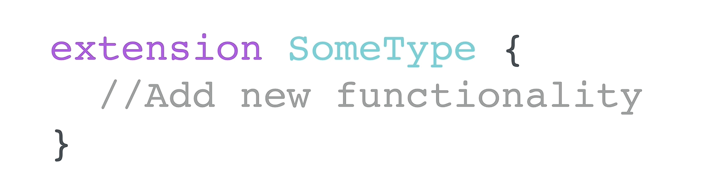

# Swift Deep Dive Notes: Extensions

## What are Extensions?

<p align="center">
    
</p>

* **Extensions** allow you to add new functionality to existing types without modifying the original code.
* Can be used with:

  * Classes
  * Structs
  * Enums
  * Protocols
  * Built-in Swift types (e.g., `Double`)
* Useful when a project needs new features without rewriting existing implementations.

**Syntax:**

```swift
extension ExistingType {
    // New functionality
}
```

---

## Extending Existing Types

### Example: Extending `Double`

Problem:

* Swift's built-in `round()` rounds to the nearest whole number.
* There is no built-in method to round to a specific number of decimal places.

Solution:

* Create an extension on `Double`.
* Add a custom method:

```swift
extension Double {
    func round(to places: Int) -> Double {
        // implementation
    }
}
```

### How the Rounding Works

1. Calculate a precision value:

   * `10^places`
2. Multiply the number by the precision.
3. Round it.
4. Divide by the precision again.
5. Return the result.

Example:

```swift
3.14159 → 3141.59
→ 3142
→ 3.142
```

### Key Concepts

* Extensions can add methods to types you didn't create.
* New methods can have the same name as existing methods if parameters differ (method overloading).
* `self` refers to the current instance of the type.

---

## Extending UIKit Classes

Even if you don't have access to a class's source code (e.g., UIKit classes), you can still extend it.

### Example: Making a Circular UIButton

Without an extension:

```swift
button.layer.cornerRadius = 25
button.clipsToBounds = true
```

With an extension:

```swift
extension UIButton {
    func makeCircular() {
        self.clipsToBounds = true
        self.layer.cornerRadius = self.frame.size.width / 2
    }
}
```

Usage:

```swift
button.makeCircular()
```

### Benefits

* Reusable code.
* Cleaner implementation.
* Makes custom functionality available to all instances of that type.

---

## Extending Protocols

Extensions can also provide **default implementations** for protocol requirements.

### Example

Protocol:

```swift
protocol CanFly {
    func fly()
}
```

Extension:

```swift
extension CanFly {
    func fly() {
        print("The object takes off into the air")
    }
}
```

### Benefits

* Types adopting the protocol automatically receive the default behavior.
* No need to implement the method unless custom behavior is desired.

Example:

```swift
struct Airplane: CanFly { }

let myPlane = Airplane()
myPlane.fly()
```

Output:

```swift
The object takes off into the air
```

---

## Real-World Example: Delegate Protocols

Protocols such as `UITextFieldDelegate` contain many methods.

Why don't we need to implement all of them?

Because Swift provides **default implementations** through protocol extensions, making many delegate methods effectively optional.

Benefits:

* Less boilerplate code.
* Only implement methods you actually need.

---

## Using Extensions for Code Organization

Extensions are also useful for organizing large classes.

Instead of putting everything inside one class:

```swift
class WeatherViewController {
    // lots of delegate methods
}
```

Use separate extensions:

```swift
extension WeatherViewController: UITextFieldDelegate {
    // text field methods
}

extension WeatherViewController: UITableViewDelegate {
    // table view methods
}
```

### Advantages

* Cleaner code.
* Easier navigation.
* Better separation of responsibilities.
* Improves readability in large projects.

---

## Key Takeaways

* Extensions add functionality to existing types without changing original code.
* Can extend:

  * Built-in Swift types
  * Custom classes/structs
  * UIKit classes
  * Protocols
* Protocol extensions can provide default implementations.
* Extensions promote:

  * Reusability
  * Maintainability
  * Cleaner architecture
  * Better code organization

### Short Analogy

Think of extensions like adding new stations to an existing train line:

* The original line remains intact.
* New functionality is added without rebuilding everything.
