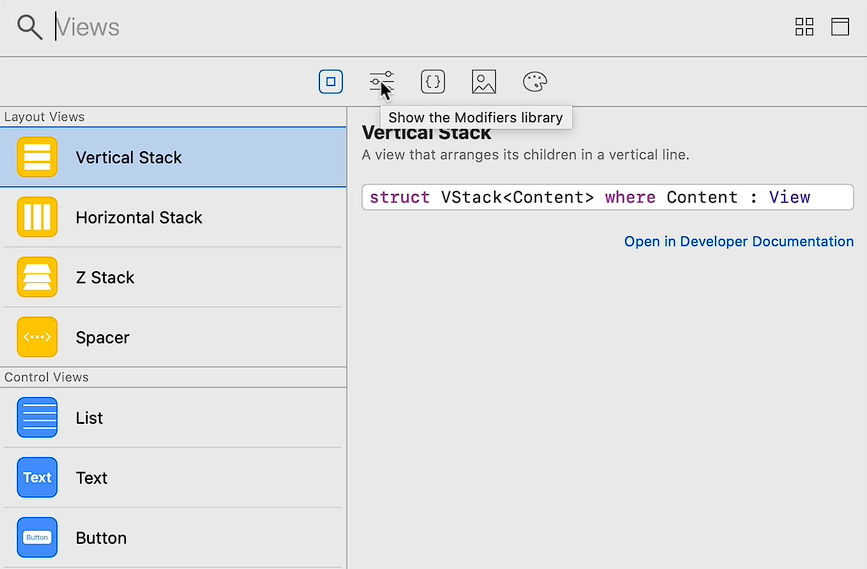
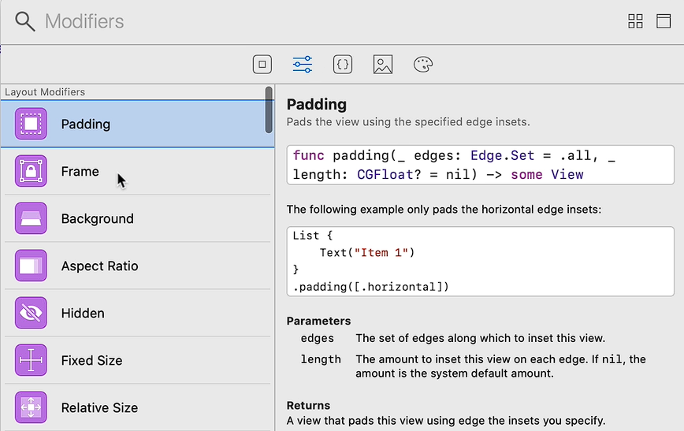

# Notes: Creating Your First SwiftUI App from Scratch ("I Am Rich")

## 1. Creating a New SwiftUI Project

* Open **Xcode** → **File → New Project**.
* Choose **iOS → Single View App**.
* Name the project **"I Am Rich"**.
* **Important:** Set **User Interface = SwiftUI** (not Storyboards).
* Save the project.

---

## 2. Preparing the Workspace

* Close unnecessary side panels to increase coding space.
* Disable the **Minimap**:

  * **Editor → Uncheck Minimap**
* Start the live preview by clicking **Resume**.
* The preview appears in the **Canvas** on the right.
* Use pinch-to-zoom if needed.

---

## 3. Understanding SwiftUI File Structure

A SwiftUI file typically contains:

1. **Main View Structure**

   * Defines the UI and its behavior.

2. **Preview Structure**

   * Controls how the view is displayed in the canvas preview.

Example uses of previews:

* Preview on different devices.
* Change device type using `.previewDevice()`.

Example:

```swift
.previewDevice("iPhone SE")
```

**Note:** Some preview devices may be unstable or crash because SwiftUI previews are still evolving.

---

## 4. Editing Text

The default code displays:

```swift
Text("Hello World")
```

Change it to:

```swift
Text("I Am Rich")
```

This is similar to a UILabel in UIKit.

---

## 5. Using Modifiers

Modifiers customize views.

Example:

```swift
Text("I Am Rich")
    .font(.system(size: 40))
```

Common text modifiers:

* Font
* Font weight
* Text color
* Alignment
* Padding

To make text bold and white:

```swift
Text("I Am Rich")
    .font(.system(size: 40))
    .fontWeight(.bold)
    .foregroundColor(.white)
```

---

## 6. Using the Object Library

<p align="center">
    
    
</p>

<p align="center">
    
</p>

The **Object Library (+ button)** allows you to:

* Drag and drop UI components.
* Add modifiers visually.
* Generate SwiftUI code automatically.

You can also inspect and edit properties using the **Attribute Inspector**.

---

## 7. Adding a Background Color

Since white text disappears on a white background, add a background color.

Use a **ZStack** to layer views:

```swift
ZStack {
    Color.systemTeal
    Text("I Am Rich")
}
```

### Extending Background into Safe Areas

Add:

```swift
.edgesIgnoringSafeArea(.all)
```

Example:

```swift
Color.systemTeal
    .edgesIgnoringSafeArea(.all)
```

**Result:** The background fills the entire screen.

---

## 8. Understanding Stacks

### ZStack

* Layers views on top of each other.
* Works along the Z-axis (depth).

Example:

* Background color behind text.

### VStack

* Arranges views vertically.
* Useful for placing text above an image.

Example:

```swift
VStack {
    Text("I Am Rich")
    Image("diamond")
}
```

---

## 9. Adding Assets

1. Open **Assets.xcassets**.
2. Import:

   * App icons
   * Diamond image asset
3. The diamond image should be named:

```text
diamond
```

Use it in code:

```swift
Image("diamond")
```

---

## 10. Working with Images

### Display an Image

```swift
Image("diamond")
```

### Make It Resizable

```swift
Image("diamond")
    .resizable()
```

### Maintain Aspect Ratio

```swift
.aspectRatio(contentMode: .fit)
```

This prevents image distortion.

### Set a Frame Size

```swift
.frame(
    width: 200,
    height: 200,
    alignment: .center
)
```

Complete example:

```swift
Image("diamond")
    .resizable()
    .aspectRatio(contentMode: .fit)
    .frame(width: 200, height: 200)
```

---

## Key Concepts Learned

### Views

* `Text`
* `Image`
* `Color`

### Layout Containers

* `ZStack` → Layer views
* `VStack` → Vertical arrangement

### Important Modifiers

* `.font()`
* `.fontWeight()`
* `.foregroundColor()`
* `.resizable()`
* `.aspectRatio()`
* `.frame()`
* `.edgesIgnoringSafeArea()`

### Tools

* Canvas Preview
* Object Library
* Modifier Library
* Attribute Inspector

---

## Final App Structure

```swift
ZStack {
    Color.systemTeal
        .edgesIgnoringSafeArea(.all)

    VStack {
        Text("I Am Rich")
            .font(.system(size: 40))
            .fontWeight(.bold)
            .foregroundColor(.white)

        Image("diamond")
            .resizable()
            .aspectRatio(contentMode: .fit)
            .frame(width: 200, height: 200)
    }
}
```

### Result

A simple SwiftUI app with:

* A teal background
* Bold white "I Am Rich" text
* A centered diamond image
* Layout built using `ZStack` and `VStack`
* Components customized using SwiftUI modifiers.
