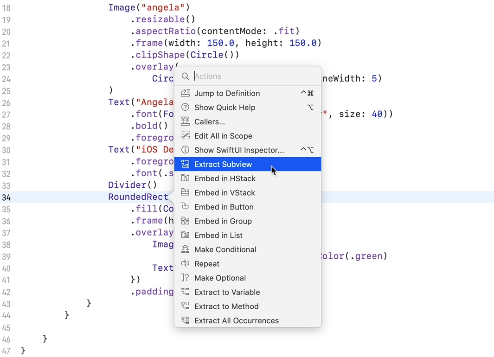

# Notes: How to Create Complex Designs and Layouts using SwiftUI (Business Card)

## Lesson Objectives

By the end of this lesson, you will learn how to:

* Create more complex layouts using **SwiftUI stacks**
* Use **custom fonts** from the internet
* Work with **RGB colors** and **HEX color codes**
* Use **SF Symbols** (Apple's icon library)
* Extract reusable **Subviews**
* Build a professional **Business Card App**

---

## 1. Creating the Project

### Setup

* Create a new **Single View App**
* Name it (e.g., `AngelaCard`)
* Select **SwiftUI** as the User Interface

---

## 2. Adding a Background Color

### Using ZStack

A `ZStack` layers views on top of each other.

```swift
ZStack {
    Color.green
        .edgesIgnoringSafeArea(.all)

    Text("Angela Yu")
}
```

### Key Points

* `ZStack` = front-to-back layout
* `edgesIgnoringSafeArea(.all)` makes the color fill the entire screen

---

## 3. Using Custom Colors (HEX → RGB)

### Color Components

SwiftUI colors use RGB values:

```swift
Color(
    red: 0.10,
    green: 0.74,
    blue: 0.61
)
```

### Notes

* RGB values range from **0 to 1**
* HEX colors can be converted to RGB using online tools
* `opacity` is optional

Example:

```swift
Color(
    red: 0.10,
    green: 0.74,
    blue: 0.61,
    opacity: 1.0
)
```

---

## 4. Styling Text

### Common Text Modifiers

```swift
Text("Angela Yu")
    .font(.largeTitle)
    .bold()
    .foregroundColor(.white)
```

### Useful Modifiers

* `.font()`
* `.bold()`
* `.foregroundColor()`

---

## 5. Using Custom Fonts

### Download Font

* Download font from Google Fonts
* Example: **Pacifico**

### Add to Project

1. Create a `Fonts` group
2. Drag `.ttf` file into Xcode
3. Ensure **Add to Targets** is checked

### Update Info.plist

Add:

```
Fonts provided by application
```

Then:

```
Pacifico-Regular.ttf
```

### Use Font

```swift
Text("Angela Yu")
    .font(.custom("Pacifico-Regular", size: 40))
```

---

## 6. Organizing Content with VStack

### Vertical Layout

```swift
VStack {
    Text("Angela Yu")
    Text("iOS Developer")
}
```

### Purpose

* Arranges views from **top to bottom**

---

## 7. Adding Images

### Import Image

* Drag image into Assets folder
* Example image name:

```swift
"Angela"
```

### Display Image

```swift
Image("Angela")
```

---

## 8. Resizing Images

### Make Image Resizable

```swift
Image("Angela")
    .resizable()
```

### Preserve Aspect Ratio

```swift
.aspectRatio(contentMode: .fit)
```

### Set Size

```swift
.frame(width: 150, height: 150)
```

---

## 9. Creating Circular Profile Images

### Clip Shape

```swift
.clipShape(Circle())
```

Result:

* Square image becomes circular

---

## 10. Adding a Border Around the Image

### Overlay Modifier

```swift
.overlay(
    Circle()
        .stroke(Color.white, lineWidth: 5)
)
```

### Concept

* `overlay()` places another view on top
* `stroke()` creates an outline

---

## 11. Separating Sections with Divider

```swift
Divider()
```

Used to:

* Separate profile section from contact details

---

## 12. Creating Contact Cards

### Rounded Rectangle

```swift
RoundedRectangle(cornerRadius: 25)
```

### Set Size

```swift
.frame(height: 50)
```

### Fill Color

```swift
.fill(Color.white)
```

---

## 13. Adding Text Over Shapes

### Overlay Text

```swift
.overlay(
    Text("123 456 789")
)
```

---

## 14. SF Symbols (Apple Icons)

### Create System Icons

```swift
Image(systemName: "phone.fill")
```

### Examples

* `phone.fill`
* `envelope.fill`

### Benefits

* Thousands of free Apple-designed icons
* Built directly into SwiftUI

---

## 15. Using HStack for Horizontal Layouts

### Arrange Icon + Text

```swift
HStack {
    Image(systemName: "phone.fill")
    Text("123 456 789")
}
```

### Purpose

* Arranges views from **left to right**

---

## 16. Changing Icon Colors

```swift
Image(systemName: "phone.fill")
    .foregroundColor(.green)
```

---

## 17. Adding Padding

```swift
.padding()
```

### Purpose

* Adds space around a view
* Similar to margins in web development

---

## 18. Extracting Reusable Subviews

### Why?

Avoid duplicated code.

### Extract Subview

1. Select component
2. Right-click
3. Choose **Extract Subview**

<p align="center">
    
</p>

Example name:

```swift
InfoView
```

---

## 19. Creating a Reusable InfoView

### Parameters

```swift
struct InfoView: View {

    let text: String
    let imageName: String

    var body: some View {
        // UI code
    }
}
```

### Usage

```swift
InfoView(
    text: "123 456 789",
    imageName: "phone.fill"
)
```

Another example:

```swift
InfoView(
    text: "angela@email.com",
    imageName: "envelope.fill"
)
```

---

## 20. Creating a Separate SwiftUI File

Create:

```text
InfoView.swift
```

Move the reusable component into this file to keep code organized.

---

## 21. Previewing Individual Components

### Preview Layout

```swift
.previewLayout(.sizeThatFits)
```

### Benefit

* Preview only the component size
* Easier than rendering a full phone screen

---

## Key SwiftUI Components Learned

| Component        | Purpose                          |
| ---------------- | -------------------------------- |
| ZStack           | Layer views front-to-back        |
| VStack           | Arrange views vertically         |
| HStack           | Arrange views horizontally       |
| Image            | Display images                   |
| Divider          | Separate sections                |
| RoundedRectangle | Custom card shape                |
| Circle           | Circular shapes/profile pictures |
| Overlay          | Place views on top of others     |
| SF Symbols       | Apple icon library               |

---

## Important Modifiers Learned

| Modifier             | Purpose                    |
| -------------------- | -------------------------- |
| `.font()`            | Change font                |
| `.foregroundColor()` | Change color               |
| `.resizable()`       | Resize image               |
| `.aspectRatio()`     | Preserve image proportions |
| `.frame()`           | Set width/height           |
| `.clipShape()`       | Crop into shape            |
| `.overlay()`         | Add layer on top           |
| `.padding()`         | Add spacing                |
| `.fill()`            | Fill a shape with color    |
| `.previewLayout()`   | Customize preview          |

---

# Final App Features

* Custom background color
* Custom Google Font (Pacifico)
* Circular profile image with border
* Name and job title
* Phone number card with icon
* Email card with icon
* Reusable `InfoView` component
* Clean SwiftUI layout using stacks and modifiers
