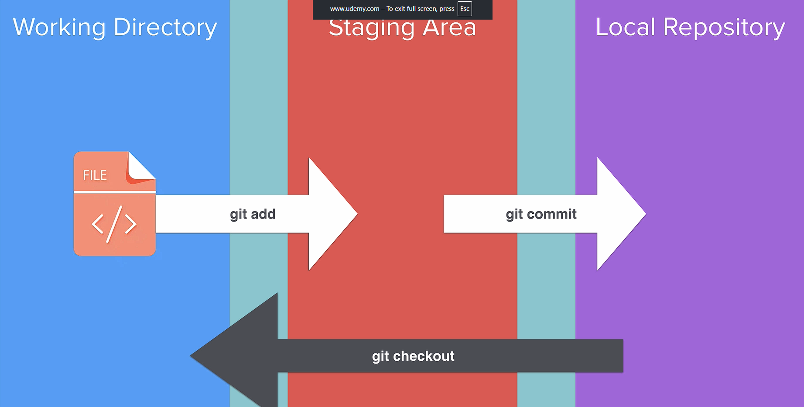

# Notes: Version Control using Git and Command Line

### 1. Creating a Project Directory

* Open **Terminal**.
* Navigate to the Desktop:

  ```bash
  cd Desktop
  ```
* Create a new folder:

  ```bash
  mkdir Story
  ```
* Enter the folder:

  ```bash
  cd Story
  ```
* Check contents:

  ```bash
  ls
  ```

### 2. Creating Files

* Create a text file:

  ```bash
  touch chapter1.txt
  ```
* Open the file:

  ```bash
  open chapter1.txt
  ```

  * Opens in TextEdit (Mac default).
  * Advanced users can use terminal editors like Vim.

### 3. Initializing Git

* Create a Git repository:

  ```bash
  git init
  ```
* View hidden files:

  ```bash
  ls -a
  ```
* A hidden `.git` folder is created to store version history.

---

## Key Git Concepts

<p align="center">
    
</p>

### Working Directory

* The folder where Git is initialized.
* Example: `Story` directory.
* Contains files currently being worked on.

### Staging Area

* An intermediate area between the working directory and repository.
* Lets you choose which changes will be included in the next commit.

### Local Repository

* Stored inside the `.git` folder.
* Contains committed versions (save points) of your project.

---

## Tracking Files with Git

### Check Status

```bash
git status
```

* **Red files** = untracked (not staged).
* **Green files** = staged and ready to commit.

### Add a File to Staging

```bash
git add chapter1.txt
```

### Add All Files

```bash
git add .
```

---

## Committing Changes

### Create a Commit

```bash
git commit -m "Complete Chapter 1"
```

### Commit Message Best Practices

* Be descriptive.
* Use **present tense**.
* Examples:

  * "Complete Chapter 1" --> Correct
  * "Completed Chapter 1" --> Incorrect

### View Commit History

```bash
git log
```

Shows:

* Commit hash (unique identifier)
* Author
* Date and time
* Commit message

---

## Example Workflow

### First Commit

1. Create `chapter1.txt`
2. Add content
3. Stage file:

   ```bash
   git add chapter1.txt
   ```
4. Commit:

   ```bash
   git commit -m "Complete Chapter 1"
   ```

### Second Commit

1. Create:

   ```bash
   touch chapter2.txt chapter3.txt
   ```
2. Edit files
3. Stage all:

   ```bash
   git add .
   ```
4. Commit:

   ```bash
   git commit -m "Complete Chapter 2 and 3"
   ```

---

## Understanding HEAD

* **HEAD** points to the current commit you're working from.
* In `git log`, HEAD indicates your current position in project history.

---

## Viewing Changes

### Compare Current File with Last Commit

```bash
git diff chapter3.txt
```

Shows:

* **Red** = removed content
* **Green** = added content

Useful for reviewing modifications before committing.

---

## Reverting Changes

### Restore a File to Last Committed Version

```bash
git checkout chapter3.txt
```

Use when:

* You made unwanted changes.
* The changes have **not yet been committed**.

Result:

* File returns to its state from the most recent commit.

---

## Git Workflow Summary

```text
Working Directory
       │
   git add
       ▼
 Staging Area
       │
 git commit
       ▼
Local Repository (.git)
```

### Common Commands Cheat Sheet

| Command                   | Purpose                               |
| ------------------------- | ------------------------------------- |
| `git init`                | Initialize a Git repository           |
| `git status`              | Check file status                     |
| `git add file.txt`        | Stage a specific file                 |
| `git add .`               | Stage all files                       |
| `git commit -m "message"` | Create a commit                       |
| `git log`                 | View commit history                   |
| `git diff file.txt`       | View changes in a file                |
| `git checkout file.txt`   | Revert file to last committed version |
| `ls -a`                   | Show hidden files including `.git`    |

---

## Key Takeaway

Git tracks changes through a three-step process:

**Working Directory → Staging Area → Repository**

This allows you to:

* Save project checkpoints (commits).
* Review changes before saving.
* Restore previous versions if mistakes occur.
* Maintain a complete history of your work.
