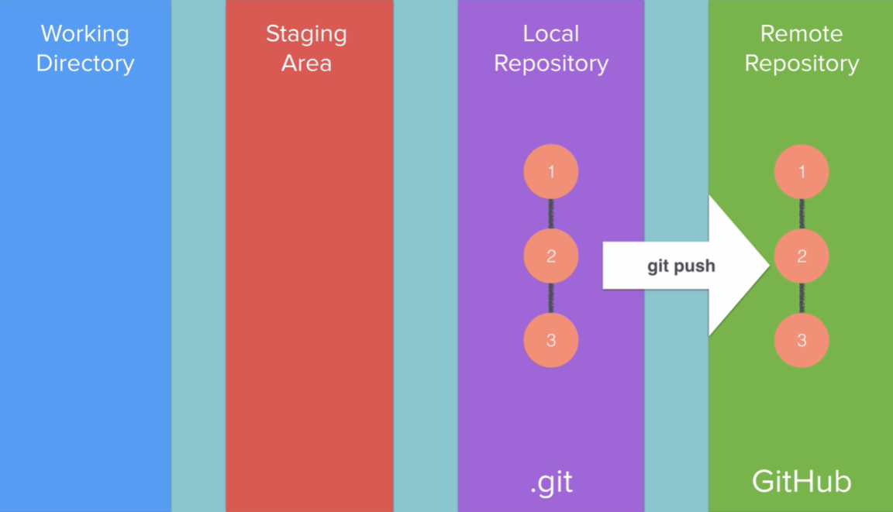

# Notes: GitHub and Remote Repositories

## What is a Remote Repository?

* A **remote repository** is a Git repository hosted on another computer/server, commonly on **[GitHub](https://github.com)**.
* It allows you to store, share, and collaborate on projects online.
* GitHub is widely used for hosting Git repositories and open-source projects.

---

## Creating a GitHub Repository

1. Sign up for a GitHub account.
2. Click the **+** button in the top-right corner and select **New repository**.
3. Enter:

   * Repository name (e.g., `Story`)
   * Description (optional)
4. Choose repository visibility:

   * **Public**: Anyone can view the repository.
   * **Private**: Restricted access (may require a paid plan depending on GitHub's policies).
5. Leave **Initialize README** unchecked if you already have a local Git repository.
6. Click **Create repository**.

---

## Benefits of Public Repositories

* Learn from other developers' code.
* Explore open-source projects.
* Contribute to community projects.
* Showcase your work and coding style.
* Collaborate with developers worldwide.

---

## Connecting a Local Repository to GitHub

### Step 1: Add a Remote Repository

```bash
git remote add origin <repository-url>
```

Example:

```bash
git remote add origin https://github.com/username/Story.git
```

#### Explanation

* `git remote add` → Adds a remote repository.
* `origin` → Conventional name for the remote repository.
* `<repository-url>` → URL of the GitHub repository.

> Although you can use any name instead of `origin`, it is best practice to use `origin` because it is the standard convention.

### Step 2: Push Local Repository to GitHub

```bash
git push -u origin master
```

#### Breakdown

* `git push` → Uploads commits to the remote repository.
* `-u` → Links (tracks) the local and remote branches.
* `origin` → Name of the remote repository.
* `master` → Branch being pushed (default/main branch in this lesson).

---

## What Happens During a Push?

* Git uploads all commits from the local repository to GitHub.
* The remote repository becomes synchronized with the local repository.
* Git establishes tracking between local and remote branches.

Example message:

```text
Branch master set up to track remote branch master from origin.
```

---

## Viewing Repository History on GitHub

GitHub allows you to:

* View all project files.
* See commit history.
* Examine changes made in each commit.
* Visualize project progress through graphs and network views.

Useful sections:

* **Commits** → View all save points.
* **Insights → Network** → Visual representation of commits and branches.

---

## Git Workflow Recap

### 1. Working Directory

* The folder containing project files.

### 2. Staging Area

* Temporary area where selected files are prepared for commit.

```bash
git add .
```

### 3. Local Repository

* Stores commits (save points) on your machine.

```bash
git commit -m "Commit message"
```

### 4. Remote Repository

* Online version of the repository hosted on GitHub.

```bash
git push
```

Flow:

<p align="center">
    
</p>

---

## Understanding the Master Branch

* The **master branch** (often called **main** in modern repositories) is the primary branch.
* It contains the main sequence of commits.
* Commits are arranged chronologically, creating a project timeline.

Example:

```text
Commit 1 → Commit 2 → Commit 3
```

This sequence forms the master/main branch.

---

## Local vs Remote Repository

| Local Repository           | Remote Repository                  |
| -------------------------- | ---------------------------------- |
| Stored on your computer    | Hosted online (e.g., GitHub)       |
| Used for development       | Used for sharing and collaboration |
| Can exist without internet | Requires internet access           |
| Contains commit history    | Contains synced commit history     |

---

## Key Commands Summary

```bash
# View commit history
git log

# Add GitHub repository as remote
git remote add origin <repository-url>

# Push commits to GitHub
git push -u origin master
```

---

## Key Takeaways

* GitHub hosts remote Git repositories online.
* Use `git remote add origin <url>` to connect a local repository to GitHub.
* Use `git push -u origin master` to upload commits.
* `origin` is the standard name for a remote repository.
* The **master/main branch** contains the primary project history.
* GitHub provides tools to view commits, changes, and project progress.
* Local and remote repositories can be independent but are usually synchronized using `git push`.

### Next Topic

**`.gitignore`** — preventing sensitive files (API keys, passwords, configuration files, etc.) from being uploaded to GitHub.
