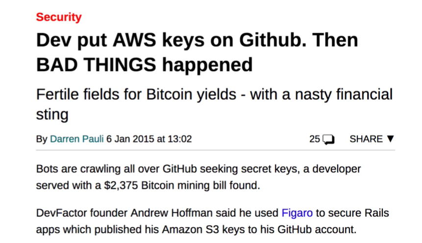

# Notes: Gitignore

## What is `.gitignore`?

A `.gitignore` file tells Git which files or folders should **not be tracked, staged, committed, or pushed** to repositories.

### Common Reasons to Ignore Files

1. **Sensitive information**

   * API keys
   * Passwords
   * Secret credentials
   * AWS keys

2. **Local user settings**

   * Personal preferences
   * Machine-specific configuration files
   * Files that are not useful to collaborators

3. **Generated or temporary files**

   * Cache files
   * Build artifacts
   * IDE-specific files

---

## Why Use `.gitignore`?

Without a `.gitignore`, Git tracks all files added to the staging area.

Example files:

```text
file1.txt
file2.txt
file3.txt
secrets.txt
.DS_Store
```

Problems:

* `secrets.txt` may expose confidential information.
* `.DS_Store` is a macOS settings file that is unnecessary for collaborators.

---

## Creating a `.gitignore` File

Create a hidden file named:

```bash
.gitignore
```

The name must be exactly:

```text
.gitignore
```

Git specifically looks for this filename.

---

## Viewing Hidden Files

To see hidden files:

```bash
ls -a
```

This displays files such as:

```text
.gitignore
.DS_Store
```

---

## Basic Git Workflow Without `.gitignore`

Initialize Git:

```bash
git init
```

Add all files:

```bash
git add .
```

Check status:

```bash
git status
```

Result:

* All files are staged, including unwanted files like `secrets.txt` and `.DS_Store`.

---

## Removing Files from Staging Area

If unwanted files were staged:

```bash
git rm --cached -r .
```

Then check:

```bash
git status
```

Files are removed from the staging area but remain in your project folder.

---

## Adding Rules to `.gitignore`

Ignore specific files:

```text
.DS_Store
secrets.txt
```

After saving:

```bash
git add .
git status
```

Only non-ignored files are staged.

---

## `.gitignore` Syntax Rules

### 1. Ignore Individual Files

```text
secrets.txt
.DS_Store
```

---

### 2. Comments

Use `#` for comments:

```text
# Files to ignore
secrets.txt
```

---

### 3. Wildcards

Ignore all files with a specific extension:

```text
*.txt
```

This ignores:

```text
file1.txt
file2.txt
notes.txt
```

---

## Example `.gitignore`

```text
# Secret files
secrets.txt

# macOS files
.DS_Store
```

---

## Committing After Using `.gitignore`

Stage files:

```bash
git add .
```

Commit:

```bash
git commit -m "Initial Commit"
```

Only files not listed in `.gitignore` are committed.

---

## Using `.gitignore` in Xcode Projects

For Swift/Xcode projects, many user-specific files should be ignored.

Instead of writing rules manually, use GitHub's prebuilt templates.

Common ignored items:

* User settings
* Workspace data
* Build files
* Machine-specific configuration

You can copy a Swift/Xcode `.gitignore` template and paste it into your project's `.gitignore`.

---

## Important Security Tip

Always add the following to `.gitignore`:

* API keys
* Password files
* Secret configuration files
* Access tokens
* Cloud service credentials (AWS, etc.)

Accidentally pushing secrets to a public repository can lead to:

* Security breaches
* Unauthorized access
* Financial loss

<p align="center">
    
</p>

---

## Key Commands Cheat Sheet

```bash
# Create .gitignore
touch .gitignore

# View hidden files
ls -a

# Initialize repository
git init

# Add files
git add .

# Check status
git status

# Remove staged files
git rm --cached -r .

# Commit changes
git commit -m "Initial Commit"
```

### Important Takeaway

**`.gitignore` is used to prevent Git from tracking files that are sensitive, temporary, machine-specific, or unnecessary for collaboration.** It improves security, keeps repositories clean, and prevents accidental exposure of confidential data.
