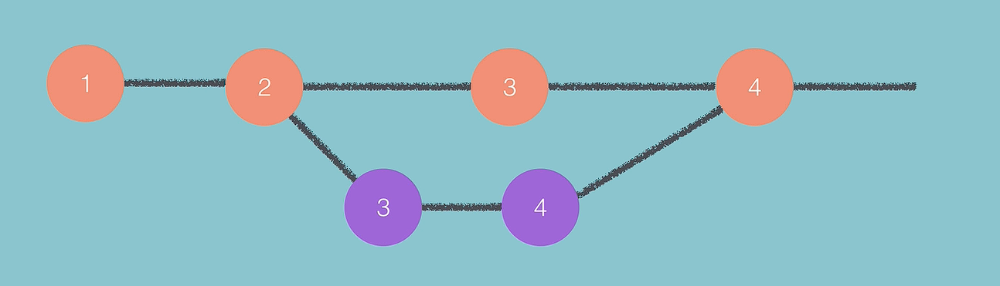

# Notes: Git Branching & Merging

## What is Branching?

* A **branch** is a separate line of development in Git.
* It allows developers to work on new features, experiments, or bug fixes without affecting the main project.
* The default/main branch is usually called **master** (or **main** in modern Git setups).

<p align="center">
    
</p>

### Why Use Branches?

* Develop features safely.
* Fix bugs without breaking the main project.
* Test ideas and experiments independently.
* Multiple developers can work simultaneously on different tasks.

---

## Basic Branch Workflow

### 1. Create a New Branch

After making some commits on the main branch:

```bash
git branch alien-plot
```

Creates a new branch called `alien-plot`.

### 2. View Available Branches

```bash
git branch
```

* Lists all branches.
* `*` indicates the currently active branch.

Example:

```bash
* master
  alien-plot
```

---

### 3. Switch to a Branch

```bash
git checkout alien-plot
```

Moves you to the `alien-plot` branch.

---

### 4. Make Changes and Commit

After editing files:

```bash
git add .
git commit -m "modify chapter 1 and 2 to have alien theme"
```

These changes belong only to the current branch.

---

### 5. Switch Back to Master

```bash
git checkout master
```

The experimental changes are not visible here because they exist only in the other branch.

---

## Parallel Development

Different branches can be developed independently:

### Master Branch

* Main project updates.
* Stable code.

### Experimental Branch

* New features.
* Tests and experiments.
* Potentially unstable code.

Both branches can progress simultaneously.

---

## Merging Branches

When a feature is successful and ready:

### Step 1: Switch to Master

```bash
git checkout master
```

### Step 2: Merge the Branch

```bash
git merge alien-plot
```

Git combines the changes from `alien-plot` into `master`.

### Merge Outcomes

* **No conflicts:** Merge happens automatically.
* **Conflicts:** Manual editing is required before completing the merge.

---

## Viewing Commit History

```bash
git log
```

Shows:

* Commit history.
* Branch merges.
* Current branch state.

---

## Pushing Changes to GitHub

After merging:

```bash
git push -u origin master
```

Uploads local changes to GitHub.

---

# Branching Example from the Story Project

### Master Branch

Initial commits:

* Chapter 1
* Chapter 2
* Chapter 3

### Alien-Plot Branch

Created after Chapter 2/3.

Changes:

* Modified Chapter 1
* Modified Chapter 2
* Added alien-themed storyline

### Master Continues

Added:

* Chapter 4

### Merge

`alien-plot` was merged back into `master`, combining:

* Alien storyline changes
* Chapter 4 additions

---

# Branching on GitHub

GitHub provides a graphical interface for branching.

## Creating a Branch

1. Open repository.
2. Click branch selector.
3. Create a new branch (e.g., `experimental`).

GitHub copies the current state of the selected branch.

---

## Editing Files in a Branch

1. Open a file.
2. Click the pencil (edit) icon.
3. Make changes.
4. Commit to the selected branch.

Example:

Original:

```text
This is a story.
```

Updated:

```text
This is a story.
This is an amazing story.
```

Committed to the `experimental` branch.

---

## Pull Requests (PR)

A **Pull Request** is GitHub's way of proposing changes from one branch to another.

### Steps

1. Open **New Pull Request**.
2. Choose:

   * Base branch: `master`
   * Compare branch: `experimental`
3. Review differences.
4. Create Pull Request.
5. Merge Pull Request.

---

## Understanding GitHub Diff Colors

### Green (+)

New content added.

### Red (-)

Content removed.

---

## GitHub Network Graph

Found under:

**Insights → Graphs → Network**

Shows:

* Branch creation points.
* Separate development paths.
* Merge points.
* Repository history visually.

---

# Key Commands Cheat Sheet

| Command                     | Purpose                          |
| --------------------------- | -------------------------------- |
| `git branch`                | List branches                    |
| `git branch <name>`         | Create a branch                  |
| `git checkout <branch>`     | Switch branches                  |
| `git add .`                 | Stage changes                    |
| `git commit -m "message"`   | Commit changes                   |
| `git merge <branch>`        | Merge branch into current branch |
| `git log`                   | View commit history              |
| `git push -u origin master` | Push to GitHub                   |

---

# Key Takeaways

* Branches allow safe, independent development.
* Multiple branches can exist simultaneously.
* Experimental work should be done in separate branches.
* Merging combines completed work back into the main branch.
* GitHub supports branching and merging through Pull Requests.
* Branching is essential for team collaboration and large projects.
