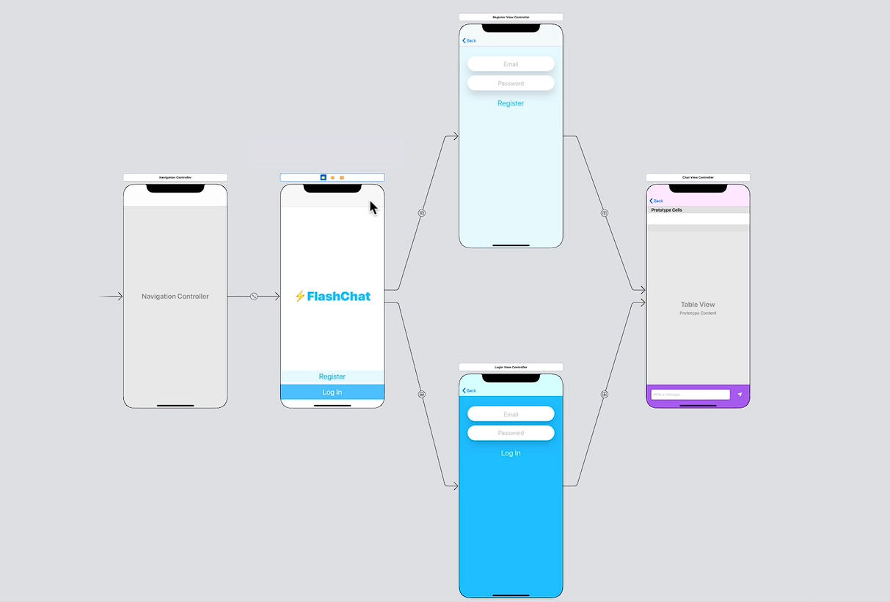

# Notes: Navigation Controller Stack and Segues 

## 1. Project Setup

* Clone the **FlashChat iOS 13** starter project from GitHub.
* Project includes a pre-configured `Main.storyboard`.
* App contains **4 screens**:

  1. Welcome Screen
  2. Registration Screen
  3. Login Screen
  4. Chat Screen

---

## 2. Custom UI Assets

* Custom image assets are used to create:

  * Styled text fields
  * Shadows and shapes
  * App branding
* Assets include:

  * Brand colors
  * App icons
  * User avatars
* Image views are used to achieve custom visual designs.

---

## 3. Storyboard Connections

* Several **IBOutlets** and **IBActions** are already connected.
* Examples:

  * `titleLabel` on Welcome Screen
  * Email and password text fields
  * Button actions on Register/Login screens

### If Assistant View Shows Wrong File

* Click **Automatic** in Assistant Editor.
* Manually select the correct Swift file.
* Each View Controller is linked to a corresponding Swift class through the **Custom Class** setting.

Examples:

* `ChatViewController` → `ChatViewController.swift`
* `LoginViewController` → `LoginViewController.swift`
* `RegisterViewController` → `RegisterViewController.swift`

---

## 4. Table Views

### What is a Table View?

* A UI component used to display data in a vertically scrolling list.
* Similar to Android's **ListView**.
* Found in the **Object Library**.

### Common Uses

* Mail app message lists
* Chat applications
* Any vertically stacked content

### Future Use

* Chat messages will be displayed using customized table view cells.

---

## 5. Storyboard Warnings

### Warning:

> View Controllers are unreachable because they have no entry points.

### Reason:

* Only the initial screen has an entry point.
* Other screens need **segues** to become reachable.

---

## 6. Creating Segues

### Register → Chat

1. Select `RegisterViewController`.
2. Hold **Control** and drag to `ChatViewController`.
3. Choose **Show** segue.

### Login → Chat

1. Select `LoginViewController`.
2. Control-drag to `ChatViewController`.
3. Choose **Show** segue.

---

## 7. Button-Based Segues

### Welcome → Register

1. Select Register button.
2. Control-drag to Register screen.
3. Create segue.

### Welcome → Login

1. Select Login button.
2. Control-drag to Login screen.
3. Create segue.

### Result

* Tapping Register opens Registration screen.
* Tapping Login opens Login screen.

---

## 8. Modal Transition vs Navigation Stack

### Modal Transition

* Screen slides up from the bottom.
* Covers previous screen.
* Not ideal for this app.

### Navigation Stack

* Preferred approach.
* Replaces screens while maintaining navigation history.
* Automatically provides:

  * Navigation bar
  * Back button

---

## 9. Embedding in Navigation Controller

To create a navigation stack:

1. Select the Welcome View Controller.
2. Go to:

   * **Editor → Embed In → Navigation Controller**

### Benefits

* Navigation bar added automatically.
* Back buttons appear on child screens.
* Easier navigation between screens.

---

## 10. Navigation Stack Analogy

* Like a **stack of pancakes**.
* New screens are placed on top.
* To return to earlier screens, top screens are removed.
* The first screen is called the **Root View Controller**.

Flow:

<p align="center">
    
</p>

```text
Welcome Screen
   ├── Register Screen
   │      └── Chat Screen
   │
   └── Login Screen
          └── Chat Screen
```

---

## 11. Two Types of Segues

### Automatic Segues

* Triggered directly by button taps.
* No code required.
* Examples:

  * Welcome → Register
  * Welcome → Login

### Programmatic Segues

* Triggered only after certain conditions are met.
* Examples:

  * Register → Chat
  * Login → Chat

Used when:

* Registration succeeds.
* Login succeeds.

---

## 12. Adding Segue Identifiers

### Register Screen → Chat Screen

Identifier:

```swift
RegisterToChat
```

### Login Screen → Chat Screen

Identifier:

```swift
LoginToChat
```

These identifiers allow segues to be triggered from code using methods like:

```swift
performSegue(withIdentifier:sender:)
```

---

## 13. Clearing Warnings

After adding identifiers:

```text
RegisterToChat
LoginToChat
```

Rebuild the project:

```text
Command + B
```

Warnings should disappear.

---

## Key Takeaways

* FlashChat contains 4 main screens connected through segues.
* Custom assets provide styling and branding.
* Table Views will be used to display chat messages.
* Navigation Controllers create navigation bars and back buttons automatically.
* Button segues are automatic, while authentication-related segues are triggered programmatically.
* Important segue identifiers:

  * `RegisterToChat`
  * `LoginToChat`
* Next topic: **Animating the FlashChat title using Swift loops.**
