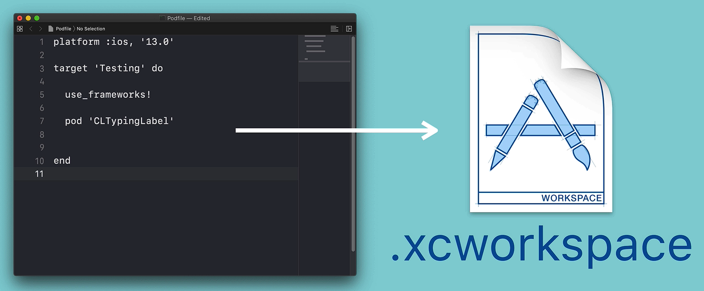

# Notes: Installing Your First CocoaPod in an Xcode Project

### Objective

Learn how to:

* Create and edit a Podfile
* Install a CocoaPod
* Generate and use an `.xcworkspace` project

---

## 1. Navigate to the Project Folder

1. Open **Terminal**.
2. Locate the folder that contains your Xcode project in **Finder**.
3. Use the `cd` (change directory) command to move into that folder:

```bash
cd [project-folder-path]
```

Tip: Drag the project folder from Finder into Terminal to automatically insert its path.

4. Verify you're in the correct folder using:

```bash
ls
```

This lists the contents of the current directory.

---

## 2. Create a Podfile

Inside the parent folder that contains the Xcode project, run:

```bash
pod init
```

This creates a new **Podfile**.

### Open the Podfile

* Right-click the Podfile.
* Select **Open With → Xcode**.

---

## 3. Configure the Podfile

### Set the Platform

The Podfile is written in **Ruby**, where comments begin with `#`.

Uncomment the platform line:

```ruby
platform :ios, '9.0'
```

This specifies the **minimum iOS version** supported by the app.

### Clean Up Comments

Remove unnecessary commented lines and keep:

```ruby
# Pods for Flash Chat iOS13
```

---

## 4. Add a CocoaPod

For this example, add the **CLTypingLabel** pod.

Inside the target block, add:

```ruby
pod 'CLTypingLabel'
```

Example:

```ruby
platform :ios, '9.0'

target 'Flash Chat iOS13' do
  pod 'CLTypingLabel'
end
```

Save the Podfile.

---

## 5. Install the Pod

Return to Terminal and run:

```bash
pod install
```

This:

* Downloads the pod from CocoaPods.
* Integrates it into the project.
* Creates an `.xcworkspace` file.

---

## 6. Use the `.xcworkspace` File

After installation, CocoaPods generates:

```text
Flash Chat iOS13.xcworkspace
```

### Important

From this point onward:

<p align="center">
    
</p>

Open the project using:

```text
.xcworkspace
```

Do NOT open the original:

```text
.xcodeproj
```

Using the wrong file can cause build errors and missing pod issues.

---

## 7. What's Inside the Workspace?

When opening the `.xcworkspace`, you'll see:

* Your original Xcode project
* A **Pods** project containing installed dependencies
* The **Podfile** you edited

This workspace combines your app and all CocoaPods dependencies into one project.

---

## Key Commands Summary

```bash
cd [folder-path]      # Navigate to project folder
ls                    # List folder contents
pod init              # Create a Podfile
pod install           # Install pods and generate workspace
```

---

## Important Takeaways

* Always run `pod init` in the parent folder containing the Xcode project.
* The Podfile is written in Ruby.
* Define a minimum iOS version using `platform :ios`.
* Add dependencies with `pod 'PodName'`.
* Run `pod install` after editing the Podfile.
* Always work from the generated `.xcworkspace` file after installing CocoaPods.
