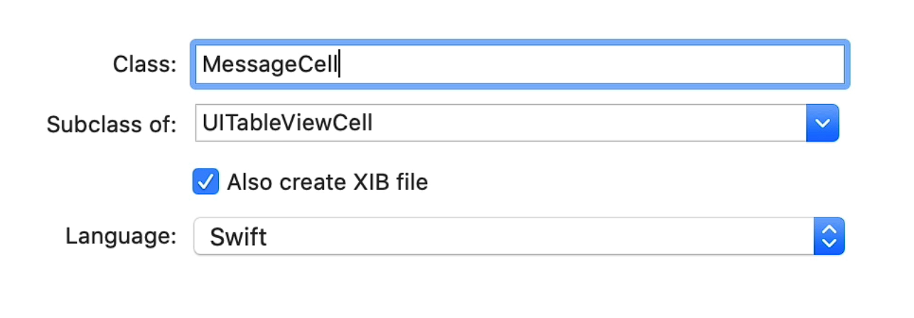

# Notes: Custom UITableView Cells with XIB in iOS

## 1. Why Use Custom Cells?

* Default `UITableViewCell` looks basic.
* Create a custom cell to achieve a more polished chat message UI.
* Custom cells allow:

  * Custom layouts
  * Message bubbles
  * Avatar images
  * Better styling

---

## 2. Create a Custom UITableViewCell

### Steps

1. Right-click the **Views** folder.
2. Create a new **Cocoa Touch Class**.
3. Set:

   * Subclass: `UITableViewCell`
   * Class Name: `MessageCell`
   * Language: Swift
4. Check **Create XIB File**.
5. Ensure:

   * Added to Views folder
   * Target: Flash Chat
6. Click **Create**.

<p align="center">
    
</p>

### Files Created

* `MessageCell.swift`
* `MessageCell.xib`

---

## 3. Design the Cell in MessageCell.xib

### Add UI Elements

#### Message Bubble

* Add a `UIView`.
* Position it on the left.
* Set background color:

  * `BrandPurple`

#### Message Label

* Add a `UILabel` inside the UIView.

#### Avatar Image

* Add an `UIImageView`.
* Position it on the right.

---

## 4. Use a Stack View

### Setup

1. Select:

   * Message Bubble View
   * Image View
2. Embed them in a **Horizontal Stack View**.

### Image Constraints

Set:

* Width = 40
* Height = 40

### Stack View Constraints

Add constraints:

* 10 pts from:

  * Top
  * Bottom
  * Leading
  * Trailing

(Relative to Content View)

### Label Constraints

Add:

* 10 pts padding on all sides inside the message bubble.

### Stack View Spacing

Change:

* Default: 8
* New: 20

### Avatar Image

Set image:

* `MeAvatar`

---

## 5. Create IBOutlets

Open Assistant Editor and connect UI elements to `MessageCell.swift`.

### Outlets

```swift
@IBOutlet weak var messageBubble: UIView!
@IBOutlet weak var label: UILabel!
@IBOutlet weak var rightImageView: UIImageView!
```

Purpose:

* Modify UI properties programmatically.
* Update message text dynamically.

---

## 6. Register the Custom Cell

Inside `ChatViewController` → `viewDidLoad()`:

```swift
tableView.register(
    UINib(
        nibName: K.cellNibName,
        bundle: nil
    ),
    forCellReuseIdentifier: K.cellIdentifier
)
```

### Constants

```swift
static let cellNibName = "MessageCell"
static let cellIdentifier = "ReusableCell"
```

### Important

Set the XIB cell's **Reuse Identifier** to:

```swift
ReusableCell
```

---

## 7. Use the Custom Cell

Inside:

```swift
tableView(_:cellForRowAt:)
```

Cast the cell:

```swift
let cell = tableView.dequeueReusableCell(
    withIdentifier: K.cellIdentifier,
    for: indexPath
) as! MessageCell
```

Populate label:

```swift
cell.label.text = messages[indexPath.row].body
```

### Cleanup

Delete the old prototype cell from `Main.storyboard`.

---

## 8. Customize Appearance

### Change Label Color

Set text color to:

```text
BrandLightPurple
```

Provides contrast against the purple bubble.

---

## 9. Create Rounded Message Bubbles

Inside:

```swift
awakeFromNib()
```

Add:

```swift
messageBubble.layer.cornerRadius =
    messageBubble.frame.size.height / 5
```

### Why?

* Corner radius adapts dynamically.
* Longer messages create taller bubbles.
* Bubble remains proportionally rounded.

---

## 10. Support Multi-Line Messages

### Problem

Labels default to:

```swift
numberOfLines = 1
```

Long messages get truncated.

### Solution

```swift
label.numberOfLines = 0
```

Benefits:

* Unlimited lines.
* Bubble expands automatically.
* Text displays completely.

---

## 11. Improve Layout for Long Messages

### Stack View Alignment

Change alignment to:

```text
Top
```

Result:

* Avatar stays aligned at the top.
* Long messages expand downward naturally.

---

## Key Concepts to Remember

### Files

* `MessageCell.swift` → Cell logic
* `MessageCell.xib` → Cell design

### Important Classes

* `UITableViewCell`
* `UINib`
* `UIView`
* `UILabel`
* `UIImageView`
* `UIStackView`

### Important Methods

* `viewDidLoad()`
* `tableView(_:cellForRowAt:)`
* `awakeFromNib()`

### Key Features Implemented

- Custom XIB-based table view cells
- Message bubble UI
- Avatar image support
- Reusable cells
- Dynamic corner radius
- Multi-line messages
- Better spacing and alignment
- Custom colors and styling

### Final Result

A chat interface with:

* Custom message bubbles
* User avatars
* Dynamic message sizing
* Cleaner and more professional UI than the default `UITableViewCell`.
