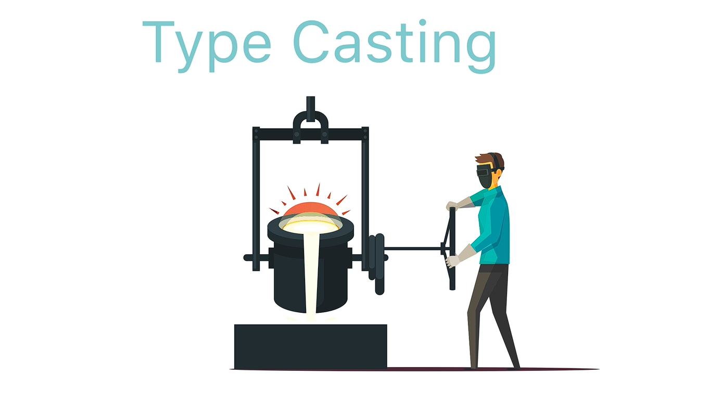

# Swift Deep Dive Notes: Type Casting

### Why Type Casting Matters

<p align="center">
    
</p>

In the code:

```swift
let cell = tableView.dequeueReusableCell(withIdentifier: identifier) as! MessageCell
```

* `dequeueReusableCell()` returns a `UITableViewCell` (superclass).
* `as! MessageCell` converts (downcasts) it into a `MessageCell` (subclass).
* This allows access to properties and methods specific to `MessageCell`.

---

# Type Casting Keywords in Swift

## 1. `is` → Type Checking

Used to check whether an object belongs to a certain type.

```swift
if animal is Fish {
    print("It's a fish")
}

```

### Use Case

* Verify an object's type before casting.
* Returns `true` or `false`.

---

## 2. `as!` → Forced Downcasting

Used when you're certain an object can be converted to a subclass.

```swift
let fish = animal as! Fish
```

### What Happens?

* Converts a superclass object (`Animal`) into a subclass object (`Fish`).
* Gives access to subclass-specific methods.

```swift
fish.breatheUnderWater()
```

### Risk

If the cast is wrong, the app crashes at runtime.

```swift
let fish = jack as! Fish   // Crash!
```

Error:

```
Could not cast value of type 'Human' to 'Fish'
```

### Use When

* You are 100% sure the cast will succeed.

---

## 3. `as?` → Optional Downcasting (Safe)

Used when you're not sure the cast will succeed.

```swift
let fish = animal as? Fish
```

### Result

Returns:

```swift
Fish?
```

(an optional Fish)

### Safe Usage

#### Optional Chaining

```swift
fish?.breatheUnderWater()
```

#### Optional Binding

```swift
if let fish = animal as? Fish {
    fish.breatheUnderWater()
}
```

### Advantage

* No crash if casting fails.
* Returns `nil` instead.

---

## 4. `as` → Upcasting

Used to convert a subclass into its superclass.

```swift
let animal = fish as Animal
```

### Characteristics

* Always succeeds.
* No `!` or `?` needed.

### Why?

Every `Fish` is already an `Animal`.

---

# Class Hierarchy Example

```swift
Animal
├── Human
└── Fish
```

### Downcasting

```swift
Animal → Fish
Animal → Human
```

Uses:

```swift
as!
as?
```

### Upcasting

```swift
Fish → Animal
Human → Animal
```

Uses:

```swift
as
```

---

# Why Arrays Cause Type Issues

Example:

```swift
let neighbours = [angela, jack, nemo]
```

Even though:

* Angela = Human
* Jack = Human
* Nemo = Fish

The array type becomes:

```swift
[Animal]
```

because `Animal` is their common superclass.

When retrieving:

```swift
let neighbour = neighbours[0]
```

Swift sees:

```swift
Animal
```

not

```swift
Human
```

Therefore subclass functionality isn't directly accessible without casting.

---

# Finding Nemo Example

```swift
func findNemo(from animals: [Animal]) {
    for animal in animals {
        if animal is Fish {
            print(animal.name)
        }
    }
}
```

Output:

```
Nemo
```

### Problem

Even inside:

```swift
if animal is Fish
```

Swift still treats `animal` as:

```swift
Animal
```

So this won't work:

```swift
animal.breatheUnderWater()
```

### Solution

```swift
let fish = animal as! Fish
fish.breatheUnderWater()
```

---

# Type Conversion vs Type Casting

### Type Conversion

```swift
let myDouble = 0.0
let myInt = Int(myDouble)
```

This is actually done using an initializer:

```swift
Int(myDouble)
```

Not true type casting.

### Type Casting

Occurs between related types in an inheritance hierarchy.

```swift
animal as! Fish
```

---

# Any, AnyObject, NSObject

## `Any`

Can hold **any type**:

* Classes
* Structs
* Enums
* Integers
* Strings

Example:

```swift
let items: [Any] = [angela, nemo, 12, "Hello"]
```

---

## `AnyObject`

Can hold only objects created from **classes**.

```swift
let items: [AnyObject]
```

Allowed:

```swift
Human()
FishClass()
```

Not allowed:

```swift
Int
String
Double
Structs
```

---

## `NSObject`

More restrictive.

Only objects derived from Foundation's `NSObject`.

Examples:

```swift
NSNumber
NSString
NSDate
```

```swift
let items: [NSObject] = [
    NSNumber(value: 12),
    NSString(string: "ABC")
]
```

Custom classes like `Human` are not automatically `NSObject`s.

---

# Quick Comparison Table

| Keyword | Purpose              | Safe?          | Returns              |
| ------- | -------------------- | -------------- | -------------------- |
| `is`    | Check type           | Yes            | `Bool`               |
| `as!`   | Forced downcast      | No (can crash) | Target type          |
| `as?`   | Optional downcast    | Yes            | Optional target type |
| `as`    | Upcast to superclass | Yes            | Superclass type      |

---

# Key Takeaways

1. **`is`** checks an object's type.
2. **`as!`** performs a forced downcast and can crash if incorrect.
3. **`as?`** performs a safe downcast and returns an optional.
4. **`as`** performs an upcast and always succeeds.
5. Arrays with mixed subclasses are usually stored as their common superclass type.
6. `Any` accepts all types, `AnyObject` only class instances, and `NSObject` only Foundation objects.
7. In the Firebase section of the course, type casting will be important when converting retrieved data into usable Swift types.
