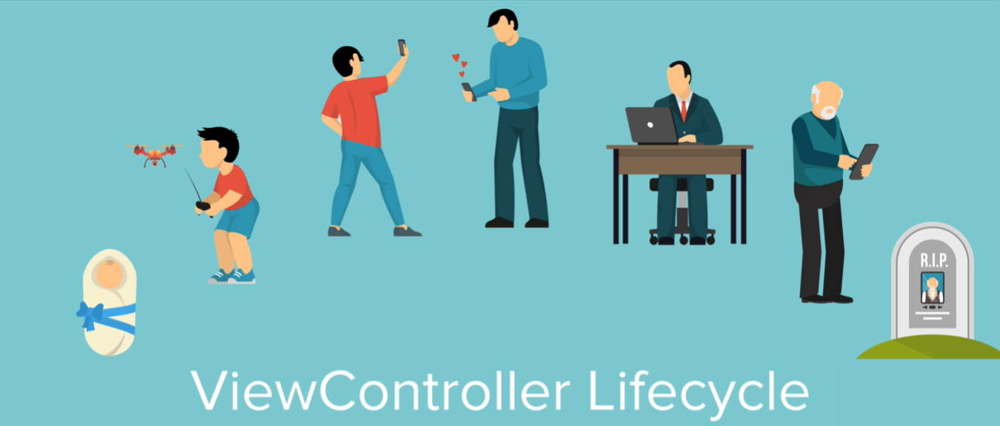
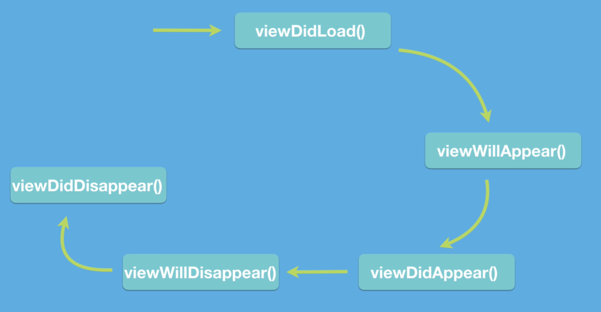

# Notes: iOS ViewController Lifecycle

## What is the ViewController Lifecycle?

* A **ViewController** goes through a series of lifecycle events from creation until it disappears.
* iOS provides lifecycle methods that let you run code at specific moments.

<p align="center">
  
</p>

---

## 1. `viewDidLoad()`

**When it runs:**

* Called **once** when the view is first created and loaded into memory.

**What happens:**

* All **IBOutlets**, **IBActions**, and UI elements are connected and available.

**Use it for:**

* Initial setup.
* Configuring labels, buttons, images, etc.
* Loading data needed once.

> **Important:** `viewDidLoad()` is called **only once** for a ViewController (unless it's destroyed and recreated).

---

## 2. `viewWillAppear()`

**When it runs:**

* Called **every time** just **before** the view appears on screen.

**User can see the view?**

* No

**Use it for:**

* Updating the UI.
* Hiding/showing navigation bars.
* Refreshing data before the screen becomes visible.

---

## 3. `viewDidAppear()`

**When it runs:**

* Called immediately **after** the view is visible.

**User can see the view?**

* Yes

**Use it for:**

* Starting animations.
* Starting timers.
* Beginning tasks the user should actually see.

---

## 4. `viewWillDisappear()`

**When it runs:**

* Called just **before** the view disappears.

**Use it for:**

* Stopping animations.
* Saving changes.
* Restoring UI (e.g., showing the navigation bar again).

---

## 5. `viewDidDisappear()`

**When it runs:**

* Called **after** the view is no longer visible.

**Important:**

* The view **may still exist in memory**.
* `viewDidDisappear()` **does not mean** the ViewController has been destroyed.

---

## Typical Lifecycle Order

<p align="center">
  
</p>

When a ViewController is shown for the first time:

```text
viewDidLoad()
viewWillAppear()
viewDidAppear()
```

When leaving the screen:

```text
viewWillDisappear()
viewDidDisappear()
```

---

## Key Differences

| Method                | Called Once?            | User Can See View? | Common Uses                          |
| --------------------- | ----------------------- | ------------------ | ------------------------------------ |
| `viewDidLoad()`       | Yes                   | No               | Initial setup, configure UI          |
| `viewWillAppear()`    | No (every appearance) | No               | Refresh UI, hide/show navigation bar |
| `viewDidAppear()`     | No                    | Yes              | Start animations, timers             |
| `viewWillDisappear()` | No                    | Yes              | Stop animations, save state          |
| `viewDidDisappear()`  | No                    | No               | Final cleanup after disappearing     |

---

## Example Behavior

### First launch (VC1)

```text
VC1
viewDidLoad
viewWillAppear
viewDidAppear
```

### Navigate to VC2

```text
VC2
viewDidLoad
viewWillAppear
viewDidAppear
```

### Return from VC2

```text
VC2
viewWillDisappear
viewDidDisappear

VC1
viewWillAppear
viewDidAppear
```

Notice:

* `VC1.viewDidLoad()` is **not called again** because VC1 was never destroyed.

---

## Presentation Style Matters

### Card/Sheet Presentation

* The first ViewController is only **covered**.
* It doesn't fully disappear.
* Therefore, its `viewWillDisappear()` and `viewDidDisappear()` may **not** be called.

### Full Screen Presentation

* The first ViewController becomes completely hidden.
* `viewWillDisappear()` and `viewDidDisappear()` are called.

---

## `prepare(for:segue:)` vs `viewDidLoad()`

`prepare(for:segue:)` runs **before** the destination ViewController's view has loaded.

At this point:

* The destination ViewController object exists.
* Its UI elements (**IBOutlets**) may still be `nil`.

Example:

```swift
destinationVC.label.text = "Hello"
```

This can crash because `label` hasn't been connected yet.

---

## Why `viewDidLoad()` Is So Important

Inside `viewDidLoad()`:

* All UI elements have been created.
* All IBOutlets are connected.
* It is safe to modify labels, buttons, images, and other views.

Example:

```swift
override func viewDidLoad() {
    super.viewDidLoad()
    label.text = "Hello"
}
```

This is safe because the view has already loaded.

---

## Key Takeaways

* `viewDidLoad()` -> Called **once**, use for initial setup.
* `viewWillAppear()` -> Runs **every time** before the screen appears.
* `viewDidAppear()` -> Best place to start animations or timers.
* `viewWillDisappear()` -> Prepare for leaving the screen.
* `viewDidDisappear()` -> View is hidden but **not necessarily deallocated**.
* A ViewController can disappear **without being destroyed**.
* `prepare(for:segue:)` happens **before** the destination view loads, so IBOutlets may still be `nil`.
* UI-related code is safest inside `viewDidLoad()` or later.
