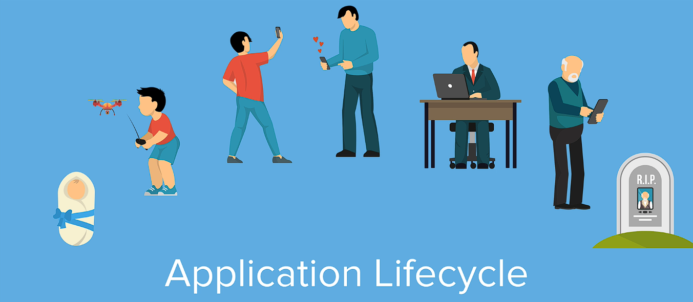
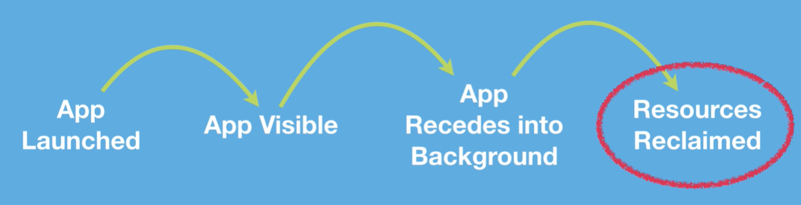
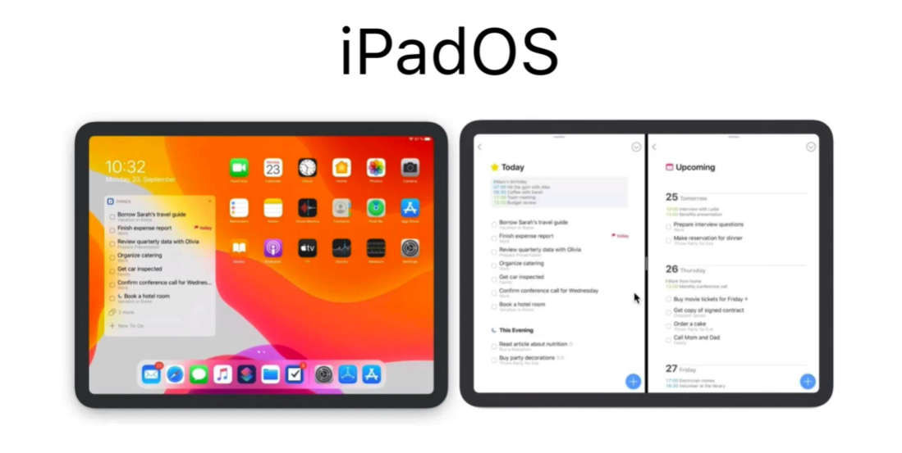

# Notes: iOS Application Lifecycle

## 1. ViewController Lifecycle vs Application Lifecycle

### ViewController Lifecycle

* Manages the lifecycle of a **single screen**.
* Common methods:

  * `viewDidLoad()`
  * `viewWillAppear()`
  * `viewDidAppear()`
  * `viewDidDisappear()`
* These methods are automatically called by iOS as a view appears or disappears.

### Application Lifecycle

Manages the **entire app** from launch to termination.

<p align="center">
  
</p>

Typical flow:

1. App launches.
2. App becomes active (foreground).
3. App moves to background.
4. App may be terminated and resources reclaimed.

---

## 2. Why the App Lifecycle Matters

<p align="center">
  
</p>

iOS prioritizes the **foreground app** because it's the one the user is actively using.

Apps in the background may:

* Lose memory
* Be terminated without warning

### As a developer, you should:

* Save user progress before the app goes into the background.
* Restore data when the app becomes active again.

**Example:**

* User completes a long form.
* User defeats a game boss.
* If the app is killed in the background without saving, all progress is lost.

---

## 3. Using Lifecycle Methods

Lifecycle methods let you run code at important moments.

### Example: Configure Firebase

```swift
application(_:didFinishLaunchingWithOptions:)
```

Used to:

* Configure Firebase
* Read `GoogleService-Info.plist`
* Perform setup before any other code runs

This method is the **first entry point** when the app launches.

---

## 4. AppDelegate vs SceneDelegate

### Before iOS 13

Only:

* `AppDelegate.swift`

Handled all application lifecycle events.

### iOS 13+

Apps now include:

* `AppDelegate.swift`
* `SceneDelegate.swift`

Reason:

<p align="center">
  
</p>

* iPadOS introduced **multiple windows**.
* Each window is treated as a separate **Scene**.

---

## 5. What is a Scene?

A **Scene** represents one window (one instance) of your app.

Hierarchy:

```
Application
    ├── Scene
    │      ├── ViewController
    │      ├── ViewController
    │
    └── Scene
           ├── ViewController
```

* One app → Multiple scenes
* One scene → Multiple view controllers

Each level has its own lifecycle.

---

## 6. Responsibilities

### AppDelegate

Handles events affecting the **entire app**, such as:

* App launch
* System-wide events
* Network time changes

Important method:

```swift
application(_:didFinishLaunchingWithOptions:)
```

### SceneDelegate

Handles events related to **individual windows/scenes**, such as:

* Scene becoming active
* Scene entering background
* Scene entering foreground

---

## 7. Important Lifecycle Methods

### `application(_:didFinishLaunchingWithOptions:)`

* First method called.
* Configure Firebase.
* Initialize databases.
* Perform startup tasks.

### `sceneWillResignActive`

Called when:

* App is interrupted
* Phone call arrives
* User opens multitasking

Good for:

* Pause music
* Pause animations
* Pause games

### `sceneDidEnterBackground`

Called when the app moves to the background.

Best place to:

* Save user data
* Save forms
* Save game progress

Reason:

* App may later be terminated without warning.

### `sceneWillEnterForeground`

Called when returning to the foreground.

Use it to:

* Restore saved data
* Refresh the UI

### `application(_:didDiscardSceneSessions:)`

Called when:

* A scene is discarded.
* The app/window is destroyed.

---

## 8. Lifecycle Order (Observed)

When launching the app:

1. `application(_:didFinishLaunchingWithOptions:)`
2. `scene(_:willConnectTo:options:)`
3. `viewDidLoad()`
4. `viewWillAppear()`
5. `sceneDidBecomeActive`
6. `viewDidAppear()`

When moving to multitasking:

* `sceneWillResignActive`

When opening another app:

* `sceneDidEnterBackground`

When returning:

* `sceneWillEnterForeground`
* `sceneDidBecomeActive`

When the app is terminated:

* `application(_:didDiscardSceneSessions:)`

---

## Helpful Swift Tip

Using:

```swift
print(#function)
```

prints the current function's name automatically.

Example output:

```text
application(_:didFinishLaunchingWithOptions:)
```

Useful for debugging lifecycle events.

---

## Key Takeaways

* **ViewController lifecycle** manages a single screen.
* **Application lifecycle** manages the whole app.
* Since **iOS 13**, lifecycle responsibilities are split between:

  * `AppDelegate`
  * `SceneDelegate`
* Save important user data in `sceneDidEnterBackground`.
* Restore data when returning to the foreground.
* `application(_:didFinishLaunchingWithOptions:)` is the earliest place to perform app initialization (e.g., configuring Firebase).
* Apps can be terminated while in the background, so never wait until termination to save important data.
