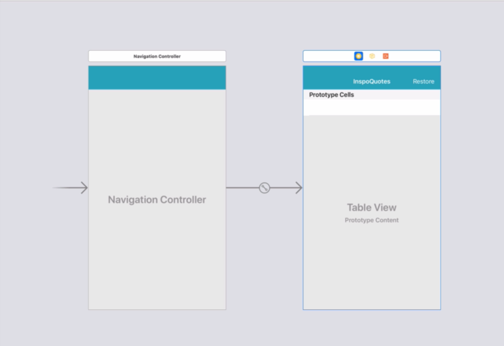

# Notes: InspoQuotes Skeleton Project Setup

## Project Setup

* Download the **InspoQuotes** skeleton project from the course resources.
* Alternatively, create the project from scratch by recreating the same features.

## App Structure

  

### Table View Controller

* The app contains a **Table View Controller** connected to:

  * `QuoteTableViewController.swift`
* The table view includes:

  * Prototype cells with the identifier **`QuoteCell`**
  * A **Restore** navigation bar button

### Restore Button

* The **Restore** button is connected to an **IBAction**:

  * `restorePressed`
* This action detects when the user taps the Restore button.

### Navigation

* The **Table View Controller** is embedded inside a **Navigation Controller**.
* This is the app's **initial (entry) screen** and currently the **only screen**.

### Data in `QuoteTableViewController`

* `quotesToShow` (**var**)

  * Contains **6 free quotes**.
* `premiumQuotes` (**let**)

  * Contains **6 premium quotes**.
  * These are unlocked after a successful **in-app purchase**.
* The instructor mentions that the reason one is a `var` and the other a `let` will be explained later.

---

## Generated Table View Code

* Most of the file contains default code automatically generated when creating a `UITableViewController`.
* To create one:

  1. Press **⌘ + N**
  2. Create a **Cocoa Touch Class**
  3. Set the subclass to `UITableViewController`
  4. Rename it to `QuoteTableViewController`
* Much of the generated code will be deleted later because it isn't needed.

---

## Skeleton Project Includes

* Table View Controller
* Navigation Controller
* Prototype cell (`QuoteCell`)
* Restore button with `restorePressed` action
* Free and premium quote arrays

### Next Lesson

* Set up an **Apple Developer account** on Apple's website for implementing **in-app purchases**.
