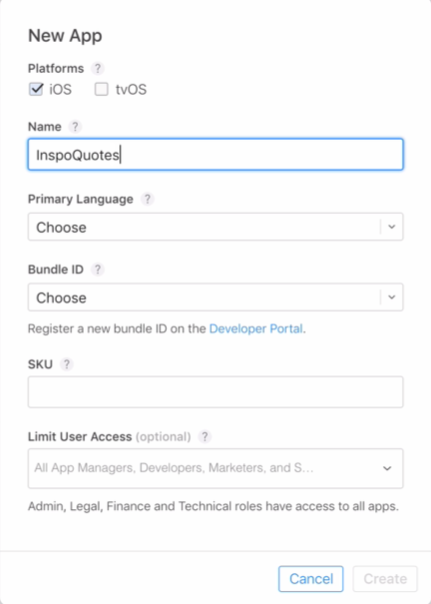

# Notes: Setting Up Apple In-App Purchases

## 1. Register a New App ID

* Go to the [Apple Developer portal](https://developer.apple.com/programs/) and log in.
* Navigate to:

  * **Certificates, IDs & Profiles** → **Identifiers** → **App IDs**
* Click **+** to create a new App ID.
* Enter:

  * **App Name** (e.g., *InspoQuotes*)
  * Select **Explicit App ID**
  * Enter the **Bundle ID**

**Important:**

* Bundle ID must exactly match the Bundle Identifier in Xcode.
* Bundle IDs must be **globally unique**.
* Recommended format:

  * `com.companyname.appname`
  * If no company: `com.yourfullname.appname`
* Capitalization matters.

---

## 2. Enable App Services

By default, new App IDs include:

* Game Center
* In-App Purchases

Simply:

* Click **Continue**
* Click **Register**
* Click **Done**

> Note: Apple may take a few minutes to propagate the changes.

---

## 3. Check App Store Connect

Log into [**App Store Connect**](https://appstoreconnect.apple.com/login/).

Before continuing, ensure:

### No Red Warnings

* Accept any:

  * Developer agreements
  * License agreements
  * Legal documents

### Agreements, Tax & Banking

Go to:

* **Agreements, Tax & Banking**

Make sure:

* No "Request" buttons remain.
* Contracts are approved.
* **Paid Applications** shows **In Effect**.

Without this, **In-App Purchases cannot be tested**.

---

## 4. Create a New App

In **My Apps**:

* Click **+**
* Select **New App**

Fill in:

<p align="center">
  
</p>

* Platform: **iOS**
* App Name

  * Must be unique on the App Store
* Primary Language
* SKU

  * Internal identifier (e.g., `LAB001`)
* Leave **User Access** blank.

Select your **Bundle ID**.

> If the Bundle ID doesn't appear, wait a few minutes for Apple's servers to update.

Click **Create**.

---

## 5. Create an In-App Purchase

Inside the app:

* Go to **Features**
* Select **In-App Purchases**
* Click **+**

Apple offers four types:

### 1. Consumable

* Used once
* Can be purchased repeatedly
* Examples:

  * Coins
  * Energy
  * Game currency

### 2. Non-Consumable (Used in this project)

* Purchased once
* Never expires
* Examples:

  * Remove Ads
  * Unlock Premium Content

### 3. Auto-Renewable Subscription

* Automatically renews
* Examples:

  * Music streaming
  * Video streaming
  * Monthly memberships

### 4. Non-Renewing Subscription

* Fixed subscription period
* Does **not** renew automatically

---

## 6. Configure the In-App Purchase

### Reference Name

* Internal name only
* Example:

  * `Premium Quotes`

### Product ID (Very Important)

Format:

```
BundleID.ProductName
```

Example:

```
com.yourname.inspoquotes.PremiumQuotes
```

**Remember:**

* Save this Product ID.
* It will be used later in the app code to request and verify purchases.

### Pricing

Choose a pricing tier.

Example:

* **Tier 1**

  * $0.99 / £0.99

### Localization

Provide:

* Display Name
* Description

Example:

* Name: **Premium Quotes**
* Description: **Unlock Premium Quotes**

Additional languages can be added later.

### Optional

* Promotional image
* Screenshot

These are **not required** for development.

---

## 7. Save

Click **Save**.

You may see:

**Missing Metadata**

This is expected because:

* Screenshots haven't been uploaded yet.

This warning only needs to be resolved before submitting the app to the App Store.

---

## Key Takeaways

* Bundle ID must exactly match Xcode.
* Bundle IDs must be unique.
* Wait for Apple servers to propagate new App IDs.
* Complete Agreements, Tax & Banking before testing purchases.
* Create the app in App Store Connect.
* Use **Non-Consumable** for one-time premium unlocks.
* Product ID is critical and must be saved for use in code.
* Missing screenshots are acceptable during development.
