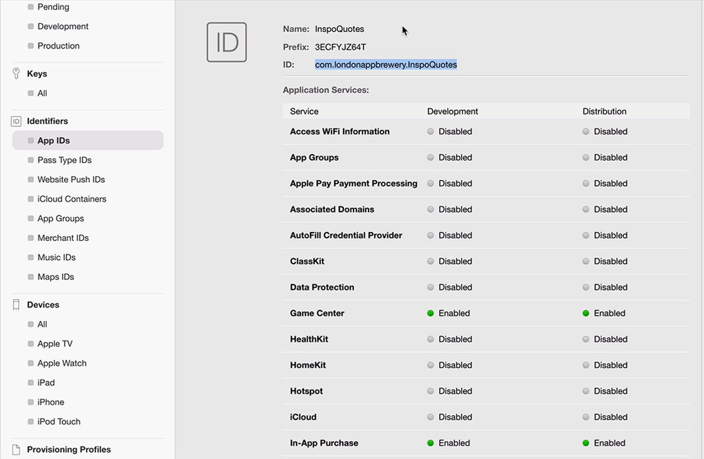
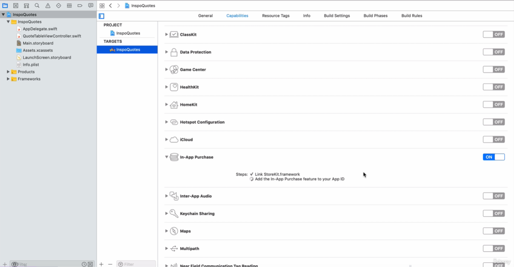
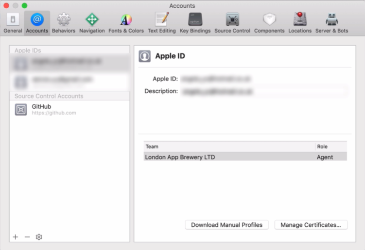

# Notes: Create an Inspirational Quotes App

## 1. Verify App Configuration

* Return to **Xcode** after finishing setup in **App Store Connect**.
* Ensure the **Bundle Identifier** in Xcode matches the **App ID** created in the Apple Developer account.
* Verify the App ID under **developer.apple.com → Account → App IDs**.

<p align="center">
  
</p>

---

## 2. Enable In-App Purchases

* In Xcode:

  * Select the project.
  * Open the **Capabilities** tab.
  * Turn **In-App Purchases** **ON**.
* Wait until Xcode finishes configuring the capability (all checkmarks appear).

<p align="center">
  
</p>

---

## 3. Troubleshooting Missing In-App Purchases Capability

If the capability doesn't appear:

* Go to **Xcode → Preferences → Accounts**.
* Make sure you're signed into the **same Apple Developer account** used to create the App ID.
* Confirm:

  * You're using a **paid developer account**.
  * Your role is **Agent** (not just User).
* Under **General**, ensure the correct **Team** is selected.
* If you have multiple Apple IDs, verify the correct one is logged in.

<p align="center">
  
</p>

---

## Display Quotes in a Table View

### 1. Prepare the View Controller

* Open **Main.storyboard**.
* The app uses a **UITableView** to display quotes.
* Remove unnecessary comments from `viewDidLoad()`.

### 2. Number of Sections

* Only **one section** is needed.
* Delete the `numberOfSections` method.

### 3. Number of Rows

Return the number of quotes dynamically instead of hardcoding:

```swift
return quotesToShow.count
```

* `quotesToShow` is an array containing **6 quotes**.

### 4. Populate Table View Cells

Implement:

```swift
tableView(_:cellForRowAt:)
```

Steps:

1. Dequeue a reusable cell using the prototype cell identifier (`QuoteCell`).
2. Set the cell's text:

```swift
cell.textLabel?.text = quotesToShow[indexPath.row]
```

* `indexPath.row` gives the current row index.

### 5. Handle Long Quotes

By default, labels display only **one line**.

Allow multiple lines:

```swift
cell.textLabel?.numberOfLines = 0
```

* `0` means the label uses as many lines as needed.
* Prevents long quotes from being truncated.

---

## Result

The app now:

* Displays **6 table view cells**.
* Shows one quote in each cell.
* Automatically expands cells to fit long quotes.

---

## Key Concepts Reviewed

* Bundle Identifier
* App ID verification
* Xcode Capabilities
* In-App Purchases setup
* UITableView
* `numberOfRowsInSection`
* `cellForRowAt`
* Reusable cells (`QuoteCell`)
* `indexPath.row`
* `numberOfLines = 0`
* Dynamic data using `quotesToShow.count`

---

### Next Step

Begin implementing the **StoreKit / In-App Purchase code**. Before proceeding, ensure you're comfortable with:

* UITableView basics
* Delegate & Data Source methods
* Reusable cells
* Displaying dynamic data in table views
