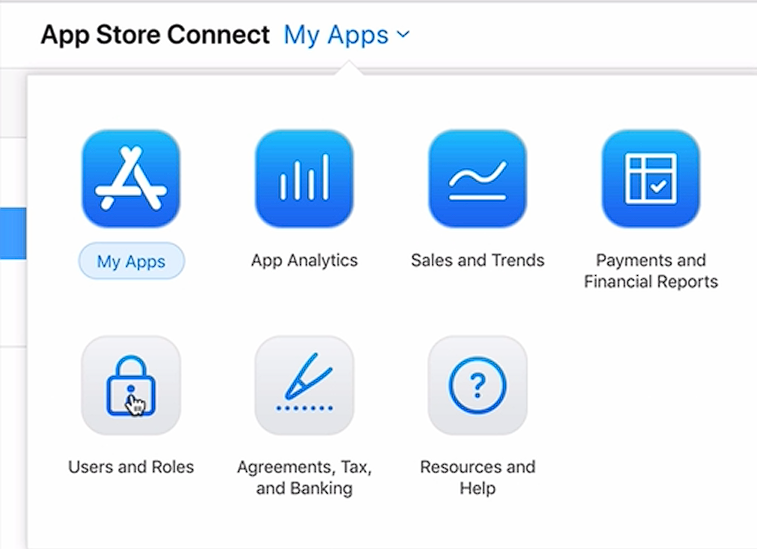

# Notes: Testing & Completing In-App Purchases (StoreKit) for Free

## Recap

* Implemented a payment request using `SKPaymentQueue`.
* Specified the product to purchase.
* Used `paymentQueue(_:updatedTransactions:)` to:

  * Detect successful purchases.
  * Detect failed transactions.

---

## 1. Creating a Sandbox Tester

### Steps

1. Open **App Store Connect**.
2. Go to **Users and Roles**.
3. Select **Sandbox Testers**.
4. Click **+** to create a new tester.

<p align="center">
  
</p>

### Requirements

* First and last names can be anything.
* Email must:

  * Be unique.
  * Be a real email.
* Password must:

  * Include uppercase letters.
  * Include numbers.
  * Meet Apple's security requirements.
* Fill in:

  * Security questions
  * Date of birth
  * App Store territory (must match the test device's App Store region).

---

## 2. Gmail Alias Trick

Instead of creating multiple email accounts, use Gmail aliases.

Example:

```text
angela@gmail.com
angela+tester1@gmail.com
angela+tester2@gmail.com
angela+tester3@gmail.com
```

### Benefits

* All emails arrive in the same inbox.
* Each alias is treated as a unique email address.
* Great for creating many sandbox testers.

### Important

This only works if the base Gmail address **has not already been used as an Apple ID**.

---

## 3. Alternative Email Option

Use **Maildrop** (`maildrop.cc`).

Pros:

* Generates disposable public inboxes.
* Useful for testing.

Cons:

* Inboxes are public.
* Never use for personal or sensitive information.

---

## 4. Testing In-App Purchases

### On the iPhone

1. Run the app on a **physical device**.
2. Open:

   * **Settings**
   * **iTunes & App Store**
   * **Sandbox Account**
3. Sign out of any existing sandbox account.
4. Sign in using the newly created sandbox tester.
5. Launch the app.
6. Make the purchase.
7. Enter the sandbox tester password.
8. Confirm the purchase.

---

## 5. Successful Purchase

If successful:

* Apple displays a success message.
* Debug console prints:

```swift
Transaction successful
```

The `.purchased` transaction state is triggered.

Example:

```swift
if transaction.transactionState == .purchased
```

This is where you unlock premium content, such as:

* Extra quotes
* Coins
* Levels
* Ad removal
* Premium features

---

## 6. Non-Consumable Purchases

Example:

* Remove Ads
* Premium Quotes

### Important Rule

A sandbox tester can purchase a **non-consumable** product **only once**.

They can:

* Restore purchases

They cannot:

* Buy the same non-consumable again

Because of this, developers often create many sandbox tester accounts.

---

## 7. Finish Transactions

After a transaction succeeds or fails, always finish it.

```swift
SKPaymentQueue.default().finishTransaction(transaction)
```

Do this in both:

* Success case
* Failure case

This removes the completed transaction from the payment queue.

---

## 8. Better Error Handling

Instead of simply printing:

```swift
Transaction failed!
```

Use optional binding:

```swift
if let error = transaction.error {
    let errorDescription = error.localizedDescription
}
```

Then print:

```swift
Transaction failed due to error: \(errorDescription)
```

### Benefits

* More descriptive errors.
* Easier debugging.
* Helps identify payment issues quickly.

---

## Workflow Summary

1. Create a payment request.
2. Add it to `SKPaymentQueue`.
3. Observe transaction updates.
4. Create a sandbox tester.
5. Sign into the sandbox account on the device.
6. Test the purchase.
7. Handle:

   * Success (`.purchased`)
   * Failure (`.failed`)
8. Unlock premium content after success.
9. Finish the transaction.
10. Log detailed errors for debugging.

---

## Key Takeaways

* Use **Sandbox Testers** to test purchases without spending money.
* Gmail aliases are an easy way to create multiple unique tester emails.
* Non-consumable products can only be purchased once per sandbox account.
* Always call `finishTransaction(transaction)` after handling a purchase.
* Use `error.localizedDescription` for clearer debugging information.
