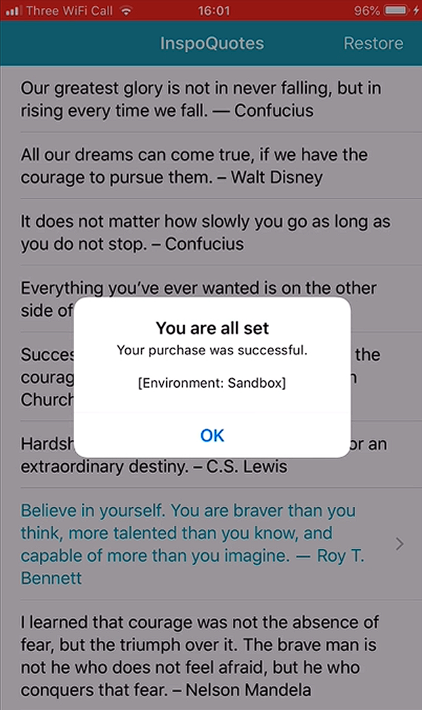

# Notes: Enabling Access After an In-App Purchase

## Goal

After a successful in-app purchase, unlock and display the **premium quotes**.

---

## 1. Show Premium Content

* Create a function:

  * `showPremiumQuotes()`
* When a purchase succeeds:

  * Call `showPremiumQuotes()`.
* Instead of replacing the existing quotes:

  * Append `premiumQuotes` to `quotesToShow`.
* Use:

  * `append(contentsOf:)`
* Result:

  * `quotesToShow` now contains both free and premium quotes.

---

## 2. Update the Table View

* The table view already uses `quotesToShow.count`.
* No need to modify:

  * `numberOfRowsInSection`
  * `cellForRowAt`
* Simply call:

  * `tableView.reloadData()`
* This refreshes the UI with the new quotes.

<p align="center">
  
</p>

---

## 3. Fix Cell Reuse Issues

### Problem

Reused table view cells kept:

* Blue text
* Disclosure indicator

### Solution

Reset every normal quote cell:

* `textLabel.textColor = .black`
* `accessoryType = .none`

This ensures reused cells display correctly.

---

## 4. Save Purchase Status

Store whether the user has purchased the premium content.

After a successful transaction:

```swift
UserDefaults.standard.set(true, forKey: productID)
```

* Value: `true`
* Key: Product ID (`premiumQuotes`)

This permanently remembers the purchase on the device.

---

## 5. Check if User Already Purchased

Create a helper method:

```swift
isPurchased() -> Bool
```

Inside it:

* Read the Boolean from `UserDefaults`
* Return:

  * `true` → Previously purchased
  * `false` → Never purchased

---

## 6. Restore Premium Content on App Launch

In `viewDidLoad()`:

```swift
if isPurchased() {
    showPremiumQuotes()
}
```

Result:

* Premium users automatically see unlocked content every time the app opens.
* No need to purchase again.

---

## 7. Improve User Experience

### Problem

After purchasing, the app still displayed:

> "Get More Quotes"

Even though there were no more quotes to buy.

### Fix

Modify the row count:

* **If purchased**

  * Return `quotesToShow.count`
* **If not purchased**

  * Return `quotesToShow.count + 1`
  * The extra row is the "Get More Quotes" button.

Result:

* Purchased users only see the 12 quote cells.
* No unnecessary purchase button.

---

## Testing Steps

* Use a **new Sandbox Tester** (previous testers already own the product).
* Purchase premium quotes.
* Verify:

  * Premium quotes appear.
  * App remembers the purchase after closing and reopening.
  * "Get More Quotes" button disappears after purchase.
  * Cell colors and accessories display correctly.

---

## Key Concepts

* `append(contentsOf:)`
* `tableView.reloadData()`
* Table View Cell Reuse
* `UserDefaults`
* Product ID as UserDefaults key
* `isPurchased()` helper function
* Automatically restoring purchased content
* Better post-purchase user experience

---

### Summary

The lesson completes the in-app purchase flow by:

1. Unlocking premium content after purchase.
2. Refreshing the UI.
3. Fixing table view cell reuse issues.
4. Saving purchase status with `UserDefaults`.
5. Restoring premium content automatically when the app launches.
6. Hiding the "Get More Quotes" option after the purchase is complete.
