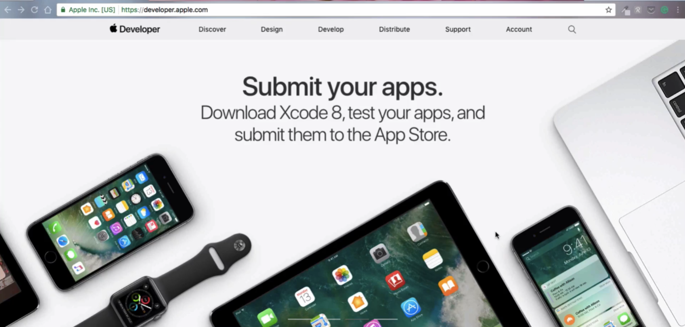
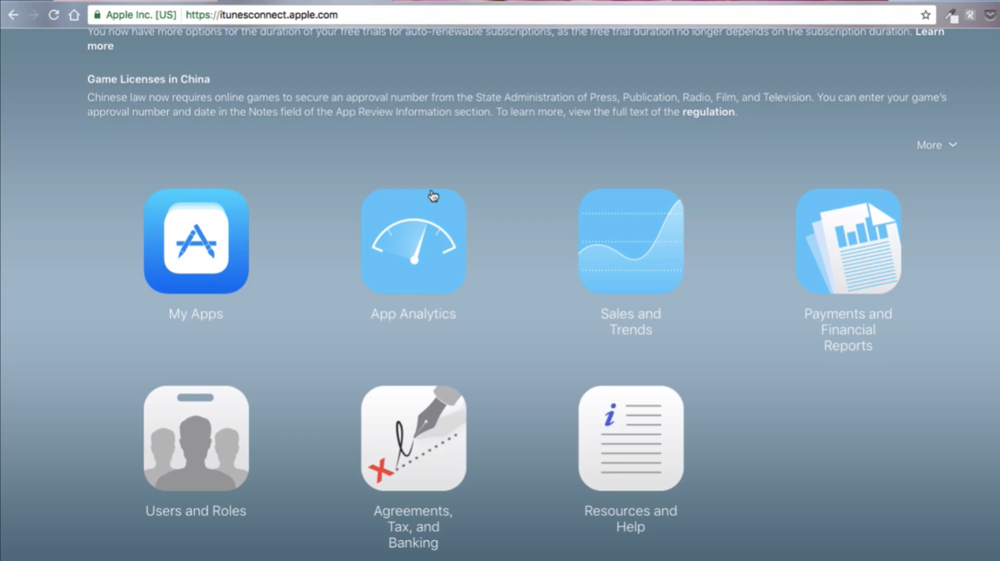
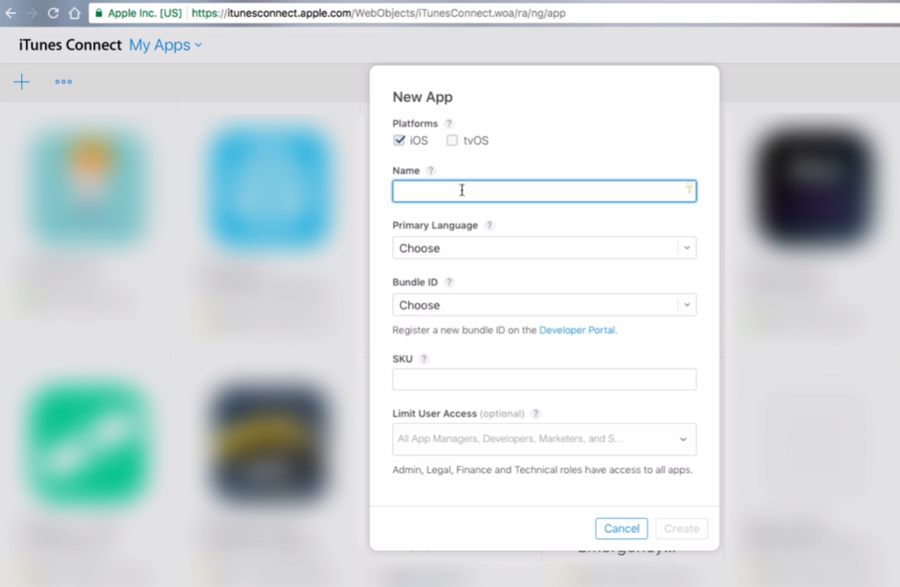
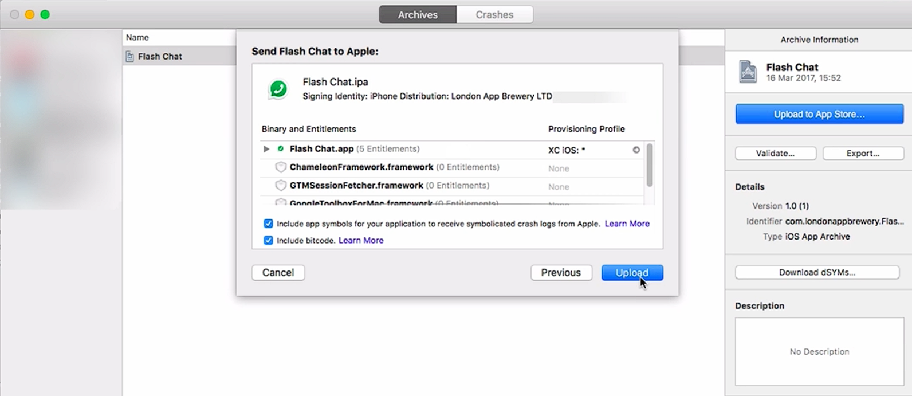
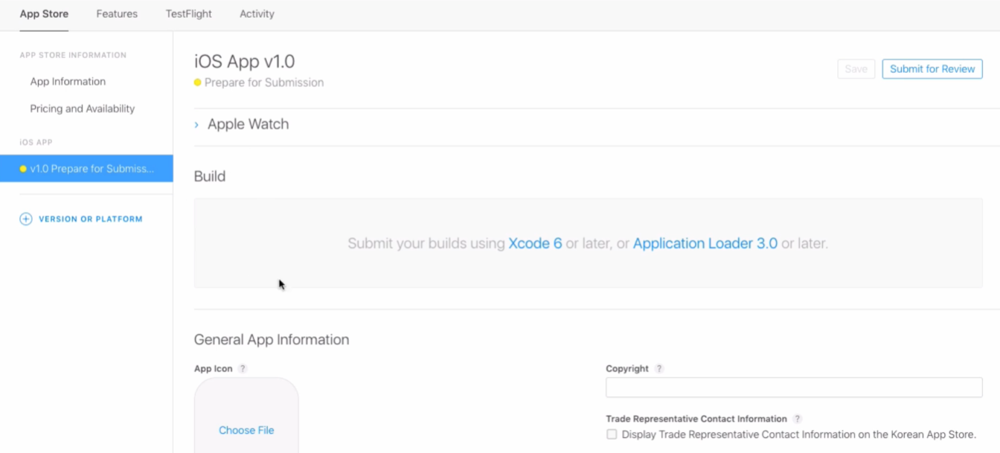

# Notes: How to Publish Your App on to the App Store

## 1. Apple Developer Program

* To publish apps on the App Store, you must join the **Apple Developer Program**.
* **Cost:** **$99/year**.
* Benefits:

  * Removes most free account limitations.
  * Valid code signing and provisioning profiles (valid for 1 year).
  * Test apps remain installed without weekly reinstallation.
* **Tip:** Subscribe only when your app is ready for release to avoid wasting part of your yearly membership.

  

---

## 2. App Store Connect (formerly iTunes Connect)

After joining the developer program, you gain access to **App Store Connect**, where you can:

* Upload new apps.
* Update existing apps.
* View analytics (downloads, users, locations).
* Monitor sales and earnings.
* Manage payments.
* Manage team members and permissions.

  

---

## 3. Creating a New App

Go to **My Apps** → **Add (+)** → **New App**.

You'll need to provide:

* **Platform** (iOS, etc.)
* **App Name**

  * Must be unique.
  * Search the App Store first.
  * Keep it memorable instead of stuffing it with keywords.
* **Primary Language**
* **Bundle ID**

  * Must match the Bundle ID used in Xcode.
  * If missing, register it in the Apple Developer Portal.
* **SKU**

  * Internal identifier for your own reference.
* **User Access**

  * Control what team members can manage.

  

---

## 4. App Information

Configure:

* App category
* Privacy Policy URL
* Pricing
* Sales periods
* Discounts (if applicable)

---

## 5. Required App Store Assets

Prepare:

* **Screenshots** of the app.
* **App Description**

  * Include important keywords naturally.
* **Keywords field**

  * Up to **100 characters**.
  * Use keyword research for App Store Optimization (ASO).
* **App Icon**

  * Size: **1024 × 1024 pixels**.

---

## 6. Uploading the Build

Before uploading:

1. Connect a **physical iPhone/iPad**.
2. Test the app on the device.
3. In Xcode:

   * **Product → Archive**
4. After archiving:

   * Click **Validate**.
   * Click **Upload to App Store**.
5. Select your Apple Developer account.
6. Upload the build.

  

**Note:** Uploading may take **10 minutes to 1 hour**, depending on project size.

---

## 7. After Upload

* Wait **5–10 minutes** after the upload completes.
* The build should appear in **App Store Connect**.
* Ensure the **Bundle ID matches** between:

  * Xcode
  * App Store Connect

  

---

## 8. App Review Information

Provide:

* Contact information.
* Notes for Apple reviewers.

**Helpful tip:**

* Use reviewer notes to explain features that may be difficult to find (e.g., **Restore Purchases** button).
* Clear instructions can reduce review delays.

---

## 9. Apple Review Guidelines

* Read Apple's **App Review Guidelines** before submitting.
* Avoid uploading:

  * Test apps
  * "Hello World" apps
  * Low-quality or unfinished apps
* Apple has strict review standards.

---

## 10. Release Options

Choose whether to:

* Release immediately after approval.
* Schedule release for a specific date (e.g., to match a marketing campaign).

---

## Key Tips

* ✔ Wait until your app is finished before paying for the developer membership.
* ✔ Choose a unique, memorable app name.
* ✔ Ensure the Bundle ID matches everywhere.
* ✔ Test thoroughly on a physical device.
* ✔ Prepare screenshots, app icon, keywords, and description beforehand.
* ✔ Use reviewer notes to explain important features.
* ✔ Expect the submission process to take **1–10 hours** in total, including filling out App Store information.
