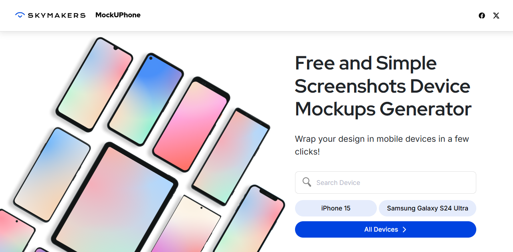
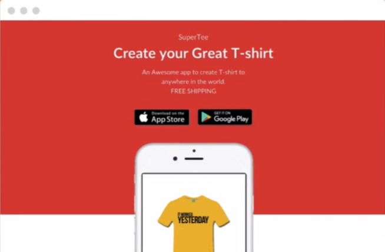

# Notes: Useful Tools to help you with App Submissions

## 1. MockUPhone

* A free online tool for creating **professional-looking app screenshots**.

  

* Allows you to:

  * Insert screenshots into **device frames (mockups)**.
  * Make App Store screenshots look more polished.
* Supports most **iOS devices**.

**Purpose:** Improve the visual presentation of your App Store listing.

---

## 2. MakeAppIcon.com

* Free tool for generating **all required app icon sizes**.
* Simply upload one high-quality image.
* Automatically creates every icon size needed for iOS.
* Download the generated icon set and drag it into your **Xcode** project.

**Why it's useful:**

* Xcode requires app icons in multiple sizes.
* Saves time and prevents manual resizing.

---

## 3. Appsite

* A simple tool for creating a **landing/showcase page** for your app.
* Makes it easy to present and promote your app online.

  

---

## Key Takeaways

* Use **MockUPhone** to create attractive App Store screenshots.
* Use **MakeAppIcon.com** to quickly generate all required app icon sizes.
* Use **Appsite** to build a professional app showcase website.
* Good screenshots, app icons, and presentation improve the overall quality and marketing of your app.

---

## Summary

These tools help streamline the app release process by improving your app's appearance and marketing:

* **MockUPhone** → Device mockups for screenshots.
* **MakeAppIcon.com** → Automatically generates all required app icon sizes.
* **Appsite** → Creates a landing page to showcase your app.

Using these resources can save time and make your App Store listing look more professional.
