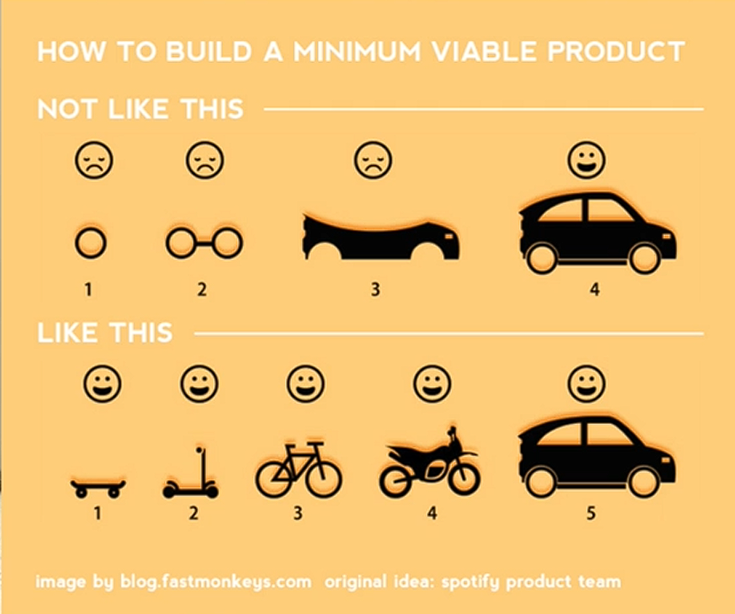

# Notes: How to Build Your Own Products

## 1. Define the Core Idea

* Clearly identify the **main purpose** of your product.
* List all desired features and functionality.
* Simplify the idea until only the **core feature** that makes your product unique remains.
* Focus on what differentiates your app from competitors.

---

## 2. Build a Minimum Viable Product (MVP)

* Start with the **simplest version** of your app.
* Avoid trying to build a feature-rich product from the beginning.
* Prioritize essential functionality first.

**Example:**

* Don't try to build a mix of Facebook, Twitter, and Snapchat.
* Build one useful feature well, then expand gradually.

---

## 3. Grow Step by Step

Think of product development as progression:

* 🛹 Skateboard → Basic version
* 🚲 Bicycle → Improved version
* 🚗 Car → Fully developed product

Instead of aiming to build a **Ferrari** immediately.

  

**Reason:**

* Smaller goals are easier to complete.
* Completing milestones keeps motivation high.
* Users can benefit from the product earlier.

---

## 4. Get User Feedback Early

Release your MVP as soon as possible to:

* Learn what users like.
* Discover problems and bugs.
* Identify features users actually want.
* Improve the overall user experience.

The sooner you receive feedback, the faster you can improve your product.

---

## 5. Follow the Product Development Cycle

Successful app development is an ongoing cycle:

1. Build the simplest version.
2. Release it.
3. Collect user feedback.
4. Improve the app.
5. Repeat.

Continuous iteration is key to building a successful product.

---

## Key Takeaways

* ✔ Clearly define your app's core purpose.
* ✔ Remove unnecessary features.
* ✔ Build a **Minimum Viable Product (MVP)** first.
* ✔ Start small and improve gradually.
* ✔ Get real user feedback as early as possible.
* ✔ Continuously refine your app based on user needs.

---

## Summary

Successful entrepreneurs focus on solving one problem well before expanding. Start with a simple, functional MVP, release it quickly, gather user feedback, and continuously improve your product through an iterative development process.
