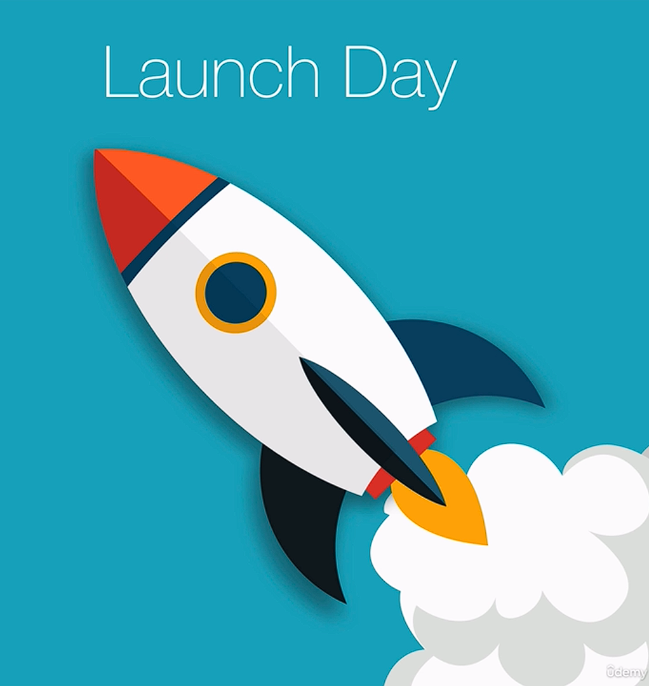
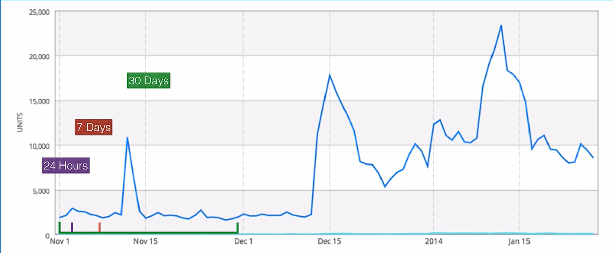

# Step 5: Marketing

## Why App Marketing Matters

* Building a great app is only the beginning—you also need people to **discover and download it**.
* The app market is highly competitive, with millions of apps available.
* Successful apps require both **quality** and **effective marketing**.

---

## 1. Test Your App Before Launch

Never market a buggy app.

### Why?

* Bugs lead to poor user experiences.
* Early users may leave negative reviews.
* Bad ratings can hurt future downloads.

**Goal:** Launch a stable, polished app.

---

## 2. Soft Launch (Beta Testing)

Instead of releasing immediately to your main audience:

* Launch first in **smaller markets** with similar demographics.
* Example:

  * Target market: US & UK
  * Test markets: Canada or New Zealand

### Benefits

* Collect real user feedback.
* Discover bugs.
* Receive feature requests.
* Improve the app before the full release.

---

## 3. Build a Landing Page Early

Create a simple website for your app **before development begins**.

Include:

* Brief description of the app
* Screenshots or concept
* Email signup form

### Purpose

  

Build a list of interested users before launch.

On launch day, you can notify everyone by email, helping generate many downloads immediately.

---

## 4. Make Launch Day Count

The first **24 hours**, **7 days**, and **30 days** are especially important.

App stores evaluate metrics such as:

* Number of downloads
* App opens
* User reviews
* Ratings

Strong early performance increases the chance of better App Store rankings.

  

---

## 5. Product Landing Page Tools

If you're not a web developer, you can create landing pages using tools like:

* WordPress
* Squarespace
* AppStop

These make it easy to collect email addresses before launch.

---

## 6. App Store Optimization (ASO)

ASO is the app equivalent of **Search Engine Optimization (SEO).**

### Goal

Help your app rank higher in App Store search results.

This is important because:

* The **top 5 search results receive about 72% of downloads.**
* The **#1 result alone gets about 35% of downloads.**

Ranking higher greatly increases visibility.

---

## 7. Keyword Research

Choose keywords that:

* Many people search for (high traffic)
* Few apps compete for (low competition)

### Finding Keywords

Use a **reverse dictionary** to discover related words.

Example:

* Coffee → espresso, beans, java

These related terms can become valuable keywords.

---

## 8. Analyze Keywords

Use ASO tools such as:

* Sensor Tower
* App Annie

Evaluate each keyword based on:

* **Traffic** (search popularity)
* **Difficulty** (competition)

Ideal keywords:

* High traffic
* Low competition

Example guideline:

* Traffic score above **3**
* Difficulty score below **3**

---

## 9. Keyword Placement

### iOS App Store

* Enter keywords in the dedicated keyword field.

### Google Play Store

* Include keywords naturally in:

  * App title
  * Description

Similar to traditional SEO for websites.

---

## Key Takeaways

* Don't market an unfinished or buggy app.
* Perform a **soft launch** to gather feedback before the full release.
* Build a **landing page early** to collect email subscribers.
* A strong **launch day** can improve App Store rankings.
* Learn **App Store Optimization (ASO)** to increase discoverability.
* Research keywords with:

  * Reverse dictionaries
  * ASO analytics tools
* Target **high-traffic, low-competition** keywords.
* Optimize your App Store listing differently for iOS and Android.

### Overall Takeaway

A successful app needs more than excellent development—it needs a **well-planned marketing strategy**. By testing thoroughly, building an audience before launch, optimizing App Store visibility, and selecting the right keywords, you greatly improve your chances of attracting downloads and long-term success.
