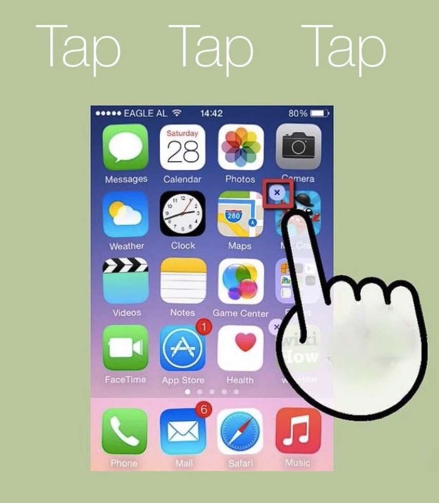

## Notes: Importance of App Design

### Why App Design Matters

* There are millions of apps available:

  * Around **2 million apps** on the iOS App Store (2016).
  * Around **2.4 million apps** on the Google Play Store (2016).
* With so much competition, a new app can easily get lost unless it stands out.

### Impact on User Retention

* Users can delete an app in just **three taps**.

  

* Apps are often removed because of:

  * Poor user experience (UX).
  * Frustration while using the app.
  * Lack of emotional engagement.

### What Makes Users Love an App?

* User satisfaction is **not primarily determined by**:

  * The number of features.
  * The quality of the code.
* The biggest factor is **design**, including:

  * Ease of use.
  * Attractive and intuitive interface.
  * Overall user experience.

### Role of Design

* Design creates emotional responses that influence whether users enjoy an app.
* Good design makes an app:

  * Beautiful.
  * Delightful.
  * Easy to navigate.

### Benefits of Strong App Design

* Increases user engagement and satisfaction.
* Encourages users to keep the app installed.
* Leads to better reviews (e.g., 5-star ratings).
* Helps the app gain visibility and rank higher in app stores.

## Key Takeaway

**Great app design is essential because it helps an app stand out, creates positive user experiences, and encourages users to love, keep, and recommend the app.**
