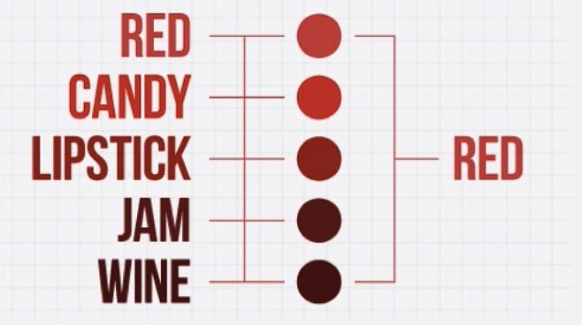
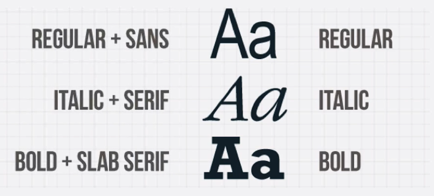

# Notes: Designer vs. Non-Designer Thinking

## 1. Introduction

* Designers and non-designers think differently.
* Learning design concepts provides benefits beyond making an app look attractive.
* Design knowledge helps create more effective, purposeful, and user-friendly products.

## 2. Designer vs. Non-Designer Thinking

### Example: Colors

* Non-designers often think of colors in simple categories (e.g., the seven colors of the rainbow).
* Designers recognize many shades and understand that each shade conveys a different mood or emotion.
* Color choice depends on the project's purpose and target audience.

**Examples:**

* Bright, candy-like colors → fun, playful projects.
* Dark wine/red tones → elegant, sophisticated projects aimed at adults.

    

### Color Theory

Topics covered:

* How to combine colors effectively.
* When and where to use specific colors.
* Understanding the emotions and meanings associated with colors.

## 3. Typography as a Design Fundamental

### What Non-Designers See

* Regular
* Italic
* Bold

### What Designers See

* Different typeface categories such as:

  * Serif
  * Sans Serif
  * Slab Serif
* Subtle differences in style and function.

    

### Typography Topics

* Different type families.
* Combining fonts effectively.
* Creating harmonious designs.
* Using typography for:

  * **Form** (visual appearance)
  * **Function** (communication and usability)

## 4. Demystifying Digital Design

* Good design often feels like a "unicorn":

  * Easy to recognize.
  * Difficult to create intentionally.
* Most people can compare designs and decide which they prefer.
* Designers must create those designs from scratch according to specific requirements.

### Designer's Skill

* Translating specifications into visual solutions.
* Creating designs that fit goals such as:

  * Contemporary
  * Professional
  * Playful
  * Elegant

## 5. Course Focus

The course will teach:

1. Fundamentals of digital design.
2. Color theory.
3. Typography.
4. User Interface (UI) Design.
5. User Experience (UX) Design.
6. Mobile design principles.

## 6. Learning Outcome

By the end of the course, students should:

* Understand how beautiful apps are designed.
* Know the fundamentals of digital design.
* Apply UI and UX principles effectively.
* Create visually appealing and functional mobile app designs.

    

## Key Takeaway

Design is not just about aesthetics; it involves understanding color, typography, user behavior, and applying design principles intentionally to create effective digital products.
