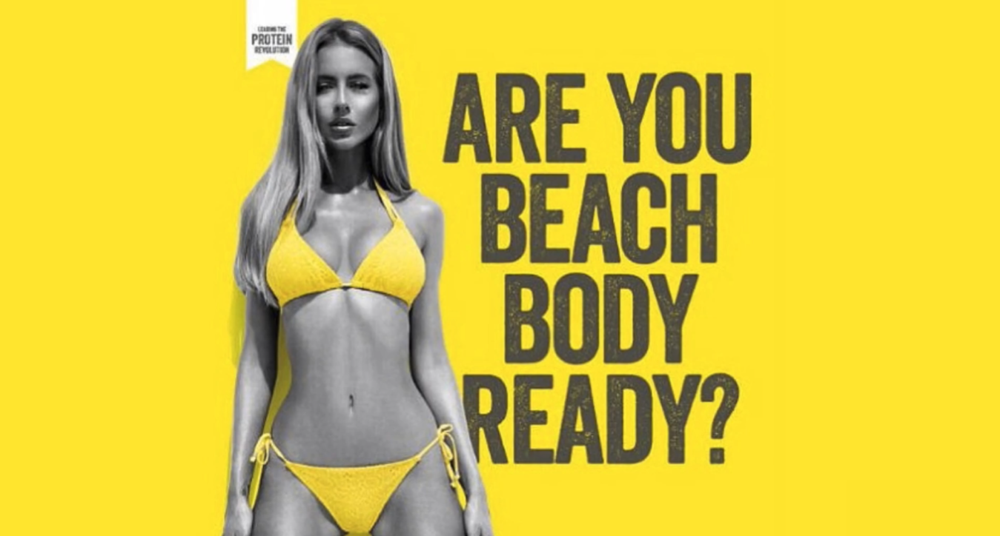
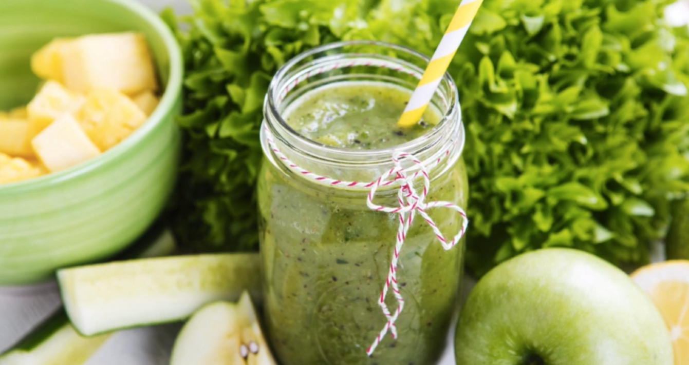
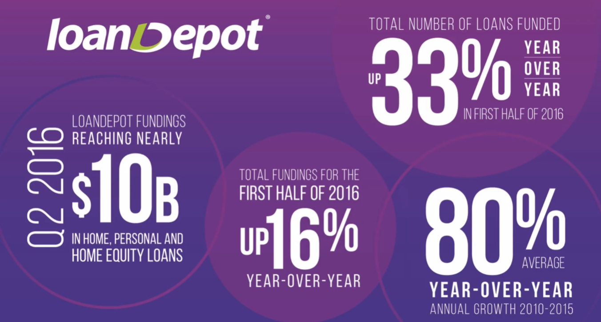
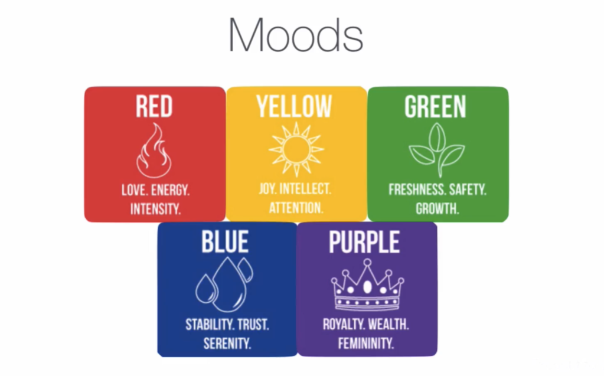

# Notes: Color Theory in Design

## 1. Importance of Color Theory

* Color theory is a fundamental concept in all forms of design, including digital design.
* Humans perceive different colors because our retinas can distinguish different light frequencies.
* Different colors consistently evoke specific emotions and psychological responses.
* Designers use colors strategically to influence how users feel and behave.

---

## 2. Color Meanings and Applications

### 🔴 Red

**Associated with:**

* Love
* Energy
* Intensity
* Excitement

**Common Uses:**

* Car advertisements
* Romantic products and campaigns
* Brands seeking to create excitement and urgency

  

**Purpose:**

* Creates a sense of speed, passion, and strong emotion.
* Effective for grabbing attention and encouraging action.

---

### 🟡 Yellow

**Associated with:**

* Joy
* Happiness
* Intellect
* Attention

**Common Uses:**

* Advertisements designed to stand out
* App icons and App Store screenshots

  

**Purpose:**

* Extremely attention-grabbing.
* Works like a visual highlighter.

**Design Caution:**

* Bright yellow can cause "attention fatigue" if used excessively.
* Better for highlights and marketing materials than large background areas.

---

### 🟢 Green

**Associated with:**

* Freshness
* Safety
* Growth
* Health

**Common Uses:**

* Food brands
* Health and wellness products
* Organic and environmentally-focused businesses

  

**Examples:**

* Food delivery and grocery services
* Health-conscious branding

**Purpose:**

* Appeals to people's desire for health, nature, and vitality.
* Creates a sense of freshness and well-being.

---

### 🔵 Blue

**Associated with:**

* Stability
* Trust
* Serenity
* Reliability

**Common Uses:**

* Healthcare and medical brands
* Corporate and professional services
* Financial institutions

  

**Purpose:**

* Builds trust and credibility.
* Makes users feel secure and confident.

**Interesting Tip:**

* Wearing blue in job interviews may help create an impression of trustworthiness and reliability.

  

---

### 🟣 Purple

**Associated with:**

* Royalty
* Wealth
* Femininity
* Luxury

**Common Uses:**

* Luxury products
* Brands targeting female audiences
* Financial services such as payday loan companies

  

**Purpose:**

* Conveys sophistication, exclusivity, and elegance.

---

## 3. Learning from Advertisements

* Advertisements are useful case studies for understanding design psychology.
* Advertising agencies carefully choose colors to:

  * Evoke emotions
  * Capture attention
  * Influence purchasing decisions
  * Create associations with products

**When analyzing an ad, ask:**

1. What emotions is it trying to evoke?
2. Which design principles are being used?
3. How does the color palette support the message?

---

## 4. Key Takeaway for Designers

Before choosing a color palette, ask:

> **"What emotions, feelings, or ideas do I want users to experience?"**

Then select colors that reinforce those goals.

  

| Color  | Key Emotions                |
| ------ | --------------------------- |
| Red    | Love, Energy, Intensity     |
| Yellow | Happiness, Joy, Attention   |
| Green  | Freshness, Growth, Health   |
| Blue   | Trust, Stability, Serenity  |
| Purple | Wealth, Royalty, Femininity |

## Summary

Color choice is not just about aesthetics—it is a powerful psychological tool. Effective designers select colors based on the emotions and messages they want to communicate, helping users form specific perceptions of a product, brand, or app.
