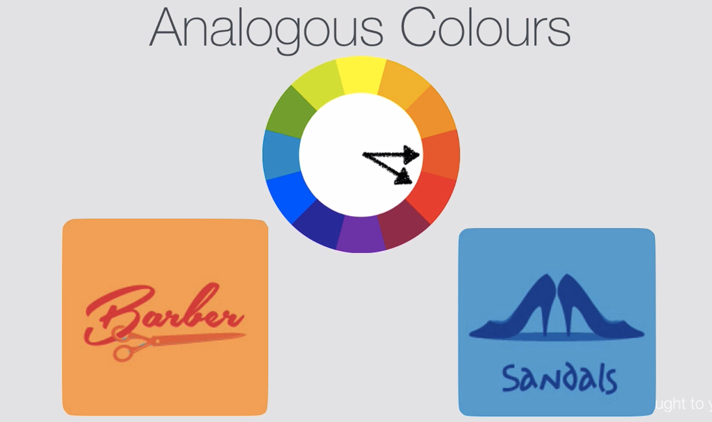
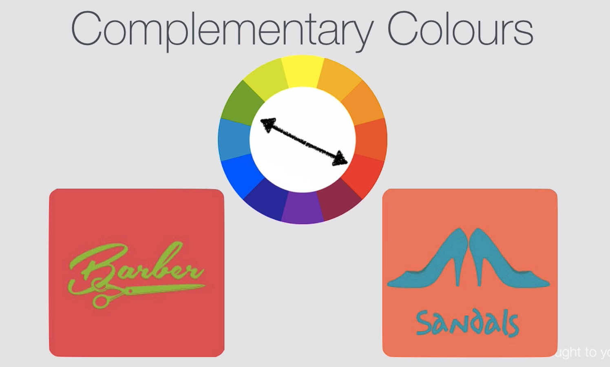
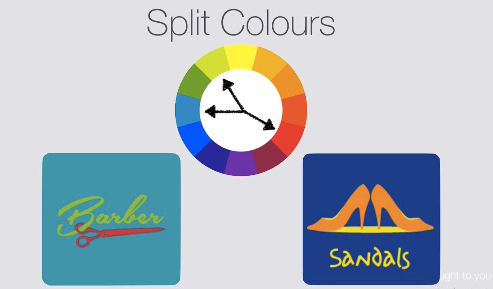
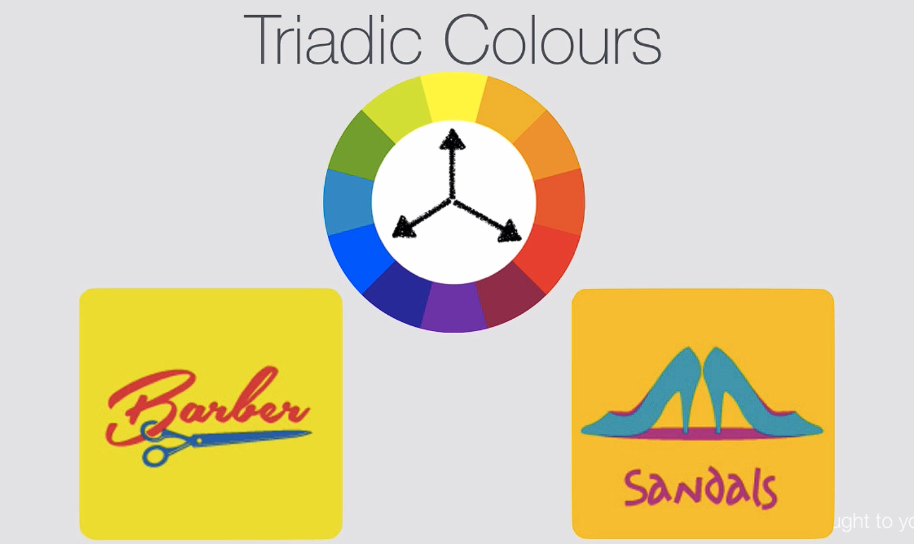
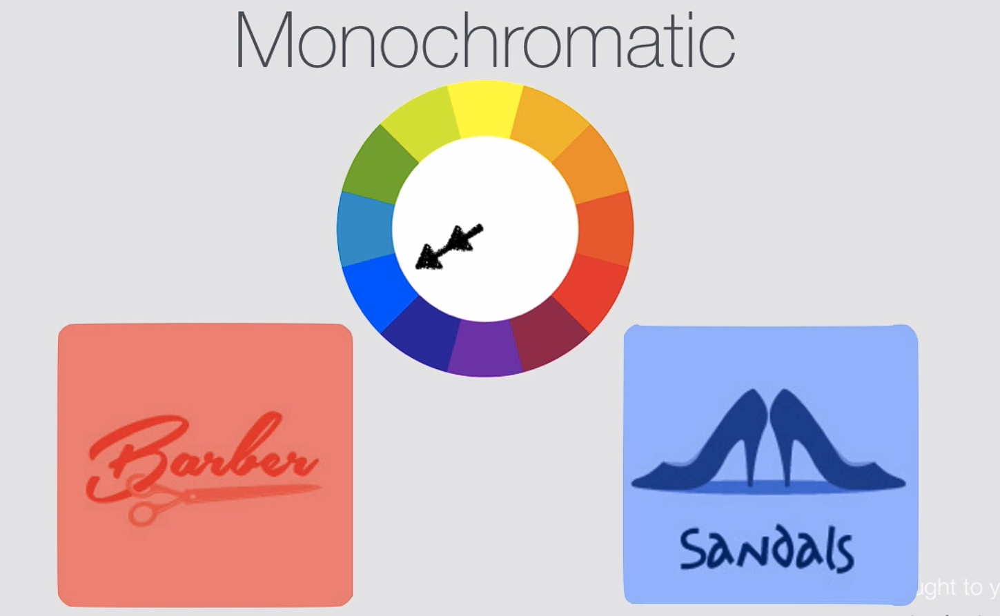

# Notes: Color Theory & Color Combinations in Design

## 1. Importance of Multiple Colors

* Modern designs rarely use only one color.
* Most designs have:

  * **Predominant (main) colors**
  * **Subsidiary (supporting) colors**
* Combining colors effectively helps communicate different messages and emotions.

---

## 2. The Color Wheel

* A color wheel is essentially the rainbow arranged in a circle.
* It is a valuable tool for artists and designers to create color schemes.

---

## 3. Analogous (Adjacent) Colors

**Definition:**

* Colors that are next to each other on the color wheel.

**Characteristics:**

* Harmonious and visually pleasing.
* Easy on the eyes.
* Suitable for designs viewed for long periods.

  

**Best Uses:**

* App interfaces
* Background screens
* User interfaces (UI)

**Benefit:**

* Creates a comfortable viewing experience that encourages users to stay engaged.

---

## 4. Complementary Colors

**Definition:**

* Colors directly opposite each other on the color wheel.

**Characteristics:**

* High contrast.
* Bold and attention-grabbing.
* Creates visual tension ("clashy" appearance).

  

**Best Uses:**

* Logos
* Advertisements
* Attention-grabbing graphics

**Limitation:**

* Not ideal for main interfaces because they can be tiring to look at for extended periods.

---

## 5. Split-Complementary Colors

**Definition:**

* Choose one color and pair it with the two colors adjacent to its complement.

**Example:**

* Instead of pairing red with green (its complement), pair red with the colors beside green.

**Characteristics:**

* Attention-grabbing but less harsh than complementary colors.
* More balanced and visually comfortable.

  

**Best Uses:**

* App icon design
* Simple graphic designs
* App Store icons

**Benefit:**

* Helps designs stand out without excessive visual clash.

---

## 6. Triadic Colors

**Definition:**

* Three colors evenly spaced around the color wheel (forming an equilateral triangle).

**Characteristics:**

* Balanced and vibrant.
* Attention-grabbing while maintaining harmony.

  

**Limitation:**

* Widely used in 1990s print and advertising design.
* Often gives designs a dated or "90s" appearance.

---

## 7. Monochromatic Colors

**Definition:**

* Using a single color with different shades, tones, and tints by adding:

  * White (tints)
  * Black (shades)

**Characteristics:**

* Modern and contemporary.
* Clean and sophisticated.
* Flexible contrast levels.

  

**Best Uses:**

* Modern digital design
* Contemporary interfaces
* Minimalist designs

**Benefit:**

* Creates a cohesive and professional look while maintaining visual hierarchy.

---

## Quick Comparison Table

| Color Scheme            | Description                           | Effect                    | Best Use                            |
| ----------------------- | ------------------------------------- | ------------------------- | ----------------------------------- |
| **Analogous**           | Adjacent colors                       | Harmonious, relaxing      | UI, app screens                     |
| **Complementary**       | Opposite colors                       | Bold, high contrast       | Logos, ads                          |
| **Split-Complementary** | Color + colors beside its complement  | Balanced yet eye-catching | App icons, branding                 |
| **Triadic**             | Three evenly spaced colors            | Vibrant, balanced         | Graphic design (use carefully)      |
| **Monochromatic**       | One color with different shades/tints | Modern, clean             | Digital products, minimalist design |

## Key Takeaway

Different color combinations create different emotional and visual effects:

* **Analogous** = calm and harmonious.
* **Complementary** = strong contrast and attention.
* **Split-Complementary** = attention-grabbing but balanced.
* **Triadic** = vibrant but can feel dated.
* **Monochromatic** = modern, clean, and highly popular in current digital design.
