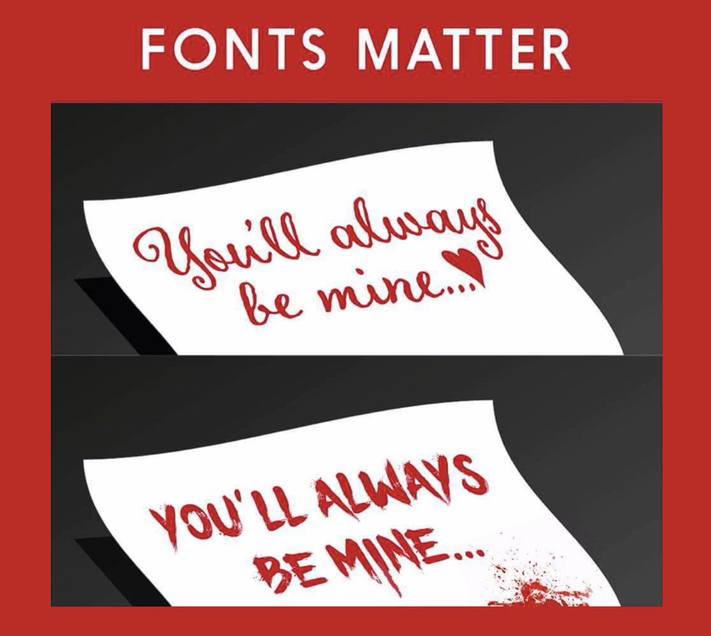

## Notes: Introduction to Typography

**What is Typography?**

* Typography is the art of choosing and combining fonts.
* Many people find font selection overwhelming because there are so many options.

**Why Typography Matters**

* Fonts communicate meaning and emotion, not just words.
* The same message can create very different impressions depending on the font used.
* Typography affects how readers perceive the tone and intent of a message.

**Example**

* A phrase like *"You'll always be mine"* can feel romantic, friendly, or even creepy depending on the font used.

  

**Key Takeaways**

* Typography is important in both print and digital design.
* Learning how to choose and combine fonts helps communicate messages effectively.
* Good font choices improve readability and create the desired emotional impact.
* Poor font choices can send unintended messages or create negative impressions.

**Main Idea**

* Typography is a powerful communication tool because fonts influence how people interpret and feel about written content.
