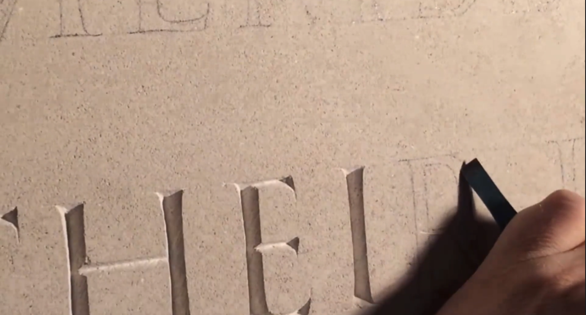
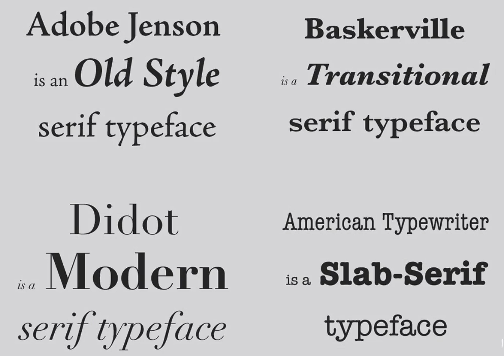

# Notes: The Serif Type Family - Origins and Use

## 1. Two Main Typeface Families

### Serif

* Identified by small decorative strokes ("feet") at the ends of letters.
* Originated from stone carving traditions.
* Stone masons found it difficult to carve perfect 90° angles, resulting in small extensions that became serifs.
* Generally associated with:

  * Tradition
  * Formality
  * Conservatism
  * Professional documents (e.g., law office letterheads)

  

### Sans Serif

* Lacks the small decorative feet.
* More modern and contemporary in appearance.
* Commonly used in modern design and branding.

---

## 2. Major Serif Classifications

### A. Old Style Serif

* Oldest serif category.
* Based on typography from the 1400s.
* Characteristics:

  * Traditional
  * Conservative
  * Historical appearance
* Examples:

  * Adobe Jenson
  * Centaur
  * Goudy Old Style

### B. Transitional Serif

* Developed after Old Style.
* More refined and modern.
* Examples:

  * Times New Roman
  * Baskerville
  * Georgia

### C. Modern Serif

* Highly refined and elegant.
* Strong contrast between thick and thin strokes.
* Example:

  * Didot (used in Vogue magazine)

### D. Slab Serif

* Thick, block-like serifs.
* Minimal difference between thick and thin strokes.
* Created for practical printing purposes, especially newspapers.

  

---

## 3. Modulation in Typefaces

### Definition

* Modulation = difference between the thickest and thinnest parts of a letter.

### Trend Across Serif Families

* Old Style → Low modulation
* Transitional → Medium modulation
* Modern → High modulation

### Why Modulation Exists

* Influenced by writing with flat-nibbed pens.
* Flat nibs naturally create thick and thin strokes depending on writing angle.
* Similar effect can be observed when comparing writing with:

  * A highlighter (broad tip)
  * A marker/sharpie

---

## 4. Slab Serif: Special Case

### Characteristics

* Very little or no modulation.
* Thick, sturdy letterforms.
* Does not follow the trend of increasing modulation seen in other serif families.

### Purpose

* Designed for newspaper printing on poor-quality paper.
* Ink spread on cheap paper often caused fine details to disappear.
* Thick strokes helped maintain readability despite ink bleeding.

### Similar Usage

* Comic book lettering often resembles slab serif styles because the bold forms remain clear when printed.

---

## Key Takeaways

* **Serifs** originated from stone carving and are associated with traditional, formal design.
* **Sans serifs** are cleaner and more modern.
* Serif families progress from:
  **Old Style → Transitional → Modern → Slab Serif**
* **Modulation** (thick-thin contrast) generally increases from Old Style to Modern serifs.
* **Slab serifs** were designed for readability in low-quality printing environments and therefore use thick, uniform strokes.
