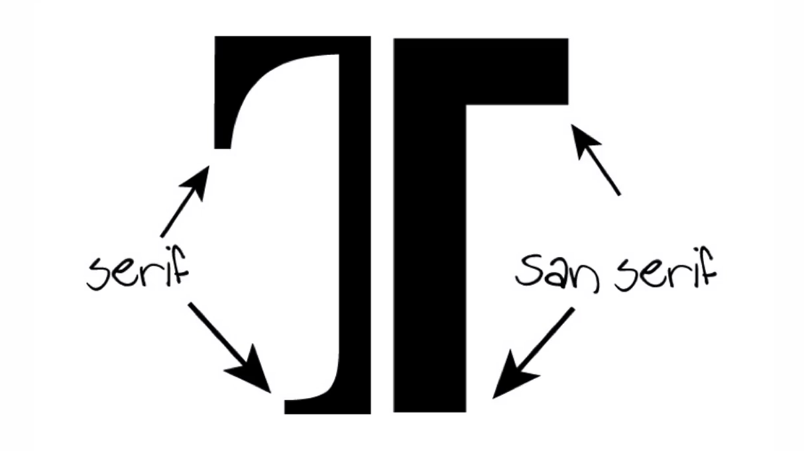
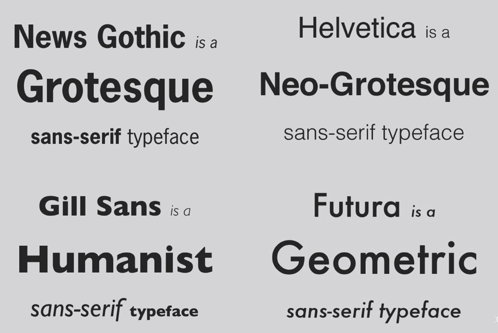

## Notes: Sans Serif Typeface Families

### What Are Sans Serifs?

* Sans serif typefaces **do not have serifs** (the small decorative feet or extensions found on serif fonts).
* They are generally considered **more modern** than serif typefaces.
* Sans serifs are divided into **four main families**.

  

---

### 1. Grotesque (Oldest Sans Serif Family)

**Characteristics:**

* Earliest sans serif style.
* Letterforms are mostly **uniform in thickness** (little variation between thick and thin strokes).

**Examples:**

* Franklin Gothic
* News Gothic

---

### 2. Neo-Grotesque

**Characteristics:**

* Developed after Grotesque fonts.
* Cleaner and more refined appearance.

**Examples:**

* Helvetica
* Arial

---

### 3. Humanist

**Characteristics:**

* Greater variation between thick and thin parts of letters.
* Shows more **modulation** (stroke contrast).
* Feels more organic and influenced by handwriting.

**Examples:**

* Gill Sans
* Tahoma
* Verdana

---

### 4. Geometric

**Characteristics:**

* Based on simple geometric shapes.
* The letter **“O”** is nearly a perfect circle, as if drawn with a compass/protractor.
* Unlike the trend toward increased modulation, geometric fonts have **very little or no modulation** and maintain nearly equal stroke thickness throughout.

**Example:**

* Futura

---

### Key Trend Across Sans Serif Families

As typefaces evolve from:

**Grotesque → Neo-Grotesque → Humanist**

* The contrast between the **thickest and thinnest parts** of letters becomes more noticeable.
* This increase in stroke variation is called **modulation**.

**Exception:**

* **Geometric fonts** break this trend.
* Despite being one of the newest families, they maintain **uniform stroke widths** with minimal modulation, similar to slab serif fonts.

---

### Quick Comparison Table

| Family        | Age    | Stroke Variation (Modulation) | Examples                     |
| ------------- | ------ | ----------------------------- | ---------------------------- |
| Grotesque     | Oldest | Very little                   | Franklin Gothic, News Gothic |
| Neo-Grotesque | Later  | Slightly more                 | Helvetica, Arial             |
| Humanist      | Newer  | Most noticeable               | Gill Sans, Tahoma, Verdana   |
| Geometric     | Modern | Very little (exception)       | Futura                       |

### Memory Tip

  

* **Grotesque** = oldest, uniform strokes.
* **Neo-Grotesque** = cleaner evolution (Helvetica, Arial).
* **Humanist** = more organic, more modulation.
* **Geometric** = based on perfect geometric shapes, especially circular "O"s.
