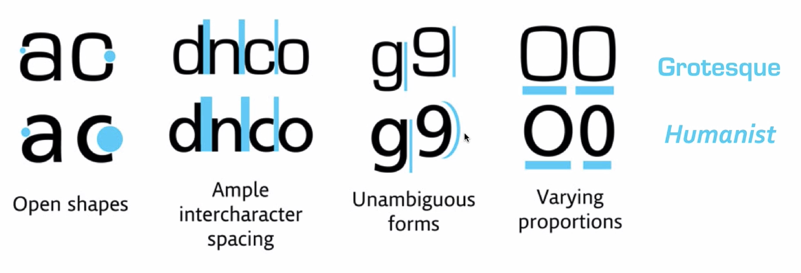

## Notes: How Typography Determines Readability

### Why Typeface Families Matter

* Typeface families and subfamilies are important for both **styling** and **readability**.
* Different typefaces create different impressions:

  * Conservative designs should avoid overly modern typefaces.
* Design is not just about appearance (**form**); it must also support **function**.

### MIT Study on Typeface Readability

* Researchers compared:

  * **Grotesque** typeface
  * **Humanist** typeface
* Context: Car dashboard displays.
* Findings:

  * Drivers spent **11% less time** looking at dashboards using a Humanist typeface.
  * This translated to approximately **40 feet less travel distance** while looking away from the road.
* Implication:

  * Better readability can improve safety and may even prevent accidents.

### Why Humanist Typefaces Are More Readable

  

#### 1. More Open Shapes

* Humanist fonts have larger openings in letters (e.g., the letter **C**).
* Open shapes make characters easier to recognize quickly.

#### 2. Greater Inter-Character Spacing

* Humanist fonts generally have more space between letters.
* Increased spacing reduces visual crowding and improves readability.

#### 3. Less Ambiguity Between Characters

* Similar-looking characters are easier to distinguish.
* Example:

  * In Grotesque fonts, **g** and **9** can appear very similar.
  * In Humanist fonts, these characters are more distinct.

#### 4. Varying Letter Proportions

* Readable typefaces often include a mix of:

  * Wide letters
  * Narrow letters
* Variation helps the brain recognize words and characters more efficiently.

### Key Takeaway

* Effective design prioritizes **function as well as form**.
* Readability is a critical factor when choosing a typeface.
* Humanist typefaces tend to be more readable because of:

  * Open shapes
  * Better spacing
  * Clear character differentiation
  * Varied letter proportions.
