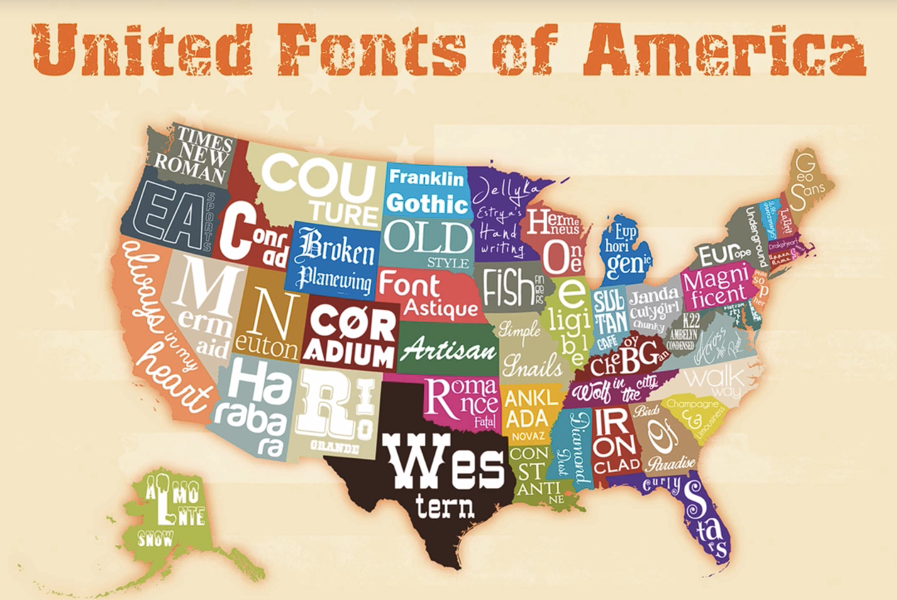
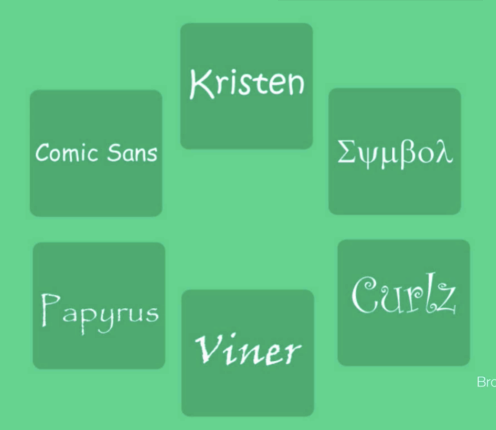

# Notes: How to Combine Fonts

## 1. Why Use Different Typefaces?

* Designers often use one typeface for **headings** and another for **body text**.
* This creates **contrast, visual interest, and hierarchy** in a design.

---

## 2. Best Font Pairing Rule: Serif + Sans Serif

* **Serif heading + Sans Serif body** = strong combination.
* **Sans Serif heading + Serif body** = also works well.
* Sans serif fonts are often preferred for body text because they generally offer better readability on screens.
* Avoid:

  * Serif + Serif
  * Sans Serif + Sans Serif
* These combinations can look bland and lack distinction.

---

## 3. Limit the Number of Fonts

* **2 fonts** = ideal.
* **3 fonts** = acceptable but should be used carefully.
* **4 or more fonts** = usually too many and can make a design look cluttered.

**Rule of thumb:** Keep font choices simple.

---

## 4. Fonts Have Personality and Mood

* Every typeface conveys a specific feeling or character.
* Examples:

  * Snowy, rugged fonts can represent Alaska.
  * Western-style fonts can represent Texas.
* Choosing a font with the wrong mood can make a design feel awkward or confusing.

  

**Key idea:** Match the font's personality to the message and brand.

---

## 5. Consider the Era of the Typeface

* Typefaces often reflect different historical periods.
* Mixing fonts from very different eras can look strange.
* Try to pair:

  * Old-style fonts with other old-style fonts.
  * Modern fonts with other modern fonts.

---

## 6. Typography Pairing Guidelines

### Keep Similar:

* **Mood/Personality**
* **Historical Era/Style**

### Create Contrast With:

* **Serifness**

  * Serif ↔ Sans Serif
* **Weight**

  * Light ↔ Bold
  * Thin ↔ Thick

Using contrast helps create visual interest and hierarchy.

---

## 7. Font Weights Matter

Fonts often come in multiple weights:

* Thin
* Light
* Regular
* Medium
* Bold
* Extra Bold/Black

Use different weights between headings and body text to improve emphasis and visual appeal.

---

## 8. Fonts to Avoid

The instructor recommends avoiding certain overused or poorly regarded fonts (e.g., Comic Sans).

* Some fonts are difficult to make look professional.
* Good typography habits should be practiced even in small projects.

  

---

## 9. Useful Typography Tools

### WhatFont

* Browser extension for Chrome and Firefox.
* Allows you to inspect fonts used on websites.
* Shows:

  * Typeface
  * Size
  * Color
  * Line height
  * Weight
  * Thickness

### Font Squirrel

* Provides many fonts that are **free for commercial use**.

### Fonts.com

* Large font library.
* Many fonts require payment for commercial use.

### SkyFonts

* App that makes installing and using new fonts easy.
* Integrates fonts into applications with minimal setup.

---

## Quick Summary for Revision

* Use **different fonts for headings and body text** to create contrast.
* Pair **Serif + Sans Serif** rather than Serif + Serif or Sans Serif + Sans Serif.
* Stick to **2 fonts** whenever possible.
* Match fonts by **mood** and **era**.
* Create contrast using **serifness** and **font weight**.
* Use tools like **WhatFont**, **Font Squirrel**, and **SkyFonts** to discover and manage fonts.
* Avoid overused or unprofessional fonts such as **Comic Sans**.
